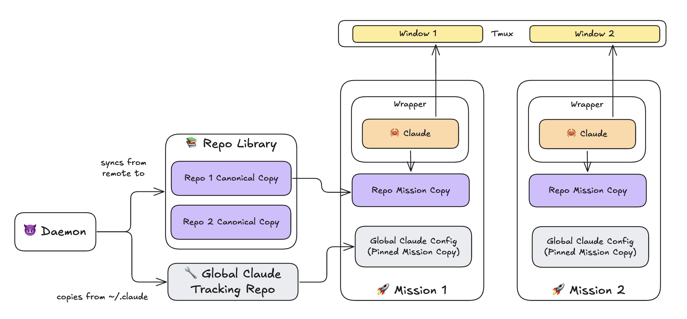

<div align="center">
    <h1>AgenC: Minecraft → Starcraft</h1>
</div>

</h1>
  <p align="center">
    AgenC is an AI work factory focused on self-upgrading.</br>
    </br>
    <b>The idea:</b> Launch tons of parallel Claudes. They stumble. Turn friction → upgrades for the factory. Repeat</br>
    </br>
    You spend your time building the factory; the Claudes do the rest.</br>
    </br>
    <a href="#why-agenc">Why AgenC</a>
    |
    <a href="#quickstart">Quickstart</a>
    |
    <a href="#how-it-works">How It Works</a>
    |
    <a href="#vs-gastown">Vs Gastown</a>
    |
    <a href="https://discord.gg/x9Y8Se4XF3">Discord</a>
  </p>
</p>

Why AgenC
----------
If you're like most people, you use Claude like this:


Much better is John Rush's philosophy of [Inputs, Not Outputs](https://www.john-rush.com/posts/ai-20250701.html):


Each iteration makes all future outputs better.

Unfortunately, this doesn't scale.

The Claudes start to step on each other, each lesson rollback requires forking a new window, juggling all the windows becomes a circus, and you spend a bunch of time `cd`ing around and getting in and out of Claude.

AgenC tames this chaos. It provides:

- 📦 Claude session isolation in fully independent sandboxes (no Git worktrees, and no merge queue - each agent is completely independent!)
- 🎨 Window management and command palette w/hotkeys so launching new sessions, switching windows, and rolling lessons back into your Claude config is a thought away
- 🔧 Palette customization, so your most-used operations are easy
- 🔐 1Password secrets injection
- 🤖 An AI assistant that knows how to configure & drive AgenC, so you never have to use CLI commands


Here's it in action:

[AgenC demo](https://github.com/user-attachments/assets/d12c5b06-c5db-420a-aaa3-7b8ca5d69ab6)

And of course, AgenC is built with AgenC.

> ### ⚠️ **ADDICTION WARNING** ⚠️
>
> AgenC **WILL** force-multiply you. But you should know it has a videogame-like addictive quality.
>
> Because it's so easy to launch & manage work, you get this "just one more mission" feeling.
> 
> In building AgenC, I noticed it was hard to switch off and go to sleep. My brain would be buzzing with ideas, and I'd wake up in the middle of the night wanting to launch new threads.
>
> Please remember to take breaks, and leave sufficient wind-down time before sleep!

Quickstart
-----------

### Prerequisites

- **macOS** (won't work on Linux yet)
- **Claude Code** installed and in your PATH ([installation guide](https://docs.anthropic.com/en/docs/claude-code/getting-started))

### Install

```bash
brew tap mieubrisse/agenc
brew install agenc
```

This automatically installs required dependencies (`gh`, `fzf`, `tmux`).

### 1. 🔧 Initialize
The AgenC directory defaults to `~/.agenc`. Override with `AGENC_DIRPATH` if needed.

Run the following and answer the prompts:

```bash
agenc init
```

I recommend "yes" to creating a config repo; AgenC will sync it to GitHub automatically.

The AgenC interface is tmux. Run this so you get the AgenC keybindings:

```bash
agenc tmux inject
```

If you haven't used tmux before, drop this into your `~/.tmux.conf`:

```tmux
set -g extended-keys on

# Ctrl-h goes to previous window
bind -n C-h previous-window

# Ctrl-l goes to next window
bind -n C-l next-window

# Ctrl-; toggles between panes inside a window
bind -n 'C-;' select-pane -t :.+

# Ctrl-shift-h moves a window to the left
bind -n C-S-h swap-window -t -1\; select-window -t -1

# Ctrl-shift-l moves a window to the right
bind -n C-S-l swap-window -t +1\; select-window -t +1
```

### 2. 🚀 Launch
Attach to the AgenC interface:

```bash
agenc attach
```

You'll be dropped into the repo selection screen. Select "Github Repo" and enter a repo you're working on.

AgenC will clone it, launch a new **mission**, and drop you into Claude to start your work.

Missions are the main primitive of AgenC: disposable self-contained workspaces with a full copy of the Git repo (not worktrees, so no need for a master merge queue).

You can see your missions with `agenc mission ls`.

### 3. 🎨 Command Palette
Inevitably you'll want to do side work while Claude is working away.

Press `ctrl-y` to open the command palette and...

- 🐚 Open a shell in your current mission's workspace ("Open Shell" or `ctrl-p`)
- 🚀 Launch a side mission ("New Mission" or `ctrl-n`)
- 🔀 Switch between your running missions ("Switch Mission" or `ctrl-m`)
- 🦀 Open a quick empty Claude for side questions ("Quick Claude" or "Side Claude")
- 💬 Send me feedback about AgenC!

The command palette can be configured with custom hotkeys and custom commands.

The hard way to do this is through the [CLI helpdocs](docs/cli/agenc.md) the `agenc config paletteCommand`. For example, this is to open my dotfiles:

```
agenc config paletteCommand add dotfiles \
    --title="🛠️ Open Dotfiles" \
    --command="agenc tmux window new -- agenc mission new mieubrisse/dotfiles" \
```

The easier way is through the Adjutant.

### 5. 🤖 Adjutant
AgenC has an AI assistant called Adjutant ("Adjutant" on the palette or `ctrl-t`) that knows how to configure AgenC, as well as launch and manage missions.

You _can_ use the `agenc config` commands to configure stuff like palette commands... but now I just talk to the Adjutant for my AgenC configuration needs.

### 6. Mission Management
You can see all missions with `agenc mission ls`. 

Missions can also be stopped with "Mission Stop" or "Mission Resume" on the palette. Since each mission is an isolated workspace, no work is lost.

Full CLI docs: [docs/cli/](docs/cli/)

### 6. 🔐 Secrets

If you create a `.claude/secrets.env` with [1Password CLI secret references](https://developer.1password.com/docs/cli/secret-references/) in it, AgenC will resolve them on mission launch and inject them into Claude. This is useful for MCP server credentials.

For example:

.claude/secrets.env:
```bash
SUBSTACK_SESSION_TOKEN="op://Private/Substack Session Token/credential"
SUBSTACK_USER_ID="op://Private/Substack Session Token/username"
```

.mcp.json:
```
{
    "mcpServers": {
        "substack-api": {
            "command": "npx",
            "args": ["-y", "substack-mcp@latest"],
            "env": {
                "SUBSTACK_PUBLICATION_URL": "https://mieubrisse.substack.com/",
                "SUBSTACK_SESSION_TOKEN": "$SUBSTACK_SESSION_TOKEN",
                "SUBSTACK_USER_ID": "$SUBSTACK_USER_ID"
            }
        }
    }
}
```

### 8. Send feedback
I'd love to hear from you! To send me feedback you can...

- Use "Send Feedback" in the command palette
- Ask the Adjutant to do it
- [Join the Discord](https://discord.gg/x9Y8Se4XF3).

Tips
----
- **Run Claude in sandbox mode.** This cuts cuts a lot of permission request fatigue. Run `/sandbox` from your global Claude Code (not inside a mission) to enable sandboxed command execution. This allows Claude to run commands within defined sandbox restrictions without manual approval prompts on every action. The setting automatically carries into every AgenC mission. This is the recommended alternative to `--dangerously-skip-permissions`.

- **Rename missions when you stop them.** Use `/rename` inside Claude to give a mission a descriptive name before exiting. This makes finding and resuming the right mission much easier later when you run "Resume Mission" or `agenc mission resume`.

- **Have your agents always commit and push.** Unpushed work sits stranded on the mission's local filesystem. You can add instructions that get injected for AgenC agents only in your `$AGENC_DIRPATH/config/claude-modifications/CLAUDE.md`. Tell your agents here that they should always commit (and, optionally, push if you're working solo on th erepo). This lets you fire-and-forget instructions to your agents, confident the work will persist even if the mission ends.


How It Works
------------



AgenC runs three cooperating processes that work together to give you a factory of Claudes:

### Missions

A **mission** is AgenC's core primitive — a fully isolated workspace where one Claude works on one task.

When you create a mission, AgenC:

1. **Clones a full copy of your Git repo** into `$AGENC_DIRPATH/missions/<uuid>/agent/`. This is NOT a Git worktree — it's a complete independent clone. This means no merge queue, no conflicts with other missions, and no shared state. Each Claude has its own sandbox.

2. **Builds a custom Claude config** by merging your global `~/.claude` config with AgenC-specific settings. This gives the Claude access to the mission's workspace, hooks that track when it's busy or idle, and permissions tailored for its work.

3. **Spawns a wrapper process** that supervises the Claude session. The wrapper handles authentication, tracks mission health, and can restart Claude if needed.

Missions are disposable. You can stop them, resume them, or archive them. Work persists because each mission is a real Git repo — commit and push like normal.

### Wrapper

The **wrapper** is a supervisor process — one per active mission — that tends the Claude child process.

The wrapper:

- **Passes authentication** to Claude via the `CLAUDE_CODE_OAUTH_TOKEN` environment variable (more below)
- **Tracks idle state** by listening to hooks that fire when Claude starts and stops responding
- **Writes heartbeats** to the database every 30 seconds so the daemon knows which missions are alive
- **Restarts Claude** on command (via unix socket) — useful after upgrading Claude or when something breaks
- **Updates the repo library** immediately when you push, so other missions get your changes without waiting

When Claude exits (naturally or via `/exit`), the wrapper cleans up and stops. The mission directory stays intact, so you can resume later.

### Daemon

The **daemon** is a background process that keeps the factory running smoothly. It runs six concurrent loops:

1. **Repo sync** (every 60 seconds) — Fetches and fast-forwards repos in the shared library so new missions clone from fresh code
2. **Config auto-commit** (every 10 minutes) — If your `$AGENC_DIRPATH/config/` is a Git repo, the daemon auto-commits and pushes changes so your config stays version-controlled
3. **Cron scheduler** (every 60 seconds) — Spawns headless missions on schedule for recurring tasks
4. **Config watcher** (on file change) — Watches `~/.claude` and mirrors changes to a shadow repo so missions can inherit your latest config
5. **Keybindings writer** (every 5 minutes) — Regenerates tmux keybindings to pick up any palette command changes
6. **Mission summarizer** (every 2 minutes) — Uses Claude Haiku to generate short descriptions of active missions for tmux window titles

The daemon starts automatically when you run `agenc attach`. If it crashes, just restart it with `agenc daemon restart` — running missions are unaffected.

### Repo Library

AgenC maintains a **shared library** of Git repos at `$AGENC_DIRPATH/repos/`. When you create a mission, AgenC copies from this library instead of cloning from GitHub every time.

The daemon keeps the library fresh by fetching every 60 seconds. The wrapper contributes by watching for pushes — when you `git push` from a mission, the wrapper immediately updates the library copy so other missions get your changes.

Missions cannot read or modify the repo library directly (enforced via permissions). They only see their own workspace.

### Authentication

Standard Claude Code authentication doesn't work well with multiple concurrent sessions — the tokens refresh and invalidate each other in a loop ([GitHub issue](https://github.com/anthropics/claude-code/issues/24317)).

AgenC solves this by using a **long-lived OAuth token** that you provide once during setup. The token is stored at `$AGENC_DIRPATH/cache/oauth-token` (mode 600, never committed to Git). When the wrapper spawns Claude, it reads this file and passes the token via the `CLAUDE_CODE_OAUTH_TOKEN` environment variable.

All missions share the same token, so there's no refresh thrashing. When the token expires, update it once with `agenc config set claudeCodeOAuthToken <new-token>`, and all new missions (plus running missions after restart) pick it up automatically.

See [docs/authentication.md](docs/authentication.md) for details.

Configuration
-------------

AgenC stores its state in `$AGENC_DIRPATH` (defaults to `~/.agenc`). The central configuration file is `$AGENC_DIRPATH/config/config.yml`.

Key features:

- **Synced repos** — keep repositories continuously up-to-date in a shared library
- **Cron jobs** — spawn headless missions on a schedule
- **Palette commands** — customize the tmux command palette and keybindings
- **Config auto-sync** — optionally back the config directory with Git for automatic versioning

See [docs/configuration.md](docs/configuration.md) for the full reference.

Troubleshooting
---------------

Run `agenc doctor` to check for common configuration issues.

### "Command Line Tools are too outdated"

If you see this error during installation:

```
Error: Your Command Line Tools are too outdated.
```

This is a [Homebrew requirement](https://docs.brew.sh/Common-Issues#homebrew-is-slow), not an AgenC issue. Homebrew requires up-to-date Xcode Command Line Tools to function, even when installing pre-built binaries.

To fix, update your Command Line Tools:

```
xcode-select --install
```

If that doesn't work, remove and reinstall:

```
sudo rm -rf /Library/Developer/CommandLineTools
xcode-select --install
```

Then retry `brew install agenc`.

Uninstall
---------

```
agenc tmux uninject
agenc mission nuke -f
agenc daemon stop
brew uninstall agenc
```

This stops the agenc daemon and removes all mission assets. To remove the AgenC data directory itself:

```
rm -rf ~/.agenc
```

If you customized `AGENC_DIRPATH`, remove that directory instead.

Development
-----------
Clone the repo and run `make build`.

CLI Reference
-------------

Run `agenc --help` for available commands, or see [docs/cli/](docs/cli/) for complete documentation.

Theory
------

An AI agent is a probabilistic function. It takes input - context, instructions, tools - and produces a good output some percentage of the time. Not 100%. Never 100%. That's the fundamental constraint of the medium.

This is what makes AI agents different from traditional software. A well-written function returns the correct result every time. An AI agent returns a *useful* result most of the time, and the exact threshold depends on how well you've tuned it.

Your organization is a function too - composed of these agent functions. You have a coding agent, an email agent, a writing agent. Each is a probabilistic function with its own success rate. The org's overall capability is bounded by its weakest agents and degraded by uncertainty compounding across them.

This is what it means to "program an organization." The industrial capitalists could only approximate it - writing policies, training workers, hoping the message got through. You can do it precisely: adjust a prompt, add a permission, provide a better example. The agent updates immediately. The org function improves.

The key insight is that refining the outer function means refining the inner functions. Every time an agent misbehaves, that's signal. Capture it in the agent's config, and you've permanently raised its success rate. Do this systematically across all your agents, and the organization compounds in capability rather than in error.

Vs Gastown
----------
Gastown is a great idea that provided the inspiration to write AgenC, and Steve Yegge sees far beyond the horizon of what we mere mortals see.

Particular things I like:
- Persistent tracking of work + dependencies with Beads is a close alignment with [Fractal Outcomes](https://github.com/mieubrisse/orgbrain/blob/master/fractal-outcomes.md), a work organization framework Galen Marchetti and I have been building since 2020. It's worked well with real people, and I think it'll work better with agents.
- The Polecat handoff feature, and the idea that "if the session compacts, that's an error"
- Tmux as the interface
- Inter-agent mail

However, I ultimately decided not to use Gastown and build AgenC because:
- **I want less complexity.** Gastown has tons of concepts and moving pieces. I don't want to spend time debugging Deacon and Witness and Polecat interactions; I just want a HUD with great affordances for managing my work and Claude swarm.
- **I think learning capture is the future.** I'm [a firm believer in knowledge leverage](https://mieubrisse.substack.com/p/the-leverage-series). Meaning, I want identification of factory friction & lesson capture to be a first-class concept. Gastown's fixed personas seem less focused on learning and more "brute-force the PRs until they work". I don't want to burn a Claude Max subscription in a couple days, and I want my factory to get smarter exponentially.
- **I think a fully-controlled sandbox is a better architecture for learning.** AgenC works hard to fully control the environment the Claude - snapshotting global Claude config and using full repo clones - so we can enable automatic lesson identification and capture. Gastown uses worktrees, which tie the agents to the central repo and require the Refinery.
- **I want a work-agnostic factory.** Gastown seems to orient towards doing a bunch of coding on a single repo. But I want a factory where coding and writing and assistant work are treated the same. And doing this work involves popping across many repos - dotfiles, writing repo, calendar assistant repo, Todoist assistant repo.
- **I want Claude sessions as cattle, not pets.** Gastown seems to orient around a smaller number of named agents, particularly Polecats and Crew.

So if Gastown is Kubernetes, I think AgenC is Docker. It's not as magic, not as high-level, but there's less chaos and more determinism.
