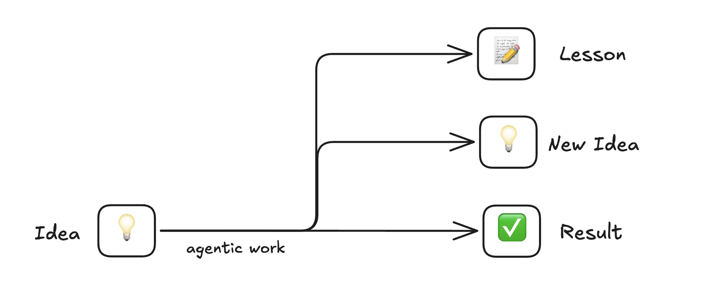
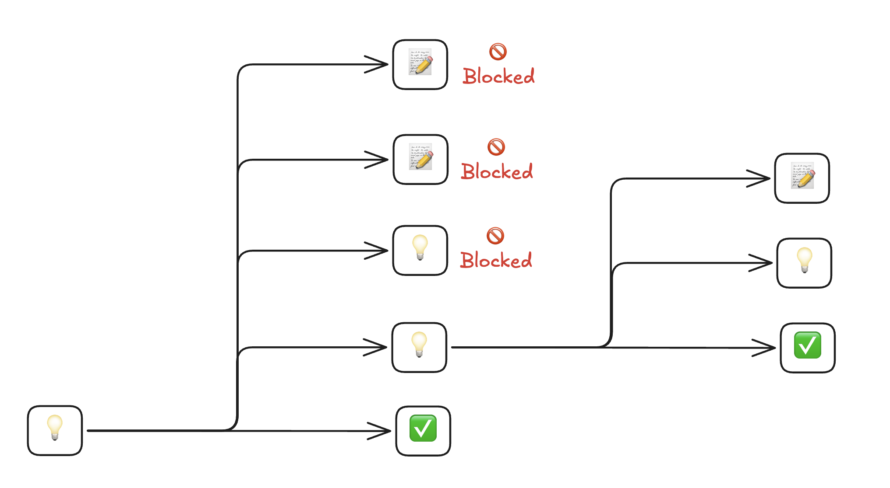
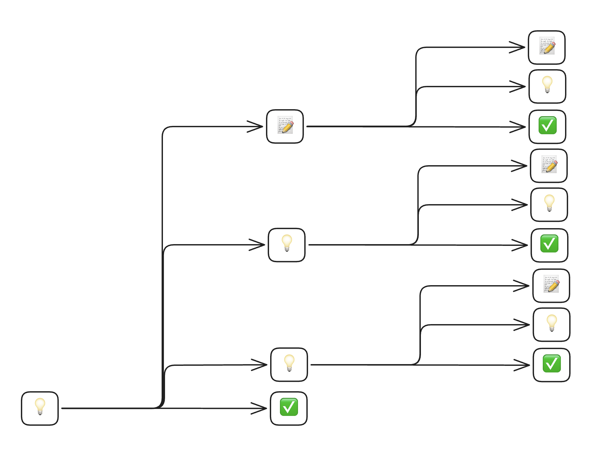

AgenC
=====
AgenC is a tmux-based control plane for teams of Claudes doing your bidding. I call it an "AI work factory".

### The Problem

Agentic work looks like this:



You drive a Claude or two, produce output, and generate more ideas + learnings on how to refine your config and prompts.

But you can't implement them all because Claude is the bottleneck:



Launching new Claudes is effortful: you have to ensure they don't step on each other, managing the various terminal windows is a circus, and if you don't want to run with `--dangerously-skip-permissions` you'll spend a lot of time refining `settings.json` permission configs. If you upgrade your prompts or configs, you have to hunt down the sessions and reload them manually.

### The Solution

AgenC isolates Claudes in self-contained sandboxed workspaces, makes it trivial to spawn side missions, and provides a command palette with the tools you need to herd everything:



The gap between "I need to do this thing" and "I'm doing this thing" stays near zero, no matter how many plates you're spinning.

It's like going from Minecraft to Starcraft.

Quick Start
-----------

### Prerequisites

- **macOS**
- **Claude Code** installed and in your PATH ([installation guide](https://docs.anthropic.com/en/docs/claude-code/getting-started))

### Install

```
brew tap mieubrisse/agenc
brew install agenc
```

This automatically installs required dependencies (`gh`, `fzf`, `tmux`).

### 1. Enter the tmux session

```
agenc tmux attach
```

This is the primary interface — the command palette, window management, and keybindings all live here.

### 2. Launch a mission

Start a new mission:

```
agenc mission new
```

Select **"Clone new repo"** from the picker, paste a GitHub URL or `owner/repo` shorthand, and AgenC clones the repo into an isolated sandbox and launches Claude ready to work. Each mission gets its own tmux window and its own copy of the repo, so multiple missions can run against the same repo without interfering.

You can also skip the picker by passing the repo directly:

```
agenc mission new owner/repo                          # shorthand
agenc mission new github.com/owner/repo               # canonical
agenc mission new https://github.com/owner/repo       # HTTPS URL
agenc mission new git@github.com:owner/repo.git       # SSH URL
```

Use Claude as you normally would. If your repo has a `.claude/secrets.env` file, AgenC automatically uses the [1Password CLI](https://developer.1password.com/docs/cli/) (`op`) to resolve the secret references therein and inject them as environment variables into the Claude process — keeping your MCP server tokens and API keys in 1Password rather than on disk. See [docs/1password.md](docs/1password.md) for details.

To launch a mission without a repo (e.g., for general-purpose tasks), use `agenc mission new --blank`.

### 3. Explore alongside Claude

Press `prefix + %` to split a shell pane in the mission's workspace directory. Handy for running tests, checking git status, or poking around while Claude works.

### 4. Spin up side missions

When you need to deviate — fix a bug in another repo, try a different approach, handle a quick task — open the **command palette** (`prefix + a, k`) and launch a new mission. Each mission is its own tmux window; switch between them with `prefix + n` / `prefix + p`.

The default command palette keybinding requires two keystrokes. You can bind a faster shortcut — the value is passed directly to `tmux bind-key`. For example, to use `Ctrl-y`:

```
agenc config set paletteTmuxKeybinding "-n C-y"
```

### 5. Ask the assistant

For housekeeping — cleaning up old missions, checking daemon status, configuring cron jobs — open the assistant from the command palette ("Talk to AgenC") or via:

```
agenc mission new --assistant
```

The assistant knows the full AgenC CLI and can manage the system on your behalf.

How It Works
------------

Most people treat their Claude sessions like pets — nursing context, afraid to close the window. AgenC makes them cheap. Stop a mission, fork off to handle something else, come back to the original later. The durable context lives in your Claude config, not in any single session.

AgenC is built on one principle: **[Inputs, Not Outputs](https://mieubrisse.substack.com/p/inputs-not-outputs)**. Instead of correcting an agent's output after the fact, you fix the input (its configuration) so the problem never recurs.

1. You launch a **mission** from a repo. AgenC clones the repo into an isolated sandbox and starts a Claude session.
2. When something goes wrong — bad output, missing permissions, wrong approach — you roll that lesson back into your Claude configuration (CLAUDE.md, settings.json, skills, etc.).
3. Every future mission benefits from the fix. Over time, your agents compound in capability.

Sandboxing and session management let you run dozens of missions simultaneously, each isolated from the others. For a detailed technical overview, see [System Architecture](docs/system-architecture.md).

> **Addiction Warning**
>
> AgenC is engrossing, fulfilling, pleasurable — and also restless. The system goes as fast as you can tell it what to do, so suddenly the limiting factor is your ability to make decisions. Your head buzzes with a dozen threads at once, constantly deciding, constantly building with no downtime.
>
> Fair warning: I have trouble sleeping because my head is always buzzing with mission ideas to send AgenC on. One more feature, one more fix, one more agent to tune. It doesn't stop.
>
> This isn't just AgenC. [Across the board, agentic work factories seem to have this effect](https://steve-yegge.medium.com/steveys-birthday-blog-34f437139cb5#:~:text=This%20week%20the,Even%20for%20him.).
>
> So please stop for breaks, and remember to make some wind-down time for sleep!

Workflows
---------

AgenC currently supports:

- **Human-in-the-loop coding:** Launch a mission on a repo, work with Claude interactively, commit and push from within the sandbox.
- **Human-in-the-loop assistant work with MCP:** Connect Claude to external services (Todoist, Notion, email) via MCP servers for inbox processing, calendar management, and similar tasks.
- **Scheduled autonomous work:** Define cron jobs that spawn headless missions on a schedule — daily reports, weekly cleanups, recurring maintenance.

The core loop is: launch missions, observe what works and what doesn't, refine your Claude config, and repeat. Basically, [painting with your mind](https://mieubrisse.substack.com/p/be-rembrandt).

Self-Management
---------------

AgenC includes a dedicated **assistant mission** type for managing AgenC itself. Launch one with `agenc mission new --assistant` (or select "🤖 AgenC assistant" from the fzf picker, or use the "🤖 Talk to AgenC" command palette entry). The assistant agent gets:

- A `SessionStart` hook that runs `agenc prime` to inject the CLI quick reference into the agent's context
- Permissions to run `agenc` commands and read/write the agenc data directory
- Project-level CLAUDE.md with assistant instructions

This means the assistant can:

- **Spawn missions:** `agenc mission new owner/repo --prompt "fix the auth bug"` to create new missions
- **Manage repos:** `agenc repo add owner/repo --sync` to register a new repo in the library
- **Configure crons:** edit `config.yml` directly to add or update scheduled jobs, then `agenc cron enable <name>`
- **Update config:** `agenc config set <key> <value>` to adjust agenc settings programmatically
- **Check system status:** `agenc daemon status`, `agenc mission ls`, `agenc cron ls`
- **Troubleshoot:** inspect mission directories, read logs, diagnose daemon issues

Regular missions do not include the assistant config or agenc permissions — they are focused on the code repository they were created for.

Interactive commands that require a terminal (fzf pickers, `$EDITOR`, confirmation prompts) detect non-TTY environments and return clear error messages with non-interactive alternatives, so agents never hang on interactive input.

Tips
----

- **Enable sandbox mode in Claude.** Run `/sandbox` from your global Claude Code to enable sandboxed command execution. This lets Claude run commands within sandbox restrictions without manual approval prompts on every action, and the setting carries into every AgenC mission. This is the recommended alternative to `--dangerously-skip-permissions`.
- **Rename missions when you stop them.** When you run `agenc mission stop`, give the mission a descriptive name so you can find it later with `agenc mission resume`. A wall of unnamed missions is hard to navigate.
- **Open a shell pane with prefix + %.** Inside the AgenC tmux session, the standard tmux split (`prefix + %`) opens a shell in the mission's workspace directory. Handy for running tests, checking git status, or poking around while Claude works.
- **Cycle between missions with prefix + n / prefix + p.** Each mission is a tmux window. Use the standard tmux shortcuts — `prefix + n` (next window) and `prefix + p` (previous window) — to move between them. You can also jump directly to a window by number with `prefix + <number>`.
- **Always commit and push.** Missions are ephemeral — their local filesystems don't persist. If your agent makes changes but doesn't push them, the work vanishes when the mission ends. Teach your agents (via CLAUDE.md) to commit and push after every meaningful change so that each mission's output is durable and independent.
- **Bind a friendlier hotkey for swap-pane.** When you split a pane with `prefix + %`, you'll often want to rearrange which side is which. The default tmux bindings (`prefix + {` / `prefix + }`) are awkward. Consider binding something like `C-;` in your `~/.tmux.conf` to swap to the other pane:
  ```
  bind -n 'C-;' select-pane -t :.+
  ```

Authentication
--------------

AgenC handles Claude credentials automatically. Each mission gets its own isolated Keychain entry, cloned from your global credentials at launch. OAuth tokens (for MCP servers like Todoist) propagate across missions — you only authenticate once.

Run `agenc login` for first-time setup or to refresh expired credentials. See [docs/authentication.md](docs/authentication.md) for the full details on credential flow and MCP OAuth tokens.

1Password Secret Injection
--------------------------

AgenC integrates with [1Password CLI](https://developer.1password.com/docs/cli/) to inject secrets at runtime without storing them on disk. Add a `.claude/secrets.env` file to your repo mapping environment variables to [1Password secret references](https://developer.1password.com/docs/cli/secret-references/), and AgenC handles the rest.

See [docs/1password.md](docs/1password.md) for setup instructions and examples.

Configuration
-------------

AgenC stores its state in `$AGENC_DIRPATH` (defaults to `~/.agenc`). The central configuration file is `$AGENC_DIRPATH/config/config.yml`.

Key features:

- **Synced repos** — keep repositories continuously up-to-date in a shared library
- **Cron jobs** — spawn headless missions on a schedule
- **Palette commands** — customize the tmux command palette and keybindings
- **Config auto-sync** — optionally back the config directory with Git for automatic versioning

See [docs/configuration.md](docs/configuration.md) for the full reference.

Troubleshooting
---------------

Run `agenc doctor` to check for common configuration issues.

### "Command Line Tools are too outdated"

If you see this error during installation:

```
Error: Your Command Line Tools are too outdated.
```

This is a [Homebrew requirement](https://docs.brew.sh/Common-Issues#homebrew-is-slow), not an AgenC issue. Homebrew requires up-to-date Xcode Command Line Tools to function, even when installing pre-built binaries.

To fix, update your Command Line Tools:

```
xcode-select --install
```

If that doesn't work, remove and reinstall:

```
sudo rm -rf /Library/Developer/CommandLineTools
xcode-select --install
```

Then retry `brew install agenc`.

Uninstall
---------

```
brew uninstall agenc
```

This removes the `agenc` binary. To also remove AgenC's data directory:

```
rm -rf ~/.agenc
```

If you customized `AGENC_DIRPATH`, remove that directory instead.

CLI Reference
-------------

Run `agenc --help` for available commands, or see [docs/cli/](docs/cli/) for complete documentation.

Theory
------

An AI agent is a probabilistic function. It takes input - context, instructions, tools - and produces a good output some percentage of the time. Not 100%. Never 100%. That's the fundamental constraint of the medium.

This is what makes AI agents different from traditional software. A well-written function returns the correct result every time. An AI agent returns a *useful* result most of the time, and the exact threshold depends on how well you've tuned it.

Your organization is a function too - composed of these agent functions. You have a coding agent, an email agent, a writing agent. Each is a probabilistic function with its own success rate. The org's overall capability is bounded by its weakest agents and degraded by uncertainty compounding across them.

This is what it means to "program an organization." The industrial capitalists could only approximate it - writing policies, training workers, hoping the message got through. You can do it precisely: adjust a prompt, add a permission, provide a better example. The agent updates immediately. The org function improves.

The key insight is that refining the outer function means refining the inner functions. Every time an agent misbehaves, that's signal. Capture it in the agent's config, and you've permanently raised its success rate. Do this systematically across all your agents, and the organization compounds in capability rather than in error.
