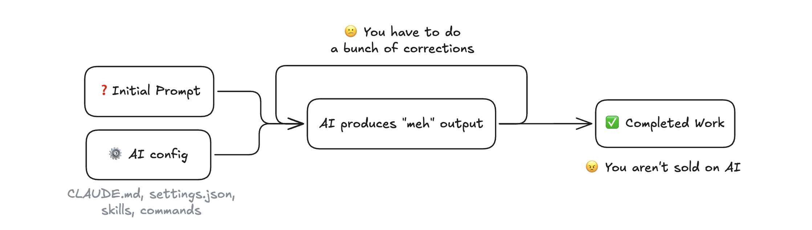
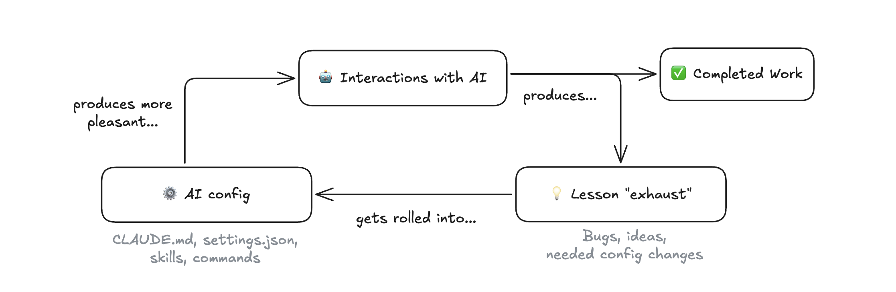
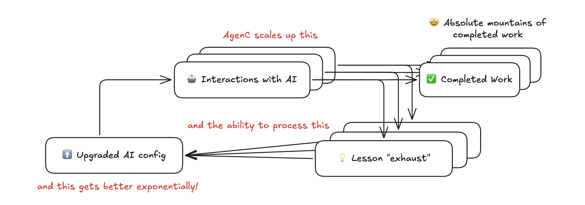
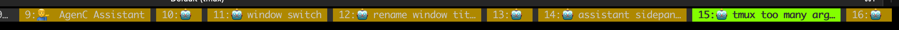

AgenC: From Minecraft to Starcraft
==================================
AgenC (pronounced "agency") is a self-upgrading AI work factory.

It establishes you as Director of your own personal organization of Claudes, and switches your work product from code/writing/completed tasks/whatever to building the org (factory) itself.

### Wait what?
If you're like most people, you use Claude like this:



Much better is John Rush's philosophy of [Inputs, Not Outputs](https://www.john-rush.com/posts/ai-20250701.html):



Each iteration of the loop makes all future outputs better.

Unfortunately, it's hard to scale this up. The Claudes start to step on each other, each lesson requires forking a new window, juggling all the windows becomes a circus, and you spend a bunch of time `cd`ing around and getting in and out of Claude.

That's where AgenC comes in:



Example: this was my terminal today - 16 Claudes each working on different features, bugs, and housekeeping.



It's like going from Minecraft to Starcraft.

> ⚠️ **ADDICTION WARNING** ⚠️
> AgenC **will** increase your output. But you should know it has a videogame-like addictive quality.
>
> Because it's so easy to launch work, you end up with tons of parallel threads. Like Starcraft, you enter this restless wired ADD state where you're managing dozens of things at once.
> 
> In building AgenC, I noticed it was really hard to switch off. My brain would be buzzing with new threads to launch, and I'd wake up in the middle of the night full of ideas.
>
> And it's not just AgenC - [we're seeing that these powerful AI tools have effects on our brains that we don't yet understand](https://steve-yegge.medium.com/the-ai-vampire-eda6e4f07163).
>
> Please remember to take breaks, and leave sufficient wind-down time before sleep!

Quick Start
-----------

### Prerequisites

- **macOS** (won't work on Linux yet)
- **Claude Code** installed and in your PATH ([installation guide](https://docs.anthropic.com/en/docs/claude-code/getting-started))

### Install

```
brew tap mieubrisse/agenc
brew install agenc
```

This automatically installs required dependencies (`gh`, `fzf`, `tmux`).

### 1. Initialize

Run `agenc config init` and answer the prompts. If this is your first time, say "yes" to creating a config repo - AgenC will sync it to GitHub automatically.

Config defaults to `~/.agenc`. Override with `AGENC_DIRPATH` if needed.

### 2. Launch

```bash
agenc attach
```

Pick a repo (recommend starting with your dotfiles) and start working. The Claude session is your mission.

View all missions: `agenc mission ls`

Navigate between missions with standard tmux window commands (`Ctrl-b n/p/[0-9]`).

### 3. Work alongside Claude

Split a shell pane (`Ctrl-b %`) to run commands or check git status while Claude works.

Suggested `~/.tmux.conf` bindings:

```tmux
bind -n C-h previous-window
bind -n C-l next-window
bind -n C-p split-window -h -c "#{pane_current_path}"
bind -n 'C-;' select-pane -t :.+
```

### 4. Spawn more missions

Open the command palette (`Ctrl-b a k`) and select "New Mission". Each mission is an independent Claude session.

### 5. Stop and resume

Exit Claude to stop a mission. Resume later with `agenc mission resume`.

Use `/rename` in Claude before exiting to make missions easier to identify. Remove finished missions with `agenc mission rm`.

Full CLI docs: [docs/cli/](docs/cli/)

### 6. Customize

Use the AgenC Assistant from the command palette to add custom commands, change keybindings, or modify settings.

Example - add a hotkey to open your dotfiles:

```bash
agenc config paletteCommand add \
  --name="open-dotfiles" \
  --title="📝 Open dotfiles" \
  --command="agenc tmux window new -- agenc mission new github.com/mieubrisse/dotfiles" \
  --keybinding="f"
```

Now `Ctrl-b a f` opens dotfiles instantly.

### 7. Secrets (optional)

For non-coding missions (Todoist, Notion, Google Workspace), use 1Password secret references in `.claude/secrets.env`:

```bash
SUBSTACK_SESSION_TOKEN="op://Private/Substack Session Token/credential"
SUBSTACK_USER_ID="op://Private/Substack Session Token/username"
```

Requires the [1Password CLI](https://developer.1password.com/docs/cli/get-started/). AgenC resolves references automatically before launching Claude.

### 8. Send feedback

Use "Send Feedback" in the command palette, ask the AgenC Assistant, or [join the Discord](https://discord.gg/x9Y8Se4XF3).

Tips
----
- **Enable sandbox mode in Claude.** Run `/sandbox` from your global Claude Code (not inside a mission) to enable sandboxed command execution. This allows Claude to run commands within defined sandbox restrictions without manual approval prompts on every action. The setting automatically carries into every AgenC mission. This is the recommended alternative to `--dangerously-skip-permissions`.

- **Rename missions when you stop them.** Use `/rename` inside Claude to give a mission a descriptive name before exiting. This makes finding and resuming the right mission much easier later when you run `agenc mission resume` or `agenc mission ls`.

- **Tell your agents to always commit and push.** Unpushed work sits stranded on the mission's local filesystem. Add instructions to your CLAUDE.md telling agents to `git push` immediately after every commit. This lets you fire-and-forget instructions to your agents, confident the work will persist even if the mission ends.

- **Bind friendlier tmux hotkeys.** Add these to your `~/.tmux.conf` for faster workflow:
  ```tmux
  # Window navigation
  bind -n C-h previous-window
  bind -n C-l next-window

  # Pane creation and swapping
  bind -n C-p split-window -h -c "#{pane_current_path}"
  bind -n 'C-;' select-pane -t :.+
  ```

  After editing `~/.tmux.conf`, reload with: `tmux source-file ~/.tmux.conf`


How It Works


### Authentication
Each mission gets a clone of your global Claude Code credentials token at launch. This token expires roughly once a day. With a single Claude Code instance, it refreshes seamlessly. The problem comes with multiple simultaneous instances: they all try to refresh the same token at once, invalidating each other in a thrashing loop that causes auth failures across all missions.

TODO:
- AgenC will show Claude commandline sttu

See [docs/authentication.md](docs/authentication.md) for the full details on credential flow and MCP OAuth tokens.

Configuration
-------------

AgenC stores its state in `$AGENC_DIRPATH` (defaults to `~/.agenc`). The central configuration file is `$AGENC_DIRPATH/config/config.yml`.

Key features:

- **Synced repos** — keep repositories continuously up-to-date in a shared library
- **Cron jobs** — spawn headless missions on a schedule
- **Palette commands** — customize the tmux command palette and keybindings
- **Config auto-sync** — optionally back the config directory with Git for automatic versioning

See [docs/configuration.md](docs/configuration.md) for the full reference.

Troubleshooting
---------------

Run `agenc doctor` to check for common configuration issues.

### "Command Line Tools are too outdated"

If you see this error during installation:

```
Error: Your Command Line Tools are too outdated.
```

This is a [Homebrew requirement](https://docs.brew.sh/Common-Issues#homebrew-is-slow), not an AgenC issue. Homebrew requires up-to-date Xcode Command Line Tools to function, even when installing pre-built binaries.

To fix, update your Command Line Tools:

```
xcode-select --install
```

If that doesn't work, remove and reinstall:

```
sudo rm -rf /Library/Developer/CommandLineTools
xcode-select --install
```

Then retry `brew install agenc`.

Uninstall
---------

```
brew uninstall agenc
```

This removes the `agenc` binary. To also remove AgenC's data directory:

```
rm -rf ~/.agenc
```

If you customized `AGENC_DIRPATH`, remove that directory instead.

CLI Reference
-------------

Run `agenc --help` for available commands, or see [docs/cli/](docs/cli/) for complete documentation.

Theory
------

An AI agent is a probabilistic function. It takes input - context, instructions, tools - and produces a good output some percentage of the time. Not 100%. Never 100%. That's the fundamental constraint of the medium.

This is what makes AI agents different from traditional software. A well-written function returns the correct result every time. An AI agent returns a *useful* result most of the time, and the exact threshold depends on how well you've tuned it.

Your organization is a function too - composed of these agent functions. You have a coding agent, an email agent, a writing agent. Each is a probabilistic function with its own success rate. The org's overall capability is bounded by its weakest agents and degraded by uncertainty compounding across them.

This is what it means to "program an organization." The industrial capitalists could only approximate it - writing policies, training workers, hoping the message got through. You can do it precisely: adjust a prompt, add a permission, provide a better example. The agent updates immediately. The org function improves.

The key insight is that refining the outer function means refining the inner functions. Every time an agent misbehaves, that's signal. Capture it in the agent's config, and you've permanently raised its success rate. Do this systematically across all your agents, and the organization compounds in capability rather than in error.
