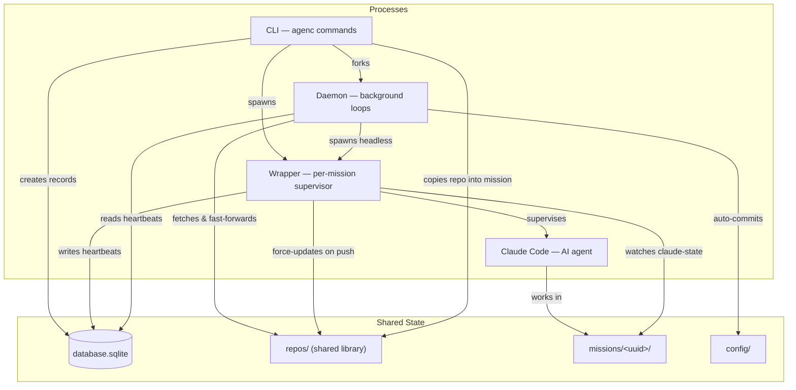

System Architecture
===================

AgenC is a CLI tool that runs AI agents (Claude Code instances) in isolated, per-mission sandboxes. It tracks all missions in a central database, manages a shared repository library, and keeps configuration version-controlled via a background daemon.

Read this document before making non-trivial changes to the codebase. It is the canonical map of how the system fits together — runtime processes, directory layout, package responsibilities, and cross-cutting patterns.


Process Overview
----------------

Three cooperating processes form the runtime. They share state exclusively through the filesystem and a SQLite database — there is no IPC, no sockets, and no message queue.



**Inter-process communication** relies entirely on filesystem artifacts and SQLite:

| Mechanism | Writer | Reader | Purpose |
|-----------|--------|--------|---------|
| `database.sqlite` | CLI, Wrapper | Daemon, CLI | Mission records, heartbeats |
| `missions/<uuid>/pid` | Wrapper | CLI (`mission stop`) | Process coordination |
| `missions/<uuid>/claude-state` | Claude (via hooks) | Wrapper (via fsnotify) | Idle detection, resume tracking |
| `daemon/daemon.pid` | Daemon | CLI (`daemon stop/status`) | Process coordination |
| `.git/refs/remotes/origin/<branch>` | Git (after push) | Wrapper (via fsnotify) | Trigger repo library update |


Runtime Processes
-----------------

### CLI

The CLI is the user-facing entry point. It parses commands, manages the database, creates mission directories, and spawns wrapper processes.

- Entry point: `main.go`
- Commands: `cmd/` (Cobra-based; one file per command or command group)
- Full command reference: `docs/cli/`

### Daemon

The daemon is a long-running background process that performs periodic maintenance. It is forked by `agenc daemon start` and detaches from the parent terminal via `setsid`.

- Entry point: `internal/daemon/daemon.go` (`Daemon.Run`)
- Process management: `internal/daemon/process.go` (PID file, fork, stop)
- PID file: `$AGENC_DIRPATH/daemon/daemon.pid`
- Log file: `$AGENC_DIRPATH/daemon/daemon.log`

The daemon runs five concurrent goroutines:

**1. Repo update loop** (`internal/daemon/template_updater.go`)
- Runs every 60 seconds
- Fetches and fast-forwards all repos in the synced set: `config.yml` `syncedRepos` + `claudeConfig.repo` + repos from missions with a recent heartbeat (< 5 minutes)
- Refreshes `origin/HEAD` every 10 cycles (~10 minutes) via `git remote set-head origin --auto`

**2. Config auto-commit loop** (`internal/daemon/config_auto_commit.go`)
- Runs every 10 minutes (first cycle delayed by 10 minutes after startup)
- If `$AGENC_DIRPATH/config/` is a Git repo with uncommitted changes: stages all, commits with timestamp message, pushes (if `origin` remote exists)

**3. Cron scheduler loop** (`internal/daemon/cron_scheduler.go`)
- Runs every 60 seconds (immediate first cycle)
- Reads enabled cron jobs from `config.yml`, checks which are due
- Spawns headless missions for due crons, respecting max concurrent limit and overlap policies
- On startup, adopts orphaned headless missions from a previous daemon instance
- On shutdown, gracefully terminates all running cron missions

**4. Config watcher loop** (`internal/daemon/config_watcher.go`)
- Initializes the shadow repo on first run, then watches `~/.claude` for changes via fsnotify
- On change (debounced at 500ms), ingests tracked files into the shadow repo (see "Shadow repo" under Key Architectural Patterns)
- Watches both the `~/.claude` directory and all tracked subdirectories, resolving symlinks to watch actual targets

**5. Keybindings writer loop** (`internal/daemon/keybindings_writer.go`)
- Writes the tmux keybindings file on startup and every 5 minutes
- Sources the keybindings into any running tmux server after writing
- Ensures keybindings stay current after binary upgrades (daemon auto-restarts on version bump)

### Wrapper

The wrapper is a per-mission foreground process that supervises a Claude child process. One wrapper runs per active mission.

- Entry point: `internal/wrapper/wrapper.go` (`Wrapper.Run` for interactive, `Wrapper.RunHeadless` for headless)
- Tmux integration: `internal/wrapper/tmux.go`

The wrapper:

1. Writes the wrapper PID to `$AGENC_DIRPATH/missions/<uuid>/pid`
2. Writes initial claude-state as `idle`
3. Spawns Claude as a child process (with 1Password wrapping if `secrets.env` exists)
4. Sets `CLAUDE_CONFIG_DIR` to the per-mission config directory
5. Sets `AGENC_MISSION_UUID` for the child process
6. Starts three background goroutines:
   - **Heartbeat writer** — updates `last_heartbeat` in the database every 30 seconds
   - **Claude-state watcher** — watches `claude-state` file via fsnotify; tracks whether a resumable conversation exists
   - **Remote refs watcher** (if mission has a git repo) — watches `.git/refs/remotes/origin/<branch>` for pushes; when detected, force-updates the repo library clone so other missions get fresh copies (debounced at 5 seconds)
7. Main event loop waits for either Claude to exit or a signal (SIGINT/SIGTERM/SIGHUP)

**Interactive mode** (`Run`): pipes stdin/stdout/stderr directly to the terminal. On signal, forwards it to Claude and waits for exit.

**Headless mode** (`RunHeadless`): runs `claude --print -p <prompt>`, captures output to `claude-output.log` with log rotation (10MB max, 3 backups). Supports timeout and graceful shutdown (SIGTERM then SIGKILL after 30 seconds).


Directory Structure
-------------------

### Source tree

```
.
├── main.go                       # CLI entry point
├── Makefile                      # Build with version injection via ldflags
├── go.mod / go.sum
├── README.md
├── CLAUDE.md                     # Agent instructions for working on this codebase
├── AGENTS.md                     # Agent definitions
├── cmd/                          # CLI commands (Cobra); see docs/cli/ for full reference
├── internal/
│   ├── config/                   # Path management, YAML config
│   ├── database/                 # SQLite CRUD
│   ├── mission/                  # Mission lifecycle, Claude spawning
│   ├── claudeconfig/             # Per-mission config merging, shadow repo
│   ├── daemon/                   # Background loops
│   ├── tmux/                     # Tmux keybindings generation
│   ├── wrapper/                  # Claude child process management
│   ├── history/                  # Prompt extraction from history.jsonl
│   ├── session/                  # Session name resolution
│   ├── version/                  # Build-time version string
│   └── tableprinter/             # ANSI-aware table formatting
├── docs/                         # Documentation
│   └── cli/                      # Generated CLI reference
├── specs/                        # Design specs (historical reference)
└── scripts/                      # Utility scripts
```

### Runtime tree (`$AGENC_DIRPATH`, defaults to `~/.agenc/`)

```
$AGENC_DIRPATH/
├── database.sqlite                        # SQLite: missions table
│
├── config/                                # User configuration (optionally a git repo)
│   ├── config.yml                         # Synced repos, Claude config source, cron jobs
│   └── claude-modifications/              # AgenC-specific Claude config overrides
│       ├── CLAUDE.md                      # Appended to user's CLAUDE.md during merge
│       └── settings.json                  # Deep-merged with user's settings.json
│
├── claude-config-shadow/                  # Shadow repo tracking ~/.claude config
│   ├── .git/                              # Local-only Git repo (auto-committed)
│   ├── CLAUDE.md                          # Normalized copy of ~/.claude/CLAUDE.md
│   ├── settings.json                      # Normalized copy of ~/.claude/settings.json
│   ├── skills/                            # Normalized copy of ~/.claude/skills/
│   ├── hooks/                             # Normalized copy of ~/.claude/hooks/
│   ├── commands/                          # Normalized copy of ~/.claude/commands/
│   └── agents/                            # Normalized copy of ~/.claude/agents/
│
├── repos/                                 # Shared repo library (daemon syncs these)
│   └── github.com/owner/repo/            # One clone per repo
│
├── missions/                              # Per-mission sandboxes
│   └── <uuid>/
│       ├── agent/                         # Git repo working directory
│       ├── claude-config/                 # Per-mission CLAUDE_CONFIG_DIR
│       │   ├── CLAUDE.md                  # Merged: shadow repo + claude-modifications
│       │   ├── settings.json              # Merged + hooks + deny entries
│       │   ├── .claude.json               # Copy of user's account identity + trust entry
│       │   ├── skills/                    # From shadow repo (path-rewritten)
│       │   ├── hooks/                     # From shadow repo (path-rewritten)
│       │   ├── commands/                  # From shadow repo (path-rewritten)
│       │   ├── agents/                    # From shadow repo (path-rewritten)
│       │   └── plugins/                   # Symlink to ~/.claude/plugins/
│       ├── pid                            # Wrapper process ID
│       ├── claude-state                   # "idle" or "busy" (written by Claude hooks)
│       ├── wrapper.log                    # Wrapper lifecycle log
│       └── claude-output.log              # Headless mode output (with rotation)
│
└── daemon/
    ├── daemon.pid                         # Daemon process ID
    ├── daemon.log                         # Daemon log
    └── daemon.version                     # Last recorded daemon version
```


Configuration Reference
-----------------------

For the full `config.yml` reference (keys, defaults, annotated examples) and environment variables, see the [Configuration section of the README](../README.md#configuration). The config file is parsed by `internal/config/agenc_config.go`.


Core Packages
-------------

### `internal/config/`

Path management and YAML configuration. All path construction flows from `GetAgencDirpath()`, which reads `$AGENC_DIRPATH` and falls back to `~/.agenc`.

- `config.go` — path helper functions (`GetMissionDirpath`, `GetRepoDirpath`, `GetDatabaseFilepath`, etc.), directory structure initialization (`EnsureDirStructure`), constant definitions for filenames and directory names
- `agenc_config.go` — `AgencConfig` struct (YAML round-trip with comment preservation), `CronConfig` struct, validation functions for repo format, cron names, schedules, timeouts, and overlap policies. Cron expression evaluation via the `gronx` library.
- `first_run.go` — `IsFirstRun()` detection

### `internal/mission/`

Mission lifecycle: directory creation, repo copying, and Claude process spawning.

- `mission.go` — `CreateMissionDir` (sets up mission directory, copies git repo, builds per-mission config), `SpawnClaude`/`SpawnClaudeWithPrompt`/`SpawnClaudeResume` (construct and start Claude `exec.Cmd` with 1Password integration and environment variables)
- `repo.go` — git repository operations: `CopyRepo`/`CopyAgentDir` (rsync-based), `ForceUpdateRepo` (fetch + reset to remote default branch), `ParseRepoReference`/`ParseGitHubRemoteURL` (handle shorthand, canonical, SSH, and HTTPS URL formats), `EnsureRepoClone`, `DetectPreferredProtocol` (infers SSH vs HTTPS from existing repos)

### `internal/claudeconfig/`

Per-mission Claude configuration building, merging, and shadow repo management.

- `build.go` — `BuildMissionConfigDir` (copies trackable items from shadow repo with path rewriting, merges CLAUDE.md and settings.json, copies and patches .claude.json with trust entry, clones Keychain credentials, symlinks plugins), `CloneKeychainCredentials`/`DeleteKeychainCredentials` (per-mission Keychain entry management), `ComputeCredentialServiceName`, `GetMissionClaudeConfigDirpath` (falls back to global config if per-mission doesn't exist), `ResolveConfigCommitHash`, `EnsureShadowRepo`
- `merge.go` — `DeepMergeJSON` (objects merge recursively, arrays concatenate, scalars overlay), `MergeClaudeMd` (concatenation), `MergeSettings` (deep-merge user + modifications, then apply operational overrides), `RewriteSettingsPaths` (selective path rewriting preserving permissions block)
- `overrides.go` — `AgencHookEntries` (Stop and UserPromptSubmit hooks for idle detection), `AgencDenyPermissionTools` (deny Read/Glob/Grep/Write/Edit on repo library), `BuildRepoLibraryDenyEntries`
- `shadow.go` — shadow repo for tracking the user's `~/.claude` config (see "Shadow repo" under Key Architectural Patterns)

### `internal/database/`

SQLite mission tracking with auto-migration.

- `database.go` — `DB` struct (wraps `sql.DB` with max connections = 1 for SQLite), `Mission` struct, CRUD operations (`CreateMission`, `ListMissions`, `GetMission`, `ResolveMissionID`, `ArchiveMission`, `DeleteMission`), heartbeat updates, session name caching, cron association tracking. Idempotent migrations handle schema evolution.

### `internal/daemon/`

Background daemon with five concurrent loops.

- `daemon.go` — `Daemon` struct, `Run` method that starts and coordinates all goroutines
- `process.go` — daemon lifecycle: `ForkDaemon` (re-executes binary as detached process via setsid), `ReadPID`, `IsProcessRunning`, `StopDaemon` (SIGTERM then SIGKILL)
- `template_updater.go` — repo update loop (60-second interval, fetches synced + active-mission repos)
- `config_auto_commit.go` — config auto-commit loop (10-minute interval, git add/commit/push)
- `cron_scheduler.go` — cron scheduler loop (60-second interval, spawns headless missions, overlap policies, orphan adoption)
- `config_watcher.go` — config watcher loop (fsnotify on `~/.claude`, 500ms debounce, ingests into shadow repo)
- `keybindings_writer.go` — keybindings writer loop (writes and sources tmux keybindings file every 5 minutes)

### `internal/tmux/`

Tmux keybindings generation, shared by the CLI (`tmux inject`) and daemon.

- `keybindings.go` — `GenerateKeybindingsContent`, `WriteKeybindingsFile`, `SourceKeybindings`

### `internal/wrapper/`

Per-mission Claude child process management.

- `wrapper.go` — `Wrapper` struct, `Run` (interactive mode), `RunHeadless` (headless mode with timeout and log rotation), background goroutines (heartbeat, claude-state watcher, remote refs watcher), signal handling
- `tmux.go` — tmux window renaming when `AGENC_TMUX=1`

### Utility packages

- `internal/version/` — single `Version` string set via ldflags at build time (`version.go`)
- `internal/history/` — `FindFirstPrompt` extracts the first user prompt from Claude's `history.jsonl` for a given mission UUID (`history.go`)
- `internal/session/` — `FindSessionName` resolves a mission's session name from Claude metadata (priority: custom-title > sessions-index.json summary > JSONL summary) (`session.go`)
- `internal/tableprinter/` — ANSI-aware table formatting using `rodaine/table` with `runewidth` for wide character support (`tableprinter.go`)


Key Architectural Patterns
--------------------------

### Per-mission config merging

Each mission gets its own `claude-config/` directory, built at creation time from three sources:

1. **Shadow repo** — a verbatim copy of the user's `~/.claude` config (CLAUDE.md, settings.json, skills, hooks, commands, agents), with `~/.claude` paths rewritten at build time to point to the mission's concrete config path. See "Shadow repo" below.
2. **AgenC modifications** — files in `$AGENC_DIRPATH/config/claude-modifications/` that overlay the user's config
3. **AgenC operational overrides** — programmatically injected hooks and deny permissions

Plugins are handled separately: `plugins/` is a symlink to `~/.claude/plugins/` rather than a copy.

Merging logic (`internal/claudeconfig/merge.go`):
- CLAUDE.md: simple concatenation (user content + modifications content)
- settings.json: recursive deep merge (user as base, modifications as overlay), then append operational overrides (hooks and deny entries)
- Deep merge rules: objects merge recursively, arrays concatenate, scalars from the overlay win

Credentials are handled separately: `.claude.json` is copied from the user's account identity file and patched with a trust entry for the mission's agent directory. Auth credentials are cloned as a per-mission macOS Keychain entry named `Claude Code-credentials-<hash>` (where `<hash>` is the first 8 hex chars of the SHA-256 of the mission's CLAUDE_CONFIG_DIR path). Claude Code looks up credentials by this naming convention when CLAUDE_CONFIG_DIR is set to a non-default path. On mission deletion, the cloned Keychain entry is cleaned up.

### Shadow repo

The shadow repo (`internal/claudeconfig/shadow.go`) tracks the user's `~/.claude` configuration in a local Git repository at `$AGENC_DIRPATH/claude-config-shadow/`. This provides version history for Claude config changes without modifying the user's `~/.claude` directory.

**Tracked items:**
- Files: `CLAUDE.md`, `settings.json`
- Directories: `skills/`, `hooks/`, `commands/`, `agents/`

**Storage:** Files are stored verbatim — no path transformation on ingest. The shadow repo is a faithful copy of `~/.claude` tracked items.

**Path rewriting:** Path rewriting is a one-way operation at build time only (`RewriteClaudePaths`). When `BuildMissionConfigDir` creates the per-mission config, `~/.claude` paths (absolute, `${HOME}/.claude`, and `~/.claude` forms) are rewritten to point to the mission's `claude-config/` directory. For `settings.json`, rewriting is selective: the `permissions` block is preserved unchanged while all other fields (hooks, etc.) are rewritten (`RewriteSettingsPaths`).

**Workflow:** `IngestFromClaudeDir` copies tracked items from `~/.claude` into the shadow repo as-is and auto-commits if anything changed. Commits are authored as `AgenC <agenc@local>`. The daemon's config watcher loop (`internal/daemon/config_watcher.go`) triggers ingestion automatically whenever `~/.claude` changes are detected via fsnotify.

### Idle detection via Claude Code hooks

The wrapper needs to know whether a resumable conversation exists. This is accomplished via Claude Code's hook system.

The config merge injects two hooks into each mission's `settings.json` (`internal/claudeconfig/overrides.go`):

- **Stop hook** — writes `idle` to the `claude-state` file when Claude finishes responding
- **UserPromptSubmit hook** — writes `busy` to `claude-state` when the user submits a prompt

The `claude-state` file lives at `$AGENC_DIRPATH/missions/<uuid>/claude-state`. The hooks reference it via `$CLAUDE_PROJECT_DIR/../claude-state`.

The wrapper watches this file using fsnotify on the parent directory (not the file itself, because shell redirects like `echo idle > file` may atomically replace the file, which would break a direct file watch). When the state becomes `busy`, the wrapper records that a resumable conversation exists (`hasConversation` flag), enabling `claude -c` on resume.

### Heartbeat system

Each wrapper writes a heartbeat to the database every 30 seconds (`internal/wrapper/wrapper.go:writeHeartbeat`). The daemon uses heartbeat staleness (> 5 minutes) to determine which missions are actively running and should have their repos included in the sync cycle (`internal/daemon/template_updater.go`).

### Repo library

All repos are cloned into a shared library at `$AGENC_DIRPATH/repos/github.com/owner/repo/`. Missions copy from this library at creation time rather than cloning directly from GitHub.

The daemon keeps the library fresh by fetching and fast-forwarding every 60 seconds. The wrapper contributes by watching `.git/refs/remotes/origin/<branch>` for push events — when a mission pushes to its repo, the wrapper immediately force-updates the corresponding library clone so other missions get the changes without waiting for the next daemon cycle (debounced at 5 seconds).

Missions are denied Read/Glob/Grep/Write/Edit access to the repo library directory via injected deny permissions in settings.json (`internal/claudeconfig/overrides.go`).

### 1Password secret injection

When a mission's `agent/.claude/secrets.env` file exists, Claude is launched via `op run --env-file secrets.env --no-masking -- claude [args]`. The 1Password CLI resolves vault references (e.g., `op://vault/item/field`) into actual secret values and injects them as environment variables. If `secrets.env` is absent, Claude launches directly without `op`.

Implemented in `internal/mission/mission.go:buildClaudeCmd` and `internal/wrapper/wrapper.go:buildHeadlessClaudeCmd`.

### Config auto-sync

The `$AGENC_DIRPATH/config/` directory can optionally be a Git repo. The daemon's config auto-commit loop (`internal/daemon/config_auto_commit.go`) checks every 10 minutes: if there are uncommitted changes, it stages all, commits with a timestamped message, and pushes (skipping push if no `origin` remote exists). This keeps agent configuration version-controlled without manual effort.

### Cron scheduling

Cron jobs are defined in `config.yml` under the `crons` key. The daemon's cron scheduler (`internal/daemon/cron_scheduler.go`) evaluates cron expressions every 60 seconds using the `gronx` library.

Key behaviors:
- **Max concurrent limit** — configurable via `cronsMaxConcurrent` (default: 10). Crons are skipped when the limit is reached.
- **Overlap policies** — `skip` (default): skips if the previous run is still active. `allow`: permits concurrent runs of the same cron.
- **Double-fire guard** — checks the database for a mission created by this cron in the current minute, preventing duplicate spawns.
- **Orphan adoption** — on daemon startup, queries the database for cron-spawned missions, checks their wrapper PIDs, and adopts any that are still running into the scheduler's tracking map.
- **Graceful shutdown** — on daemon stop, sends SIGINT to all running cron missions and waits up to 60 seconds before force-killing.

Cron missions run in headless mode (`wrapper.RunHeadless`) with configurable timeout (default: 1 hour), capturing output to `claude-output.log` with log rotation.


Data Flow: Mission Lifecycle
-----------------------------

### Creation (`agenc mission new`)

1. CLI ensures the daemon is running and a config source repo is registered
2. Resolves the git repo reference (URL, shorthand, or fzf picker) and ensures it is cloned into the repo library
3. Creates a database record — generates UUID + 8-char short ID, records the git repo name, config source commit hash, and optional cron association
4. Creates the mission directory structure: copies the repo from the library via rsync, then builds the per-mission Claude config directory (see "Per-mission config merging")
5. Creates a `Wrapper` and calls `Run` or `RunHeadless` depending on flags

### Running

1. Wrapper writes PID file and initial `claude-state` as `idle`
2. Wrapper spawns Claude (with 1Password wrapping if `secrets.env` exists), setting `CLAUDE_CONFIG_DIR` and `AGENC_MISSION_UUID`
3. Background goroutines start: heartbeat writer, claude-state watcher, remote refs watcher
4. Main event loop blocks until Claude exits or a signal arrives
5. Daemon concurrently syncs the mission's repo while the heartbeat is fresh

### Stopping

- **User-initiated** (`agenc mission stop`): reads PID file, sends SIGINT to wrapper, wrapper forwards to Claude, waits for exit, cleans up PID file
- **Natural exit**: Claude exits on its own (e.g., user types `/exit`), wrapper detects via `cmd.Wait()`, cleans up
- **Headless timeout**: context cancellation triggers SIGTERM to Claude, then SIGKILL after 30 seconds

### Resuming (`agenc mission resume`)

1. Creates a new `Wrapper` and calls `Run(isResume=true)`
2. If the previous wrapper recorded a conversation (via the `hasConversation` flag from idle detection), spawns `claude -c` to resume the last conversation; otherwise spawns a fresh Claude session
3. The wrapper re-enters the same running lifecycle: PID file, background goroutines, event loop


Failure Modes
-------------

**Daemon dies while missions are running.** Missions are unaffected — each wrapper is an independent process. The repo library stops syncing and cron jobs stop scheduling. Restarting the daemon (`agenc daemon restart`) restores both. The cron scheduler adopts orphaned headless missions on startup.

**Wrapper crashes or is killed.** Claude continues running as an orphaned process (it is a child process, but not monitored). The PID file becomes stale. The heartbeat stops updating, so the daemon drops the mission from its repo sync set after 5 minutes. A subsequent `agenc mission stop` will detect the stale PID.

**Repo fetch fails.** The daemon logs the error and moves on to the next repo. The failed repo retries on the next 60-second cycle. Missions already running are unaffected since they have their own copy.

**Database is locked.** SQLite is configured with max connections = 1. Concurrent access from the CLI, daemon, and wrapper is serialized. If a long-running transaction blocks others, they wait (SQLite's default busy timeout applies).

**Claude crashes mid-mission.** The wrapper detects the exit via `cmd.Wait()`, cleans up the PID file, and exits. The mission can be resumed with `agenc mission resume` if a conversation was recorded.


Database Schema
---------------

### `missions` table

| Column | Type | Description |
|--------|------|-------------|
| `id` | TEXT (PK) | Full UUID |
| `short_id` | TEXT (UNIQUE) | First 8 characters of UUID, for user-friendly display |
| `git_repo` | TEXT | Canonical repo name (`github.com/owner/repo`), empty for blank missions |
| `config_commit` | TEXT | Config source repo HEAD hash at mission creation (nullable) |
| `status` | TEXT | `active` or `archived` |
| `prompt` | TEXT | First user prompt, cached for listing display |
| `last_heartbeat` | TEXT | Last wrapper heartbeat timestamp (RFC3339, nullable) |
| `session_name` | TEXT | User-assigned or auto-generated session name |
| `session_name_updated_at` | TEXT | When `session_name` was last updated (nullable) |
| `cron_id` | TEXT | UUID of the cron that spawned this mission (nullable) |
| `cron_name` | TEXT | Name of the cron job (nullable, used for orphan tracking) |
| `created_at` | TEXT | Mission creation timestamp (RFC3339) |
| `updated_at` | TEXT | Last update timestamp (RFC3339) |

SQLite is opened with max connections = 1 (`SetMaxOpenConns(1)`) due to its single-writer limitation. Migrations are idempotent and run on every database open.
