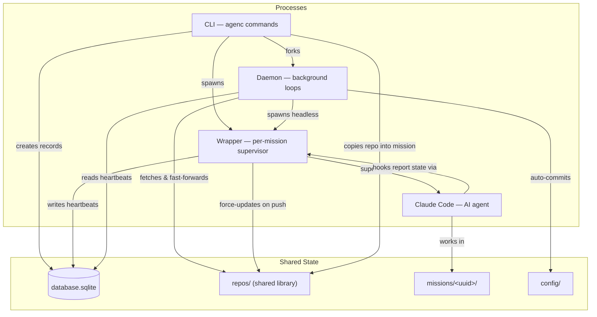

System Architecture
===================

AgenC is a CLI tool that runs AI agents (Claude Code instances) in isolated, per-mission sandboxes. It tracks all missions in a central database, manages a shared repository library, and keeps configuration version-controlled via a background daemon.

Read this document before making non-trivial changes to the codebase. It is the canonical map of how the system fits together — runtime processes, directory layout, package responsibilities, and cross-cutting patterns.


Process Overview
----------------

Three cooperating processes form the runtime. They share state through the filesystem, a SQLite database, and per-mission unix sockets (for wrapper commands).



**Inter-process communication** relies on filesystem artifacts, SQLite, and per-mission unix sockets:

| Mechanism | Writer | Reader | Purpose |
|-----------|--------|--------|---------|
| `database.sqlite` | CLI, Wrapper | Daemon, CLI | Mission records, heartbeats, pane tracking |
| `missions/<uuid>/pid` | Wrapper | CLI (`mission stop`) | Process coordination |
| `missions/<uuid>/wrapper.sock` | Wrapper (listener) | CLI, hooks (`mission send claude-update`) | Restart commands, Claude state updates |
| `daemon/daemon.pid` | Daemon | CLI (`daemon stop/status`) | Process coordination |
| `.git/refs/remotes/origin/<branch>` | Git (after push) | Wrapper (via fsnotify) | Trigger repo library update |


Runtime Processes
-----------------

### CLI

The CLI is the user-facing entry point. It parses commands, manages the database, creates mission directories, and spawns wrapper processes.

- Entry point: `main.go`
- Commands: `cmd/` (Cobra-based; one file per command or command group)
- Full command reference: `docs/cli/`

### Daemon

The daemon is a long-running background process that performs periodic maintenance. It is forked by `agenc daemon start` and detaches from the parent terminal via `setsid`.

- Entry point: `internal/daemon/daemon.go` (`Daemon.Run`)
- Process management: `internal/daemon/process.go` (PID file, fork, stop)
- PID file: `$AGENC_DIRPATH/daemon/daemon.pid`
- Log file: `$AGENC_DIRPATH/daemon/daemon.log`

The daemon runs five concurrent goroutines:

**1. Repo update loop** (`internal/daemon/template_updater.go`)
- Runs every 60 seconds
- Fetches and fast-forwards all repos in the synced set: `config.yml` `repoConfig` entries with `alwaysSynced: true` + repos from missions with a recent heartbeat (< 5 minutes)
- Refreshes `origin/HEAD` every 10 cycles (~10 minutes) via `git remote set-head origin --auto`

**2. Config auto-commit loop** (`internal/daemon/config_auto_commit.go`)
- Runs every 10 minutes (first cycle delayed by 10 minutes after startup)
- If `$AGENC_DIRPATH/config/` is a Git repo with uncommitted changes: stages all, commits with timestamp message, pushes (if `origin` remote exists)

**3. Config watcher loop** (`internal/daemon/config_watcher.go`)
- Initializes the shadow repo on first run, then watches both `~/.claude` and `config.yml` for changes via fsnotify
- On `~/.claude` changes (debounced at 500ms), ingests tracked files into the shadow repo (see "Shadow repo" under Key Architectural Patterns)
- On `config.yml` changes (debounced at 500ms), triggers cron sync to launchd plists
- Watches both the `~/.claude` directory and all tracked subdirectories, resolving symlinks to watch actual targets

**4. Keybindings writer loop** (`internal/daemon/keybindings_writer.go`)
- Writes the tmux keybindings file on startup and every 5 minutes
- Sources the keybindings into any running tmux server after writing
- Ensures keybindings stay current after binary upgrades (daemon auto-restarts on version bump)

**5. Mission summarizer loop** (`internal/daemon/mission_summarizer.go`)
- Runs every 2 minutes
- Queries the database for active missions where `prompt_count - last_summary_prompt_count >= 10`
- For each eligible mission: extracts recent user messages from session JSONL, calls Claude Haiku via `claude --print --model claude-haiku-4-5-20251001` to generate a 3-8 word description, stores the result in the `ai_summary` database column
- Skips missions that already have a custom title from `/rename` (resets the counter without generating a new summary)
- Uses the Claude CLI subprocess rather than a direct API call to avoid requiring users to configure an API key (see code comment for performance tradeoff note)

### Wrapper

The wrapper is a per-mission foreground process that supervises a Claude child process. One wrapper runs per active mission.

- Entry point: `internal/wrapper/wrapper.go` (`Wrapper.Run` for interactive, `Wrapper.RunHeadless` for headless)
- Tmux integration: `internal/wrapper/tmux.go`

The wrapper:

1. Writes the wrapper PID to `$AGENC_DIRPATH/missions/<uuid>/pid`
2. Records the tmux pane ID in the database (cleared on exit) for pane→mission resolution
3. Reads the OAuth token from the token file and sets `CLAUDE_CODE_OAUTH_TOKEN` in the child environment
4. Resolves the Claude model: checks the repo's `defaultModel` in `config.yml`, falls back to the top-level `defaultModel`, or omits `--model` entirely (letting Claude choose its default)
5. Spawns Claude as a child process (with 1Password wrapping if `secrets.env` exists), passing `--model <value>` if a model was resolved
6. Sets `CLAUDE_CONFIG_DIR` to the per-mission config directory
7. Sets `AGENC_MISSION_UUID` for the child process
8. Starts background goroutines:
   - **Heartbeat writer** — updates `last_heartbeat` in the database every 60 seconds
   - **Remote refs watcher** (if mission has a git repo) — watches `.git/refs/remotes/origin/<branch>` for pushes; when detected, force-updates the repo library clone so other missions get fresh copies (debounced at 5 seconds)
   - **Socket listener** (interactive mode only) — listens on `wrapper.sock` for JSON commands (restart, claude_update)
   - **`watchCredentialUpwardSync`** — polls per-mission Keychain every 60s; when hash changes, merges to global and broadcasts via `global-credentials-expiry`
   - **`watchCredentialDownwardSync`** — fsnotify on `global-credentials-expiry`; when another mission broadcasts, pulls global credentials into per-mission Keychain
9. Main event loop implements a three-state machine (see below)

**Interactive mode** (`Run`): pipes stdin/stdout/stderr directly to the terminal. On signal, forwards it to Claude and waits for exit. Supports restart commands via unix socket.

**Headless mode** (`RunHeadless`): runs `claude --print -p <prompt>`, captures output to `claude-output.log` with log rotation (10MB max, 3 backups). Supports timeout and graceful shutdown (SIGTERM then SIGKILL after 30 seconds). No socket listener — headless missions are one-shot and don't need restart support.

**Three-state restart machine** (interactive mode only):

```
  ┌─────────┐  restart cmd   ┌────────────────┐  claude idle   ┌────────────┐
  │ Running │ ─────────────→ │ RestartPending  │ ────────────→ │ Restarting │
  └─────────┘                └────────────────┘               └────────────┘
       ↑                                                            │
       └────────────────────────────────────────────────────────────┘
                              claude respawned

  Hard restart skips RestartPending — goes directly Running → Restarting.
```

- **Running** + Claude exits → natural exit, wrapper exits
- **Restarting** + Claude exits → wrapper-initiated restart, respawn Claude
- **RestartPending** + Claude becomes idle → transition to Restarting, SIGINT Claude
- Restarts are idempotent: duplicate requests return ok. A hard restart overrides a pending graceful.

**Socket protocol**: one JSON request per connection (connect → send → receive → close). Socket path: `missions/<uuid>/wrapper.sock`. Commands:
- `restart` — mode `graceful` (wait for idle, SIGINT, resume with `claude -c`) or `hard` (SIGKILL immediately, fresh session)
- `claude_update` — sent by Claude hooks to report state changes (event types: `Stop`, `UserPromptSubmit`, `Notification`, `PostToolUse`, `PostToolUseFailure`). The wrapper uses these to track idle state, conversation existence, trigger deferred restarts, and set tmux pane colors for visual feedback.

**Token passthrough at spawn time**: the wrapper reads the OAuth token from `$AGENC_DIRPATH/cache/oauth-token` and passes it to Claude via the `CLAUDE_CODE_OAUTH_TOKEN` environment variable. All missions share the same token file. When the user updates the token (`agenc config set claudeCodeOAuthToken <new-token>`), new missions pick it up immediately; running missions get the new token on their next restart.

**Model resolution at spawn time**: the wrapper resolves the Claude model from `config.yml` using a precedence chain: the repo's `repoConfig` `defaultModel` (if set) takes priority over the top-level `defaultModel` (if set). When a model is resolved, the wrapper passes `--model <value>` to the Claude CLI. If neither level specifies a model, `--model` is omitted and Claude uses its own default.


Directory Structure
-------------------

### Source tree

```
.
├── main.go                       # CLI entry point
├── Makefile                      # Build with version injection via ldflags
├── go.mod / go.sum
├── README.md
├── CLAUDE.md                     # Agent instructions for working on this codebase
├── AGENTS.md                     # Agent definitions
├── cmd/                          # CLI commands (Cobra); see docs/cli/ for full reference
│   ├── session.go                # `session` command group
│   ├── session_print.go          # `session print` — print raw JSONL transcript for a session
│   ├── mission_print.go          # `mission print` — print JSONL for a mission's current session
│   ├── gendocs/                  # Build-time CLI doc generator
│   └── genskill/                 # Build-time CLI quick reference generator (agenc prime)
├── internal/
│   ├── config/                   # Path management, YAML config
│   ├── database/                 # SQLite CRUD
│   ├── mission/                  # Mission lifecycle, Claude spawning
│   ├── claudeconfig/             # Per-mission config merging, shadow repo
│   ├── daemon/                   # Background loops
│   ├── tmux/                     # Tmux keybindings generation
│   ├── wrapper/                  # Claude child process management
│   ├── history/                  # Prompt extraction from history.jsonl
│   ├── session/                  # Session name resolution and transcript access
│   ├── version/                  # Build-time version string
│   └── tableprinter/             # ANSI-aware table formatting
├── docs/                         # Documentation
│   └── cli/                      # Generated CLI reference
├── specs/                        # Design specs (historical reference)
└── scripts/                      # Utility scripts
```

### Runtime tree (`$AGENC_DIRPATH`, defaults to `~/.agenc/`)

```
$AGENC_DIRPATH/
├── database.sqlite                        # SQLite: missions table
├── statusline-wrapper.sh                  # Shared statusline wrapper script
├── statusline-original-cmd                # User's original statusLine.command (saved on first build)
│
├── cache/                                 # Cached runtime data (not committed to Git)
│   └── oauth-token                        # Claude Code OAuth token (mode 600)
│
├── config/                                # User configuration (optionally a git repo)
│   ├── config.yml                         # Synced repos, Claude config source, cron jobs
│   └── claude-modifications/              # AgenC-specific Claude config overrides
│       ├── CLAUDE.md                      # Appended to user's CLAUDE.md during merge
│       └── settings.json                  # Deep-merged with user's settings.json
│
├── claude-config-shadow/                  # Shadow repo tracking ~/.claude config
│   ├── .git/                              # Local-only Git repo (auto-committed)
│   ├── CLAUDE.md                          # Normalized copy of ~/.claude/CLAUDE.md
│   ├── settings.json                      # Normalized copy of ~/.claude/settings.json
│   ├── skills/                            # Normalized copy of ~/.claude/skills/
│   ├── hooks/                             # Normalized copy of ~/.claude/hooks/
│   ├── commands/                          # Normalized copy of ~/.claude/commands/
│   └── agents/                            # Normalized copy of ~/.claude/agents/
│
├── repos/                                 # Shared repo library (daemon syncs these)
│   └── github.com/owner/repo/            # One clone per repo
│
├── missions/                              # Per-mission sandboxes
│   └── <uuid>/
│       ├── .adjutant                      # Marker file (empty); present only for adjutant missions
│       ├── agent/                         # Git repo working directory
│       ├── claude-config/                 # Per-mission CLAUDE_CONFIG_DIR
│       │   ├── CLAUDE.md                  # Merged: shadow repo + claude-modifications (+ adjutant instructions for adjutant missions)
│       │   ├── settings.json              # Merged + hooks + deny entries (+ adjutant permissions for adjutant missions)
│       │   ├── .claude.json               # Copy of user's account identity + trust entry
│       │   ├── skills/                    # From shadow repo (path-rewritten)
│       │   ├── hooks/                     # From shadow repo (path-rewritten)
│       │   ├── commands/                  # From shadow repo (path-rewritten)
│       │   ├── agents/                    # From shadow repo (path-rewritten)
│       │   ├── plugins/                   # Symlink to ~/.claude/plugins/
│       │   └── projects/                  # Symlink to ~/.claude/projects/ (persistent sessions)
│       ├── pid                            # Wrapper process ID
│       ├── wrapper.sock                   # Unix socket for wrapper commands (restart, claude_update)
│       ├── wrapper.log                    # Wrapper lifecycle log
│       ├── statusline-message             # Per-mission statusline message (e.g. token expiry warning)
│       └── claude-output.log              # Headless mode output (with rotation)
│
└── daemon/
    ├── daemon.pid                         # Daemon process ID
    ├── daemon.log                         # Daemon log
    └── daemon.version                     # Last recorded daemon version
```


Configuration Reference
-----------------------

For the full `config.yml` reference (keys, defaults, annotated examples) and environment variables, see the [Configuration section of the README](../README.md#configuration). The config file is parsed by `internal/config/agenc_config.go`.


Core Packages
-------------

### `internal/config/`

Path management and YAML configuration. All path construction flows from `GetAgencDirpath()`, which reads `$AGENC_DIRPATH` and falls back to `~/.agenc`.

- `config.go` — path helper functions (`GetMissionDirpath`, `GetRepoDirpath`, `GetDatabaseFilepath`, `GetCacheDirpath`, `GetOAuthTokenFilepath`, etc.), directory structure initialization (`EnsureDirStructure`), constant definitions for filenames and directory names, adjutant mission detection (`IsMissionAdjutant` checks for `.adjutant` marker file), OAuth token file read/write (`ReadOAuthToken`, `WriteOAuthToken`)
- `agenc_config.go` — `AgencConfig` struct (YAML round-trip with comment preservation, `defaultModel` for specifying the default Claude model), `RepoConfig` struct (per-repo settings: `alwaysSynced`, `windowTitle`, `trustedMcpServers`, `defaultModel`), `TrustedMcpServers` struct (custom YAML marshal/unmarshal supporting `all` string or a list of named servers), `CronConfig` struct, `PaletteCommandConfig` struct (user-defined and builtin palette entries with optional tmux keybindings), `PaletteTmuxKeybinding` (configurable key for the command palette, defaults to `k`), `BuiltinPaletteCommands` defaults map, `GetResolvedPaletteCommands` merge logic, validation functions for repo format, cron names, palette command names, schedules, timeouts, and overlap policies. Cron expression evaluation via the `gronx` library.
- `first_run.go` — `IsFirstRun()` detection

### `internal/mission/`

Mission lifecycle: directory creation, repo copying, and Claude process spawning.

- `mission.go` — `CreateMissionDir` (sets up mission directory, copies git repo, builds per-mission config), `SpawnClaude`/`SpawnClaudeWithPrompt`/`SpawnClaudeResume` (construct and start Claude `exec.Cmd` with 1Password integration, environment variables, and `--model` flag when a `defaultModel` is configured)
- `repo.go` — git repository operations: `CopyRepo`/`CopyAgentDir` (rsync-based), `ForceUpdateRepo` (fetch + reset to remote default branch), `ParseRepoReference`/`ParseGitHubRemoteURL` (handle shorthand, canonical, SSH, and HTTPS URL formats), `EnsureRepoClone`, `DetectPreferredProtocol` (infers SSH vs HTTPS from existing repos)

### `internal/claudeconfig/`

Per-mission Claude configuration building, merging, and shadow repo management.

- `build.go` — `BuildMissionConfigDir` (copies trackable items from shadow repo with path rewriting, merges CLAUDE.md and settings.json, copies and patches .claude.json with trust entry, symlinks plugins and projects), `GetMissionClaudeConfigDirpath` (falls back to global config if per-mission doesn't exist), `GetLastSessionID` (reads the mission's per-project `.claude.json` to resolve the current session UUID), `ResolveConfigCommitHash`, `EnsureShadowRepo`. Keychain credential functions (`CloneKeychainCredentials`, `WriteBackKeychainCredentials`, `DeleteKeychainCredentials`) handle MCP OAuth token propagation: `CloneKeychainCredentials` is called at mission spawn to seed the per-mission entry from global; `WriteBackKeychainCredentials` is called at mission exit to merge tokens back to global; `DeleteKeychainCredentials` is called by `agenc mission rm` to clean up the per-mission Keychain entry. Claude's own authentication uses the token file approach (see `internal/config/`).
- `merge.go` — `DeepMergeJSON` (objects merge recursively, arrays concatenate, scalars overlay), `MergeClaudeMd` (concatenation), `MergeSettings` (deep-merge user + modifications, then apply operational overrides), `RewriteSettingsPaths` (selective path rewriting preserving permissions block)
- `overrides.go` — `AgencHookEntries` (Stop, UserPromptSubmit, and Notification hooks for idle detection and state tracking via socket), `AgencDenyPermissionTools` (deny Read/Glob/Grep/Write/Edit on repo library), `BuildRepoLibraryDenyEntries`
- `prime_content.go` — embeds the CLI quick reference generated at build time by `cmd/genskill/` from the Cobra command tree. Content is printed by `agenc prime` and injected into adjutant missions via a `SessionStart` hook.
- `adjutant.go` — adjutant mission config builders: `buildAdjutantClaudeMd` (appends adjutant instructions), `buildAdjutantSettings` (injects adjutant permissions), `BuildAdjutantAllowEntries`/`BuildAdjutantDenyEntries` (permission entry generators)
- `adjutant_claude.md` — embedded CLAUDE.md instructions for adjutant missions (tells the agent it is the Adjutant, directs CLI usage, establishes filesystem access boundaries)
- `shadow.go` — shadow repo for tracking the user's `~/.claude` config (see "Shadow repo" under Key Architectural Patterns)

### `internal/database/`

SQLite mission tracking with auto-migration.

- `database.go` — `DB` struct (wraps `sql.DB` with max connections = 1 for SQLite), `Mission` struct, CRUD operations (`CreateMission`, `ListMissions`, `GetMission`, `ResolveMissionID`, `ArchiveMission`, `DeleteMission`), heartbeat updates, session name caching, cron association tracking. Idempotent migrations handle schema evolution.

### `internal/daemon/`

Background daemon with five concurrent loops.

- `daemon.go` — `Daemon` struct, `Run` method that starts and coordinates all goroutines, initial cron sync on startup
- `process.go` — daemon lifecycle: `ForkDaemon` (re-executes binary as detached process via setsid), `ReadPID`, `IsProcessRunning`, `StopDaemon` (SIGTERM then SIGKILL)
- `template_updater.go` — repo update loop (60-second interval, fetches synced + active-mission repos)
- `config_auto_commit.go` — config auto-commit loop (10-minute interval, git add/commit/push)
- `cron_syncer.go` — cron syncer: synchronizes `config.yml` cron jobs to macOS launchd plists in `~/Library/LaunchAgents/`, reconciles orphaned plists on startup
- `config_watcher.go` — config watcher loop (fsnotify on `~/.claude` and `config.yml`, 500ms debounce, ingests into shadow repo and triggers cron sync)
- `keybindings_writer.go` — keybindings writer loop (writes and sources tmux keybindings file every 5 minutes)
- `mission_summarizer.go` — mission summarizer loop (2-minute interval, generates AI descriptions for tmux window titles via Claude Haiku CLI subprocess)

### `internal/launchd/`

macOS launchd integration for cron scheduling.

- `plist.go` — `Plist` struct and XML generation, `ParseCronExpression` (converts cron expressions to `StartCalendarInterval`), `CronToPlistFilename` (sanitizes cron names), `PlistDirpath` helper
- `manager.go` — `Manager` wraps launchctl operations: `LoadPlist`, `UnloadPlist`, `IsLoaded`, `RemovePlist` (two-step: unload then delete), `ListAgencCronJobs`, `VerifyLaunchctlAvailable`

### `internal/tmux/`

Tmux keybindings generation and version detection, shared by the CLI (`tmux inject`) and daemon.

- `keybindings.go` — `GenerateKeybindingsContent`, `WriteKeybindingsFile`, `SourceKeybindings`. Keybinding generation accepts the detected tmux version and a slice of `CustomKeybinding` entries (built from resolved palette commands). Version-gates features: the command palette keybinding (`display-popup`) is only emitted on tmux >= 3.2. The hardcoded key table entry (`prefix + a`) and palette popup (`k`) remain fixed; all other keybindings (including built-in defaults like `n`, `p`, `d`) are driven by the resolved palette commands.
- `version.go` — `ParseVersion` (parses `tmux -V` output), `DetectVersion` (runs `tmux -V` and parses the result). Used by keybindings generation, the daemon, and the CLI to detect the installed tmux version.

### `internal/wrapper/`

Per-mission Claude child process management.

- `wrapper.go` — `Wrapper` struct, `Run` (interactive mode with three-state restart machine), `RunHeadless` (headless mode with timeout and log rotation), background goroutines (heartbeat, remote refs watcher, socket listener), `handleClaudeUpdate` (processes hook events for idle tracking and pane coloring), signal handling, OAuth token passthrough via `CLAUDE_CODE_OAUTH_TOKEN` environment variable, model resolution from `defaultModel` config (repo-level then top-level) passed as `--model` to the Claude CLI
- `credential_sync.go` — MCP OAuth credential sync goroutines: `initCredentialHash` (baseline hash at spawn), `watchCredentialUpwardSync` (polls per-mission Keychain every 60s; when hash changes, merges to global and writes broadcast timestamp to `global-credentials-expiry`), `watchCredentialDownwardSync` (fsnotify on `global-credentials-expiry`; when another mission broadcasts, pulls global into per-mission Keychain)
- `socket.go` — unix socket listener, `Command`/`Response` protocol types (including `Event` and `NotificationType` fields for `claude_update` commands), `commandWithResponse` internal type for synchronous request/response
- `client.go` — `SendCommand` and `SendCommandWithTimeout` helpers for CLI/daemon/hook use, `ErrWrapperNotRunning` sentinel error
- `tmux.go` — tmux window renaming when inside any tmux session (`$TMUX` set) (startup: `AGENC_WINDOW_NAME` > config.yml `windowTitle` > repo short name > mission ID; dynamic on Stop events: custom title from /rename > AI summary from daemon > auto-generated session name), pane color management (`setWindowBusy`, `setWindowNeedsAttention`, `resetWindowTabStyle`) for visual mission status feedback, pane registration/clearing for mission resolution

### Utility packages

- `internal/version/` — single `Version` string set via ldflags at build time (`version.go`)
- `internal/history/` — `FindFirstPrompt` extracts the first user prompt from Claude's `history.jsonl` for a given mission UUID (`history.go`)
- `internal/session/` — `FindSessionName` resolves a mission's session name from Claude metadata (priority: custom-title > sessions-index.json summary > JSONL summary) (`session.go`), `FindCustomTitle` returns only the /rename custom title (`session.go`), `FindSessionJSONLPath` locates the JSONL transcript file for a session UUID by searching all project directories under `~/.claude/projects/` (`session.go`), `ListSessionIDs` returns all session UUIDs for a mission sorted by modification time (most recent first) by scanning the mission's project directory for `.jsonl` files (`session.go`), `TailJSONLFile` reads the last N lines from a JSONL file and writes them to a given writer, or writes the entire file when N is zero (`session.go`), `ExtractRecentUserMessages` extracts user message contents from session JSONL for AI summarization (`conversation.go`)
- `internal/tableprinter/` — ANSI-aware table formatting using `rodaine/table` with `runewidth` for wide character support (`tableprinter.go`)


Key Architectural Patterns
--------------------------

### Per-mission config merging

Each mission gets its own `claude-config/` directory, built at creation time from four sources:

1. **Shadow repo** — a verbatim copy of the user's `~/.claude` config (CLAUDE.md, settings.json, skills, hooks, commands, agents), with `~/.claude` paths rewritten at build time to point to the mission's concrete config path. See "Shadow repo" below.
2. **`agenc prime` hook** — for adjutant missions only, a `SessionStart` hook in the project-level settings runs `agenc prime`, which prints the CLI quick reference into the agent's context. Content is generated at build time from the Cobra command tree (`cmd/genskill/`).
3. **AgenC modifications** — files in `$AGENC_DIRPATH/config/claude-modifications/` that overlay the user's config
4. **AgenC operational overrides** — programmatically injected hooks and deny permissions

**Adjutant missions** (`agenc mission new --adjutant`) receive additional configuration beyond the standard merge. The presence of the `.adjutant` marker file in the mission directory triggers conditional logic in `BuildMissionConfigDir`:

- **CLAUDE.md** — the adjutant-specific instructions (`internal/claudeconfig/adjutant_claude.md`) are appended after the standard user + modifications merge
- **settings.json** — adjutant permissions are injected: allow entries for Read/Write/Edit/Glob/Grep on `$AGENC_DIRPATH/**` and `Bash(agenc:*)`, plus deny entries for Write/Edit on other missions' agent directories
- **`agenc prime` SessionStart hook** — project-level hook in adjutant missions only (regular missions do not get it)

Two directories are symlinked rather than copied: `plugins/` → `~/.claude/plugins/` (so plugin installations are shared), and `projects/` → `~/.claude/projects/` (so conversation transcripts and auto-memory persist beyond the mission lifecycle).

Merging logic (`internal/claudeconfig/merge.go`):
- CLAUDE.md: simple concatenation (user content + modifications content)
- settings.json: recursive deep merge (user as base, modifications as overlay), then append operational overrides (hooks and deny entries)
- Deep merge rules: objects merge recursively, arrays concatenate, scalars from the overlay win

Credentials are handled in two layers. Claude's own authentication uses a token file at `$AGENC_DIRPATH/cache/oauth-token` — the wrapper reads this at spawn time and passes it as `CLAUDE_CODE_OAUTH_TOKEN` in the child environment. MCP server OAuth tokens (`mcpOAuth`) use the macOS Keychain: at spawn time the wrapper clones the global `"Claude Code-credentials"` entry into a per-mission entry (`"Claude Code-credentials-<8hexchars>"`). Two goroutines keep these in sync: upward sync detects hash changes in the per-mission entry and merges them to global; downward sync watches a broadcast file (`global-credentials-expiry`) for changes made by other missions and pulls the updated global entry into the per-mission entry.

### Shadow repo

The shadow repo (`internal/claudeconfig/shadow.go`) tracks the user's `~/.claude` configuration in a local Git repository at `$AGENC_DIRPATH/claude-config-shadow/`. This provides version history for Claude config changes without modifying the user's `~/.claude` directory.

**Tracked items:**
- Files: `CLAUDE.md`, `settings.json`
- Directories: `skills/`, `hooks/`, `commands/`, `agents/`

**Storage:** Files are stored verbatim — no path transformation on ingest. The shadow repo is a faithful copy of `~/.claude` tracked items.

**Path rewriting:** Path rewriting is a one-way operation at build time only (`RewriteClaudePaths`). When `BuildMissionConfigDir` creates the per-mission config, `~/.claude` paths (absolute, `${HOME}/.claude`, and `~/.claude` forms) are rewritten to point to the mission's `claude-config/` directory. For `settings.json`, rewriting is selective: the `permissions` block is preserved unchanged while all other fields (hooks, etc.) are rewritten (`RewriteSettingsPaths`).

**Workflow:** `IngestFromClaudeDir` copies tracked items from `~/.claude` into the shadow repo as-is and auto-commits if anything changed. Commits are authored as `AgenC <agenc@local>`. The daemon's config watcher loop (`internal/daemon/config_watcher.go`) triggers ingestion automatically whenever `~/.claude` changes are detected via fsnotify.

### Idle detection via socket

The wrapper needs to know whether Claude is idle and whether a resumable conversation exists. This is accomplished via Claude Code hooks that send state updates directly to the wrapper's unix socket.

The config merge injects five hooks into each mission's `settings.json` (`internal/claudeconfig/overrides.go`):

- **Stop hook** — calls `agenc mission send claude-update $AGENC_MISSION_UUID Stop` when Claude finishes responding
- **UserPromptSubmit hook** — calls `agenc mission send claude-update $AGENC_MISSION_UUID UserPromptSubmit` when the user submits a prompt
- **Notification hook** — calls `agenc mission send claude-update $AGENC_MISSION_UUID Notification` when Claude needs user attention (permission prompts, idle prompts, elicitation dialogs)
- **PostToolUse hook** — calls `agenc mission send claude-update $AGENC_MISSION_UUID PostToolUse` after a tool call succeeds
- **PostToolUseFailure hook** — calls `agenc mission send claude-update $AGENC_MISSION_UUID PostToolUseFailure` after a tool call fails

The `agenc mission send claude-update` command reads hook JSON from stdin (to extract `notification_type` for Notification events), then sends a `claude_update` command to the wrapper's unix socket with a 1-second timeout. It always exits 0 to avoid blocking Claude.

The wrapper processes these updates in its main event loop (`handleClaudeUpdate`):
- **Stop** → marks Claude idle, records that a conversation exists, sets tmux pane to attention color, triggers deferred restart if pending, updates tmux window title (priority: custom title from /rename > AI summary from daemon > auto-generated session name)
- **UserPromptSubmit** → marks Claude busy, records that a conversation exists, resets tmux pane to default color, updates `last_active` in the database, increments `prompt_count` (used by the daemon's mission summarizer to determine summarization eligibility)
- **Notification** → sets tmux pane to attention color for `permission_prompt`, `idle_prompt`, and `elicitation_dialog` notification types
- **PostToolUse / PostToolUseFailure** → sets tmux pane to busy color; corrects the window color after a permission prompt (which turns the pane orange) when Claude resumes work after the user responds

### Statusline wrapper

The statusline wrapper (`$AGENC_DIRPATH/statusline-wrapper.sh`) intercepts Claude Code's `statusLine` feature to display per-mission messages. During config building, the user's original `statusLine.command` is saved to `$AGENC_DIRPATH/statusline-original-cmd`, and the merged `settings.json` is patched to invoke the wrapper script with the mission's message file path as an argument.

The wrapper script reads stdin (the JSON payload from Claude Code), checks whether the per-mission `statusline-message` file exists and is non-empty, and either displays its contents or delegates to the user's original command.

### Tmux pane coloring

The wrapper provides visual feedback by setting the tmux pane background color when Claude needs user attention (`internal/wrapper/tmux.go`). When Claude stops responding, encounters a permission prompt, or shows an elicitation dialog, the pane background turns dark teal (`colour022`). When the user submits a new prompt, the pane resets to the default background. The pane style is also reset on wrapper exit. All pane color operations are no-ops outside tmux (`TMUX_PANE` empty).

### Mission pane tracking

Each wrapper records its tmux pane ID (`TMUX_PANE`) in the database's `tmux_pane` column on startup and clears it on exit (`internal/wrapper/tmux.go`). This enables tmux keybindings and the command palette to resolve which mission is focused in the current pane.

The resolution flow:

1. A tmux keybinding calls `agenc tmux resolve-mission "$(tmux display-message -p "#{pane_id}")"` to look up the focused pane's mission UUID
2. The UUID is exported as `AGENC_CALLING_MISSION_UUID`
3. For the palette: the env var is passed into the popup so `buildPaletteEntries` can filter out mission-scoped commands when no mission is focused, and the var is available to executed commands via `sh -c`
4. For direct keybindings: mission-scoped keybindings (those whose command contains `AGENC_CALLING_MISSION_UUID`) include a guard that skips execution when the UUID is empty

Commands reference `$AGENC_CALLING_MISSION_UUID` as a plain shell variable — no special placeholder syntax. The palette detects mission-scoped commands by checking whether the command string contains the env var name (`ResolvedPaletteCommand.IsMissionScoped()`).

### Heartbeat system

Each wrapper writes a heartbeat to the database every 60 seconds (`internal/wrapper/wrapper.go:writeHeartbeat`). The daemon uses heartbeat staleness (> 5 minutes) to determine which missions are actively running and should have their repos included in the sync cycle (`internal/daemon/template_updater.go`).

The `last_active` column tracks a different signal: when the user last submitted a prompt to the mission's Claude session (`internal/wrapper/wrapper.go:handleClaudeUpdate`). Unlike `last_heartbeat`, which stops updating when the wrapper exits, `last_active` persists indefinitely and reflects true user engagement. Mission listing and the switcher sort by `last_active` first, falling back to `last_heartbeat` then `created_at`.

### Repo library

All repos are cloned into a shared library at `$AGENC_DIRPATH/repos/github.com/owner/repo/`. Missions copy from this library at creation time rather than cloning directly from GitHub.

The daemon keeps the library fresh by fetching and fast-forwarding every 60 seconds. The wrapper contributes by watching `.git/refs/remotes/origin/<branch>` for push events — when a mission pushes to its repo, the wrapper immediately force-updates the corresponding library clone so other missions get the changes without waiting for the next daemon cycle (debounced at 5 seconds).

Missions are denied Read/Glob/Grep/Write/Edit access to the repo library directory via injected deny permissions in settings.json (`internal/claudeconfig/overrides.go`).

### 1Password secret injection

When a mission's `agent/.claude/secrets.env` file exists, Claude is launched via `op run --env-file secrets.env --no-masking -- claude [args]`. The 1Password CLI resolves vault references (e.g., `op://vault/item/field`) into actual secret values and injects them as environment variables. If `secrets.env` is absent, Claude launches directly without `op`.

Implemented in `internal/mission/mission.go:buildClaudeCmd` and `internal/wrapper/wrapper.go:buildHeadlessClaudeCmd`.

### Config auto-sync

The `$AGENC_DIRPATH/config/` directory can optionally be a Git repo. The daemon's config auto-commit loop (`internal/daemon/config_auto_commit.go`) checks every 10 minutes: if there are uncommitted changes, it stages all, commits with a timestamped message, and pushes (skipping push if no `origin` remote exists). This keeps agent configuration version-controlled without manual effort.

### Cron scheduling

Cron jobs are defined in `config.yml` under the `crons` key. The daemon syncs cron configuration to macOS launchd plists in `~/Library/LaunchAgents/`.

**Architecture:**
```
config.yml → fsnotify → daemon → cron syncer → launchd plists → launchd → agenc mission new
```

The daemon's cron syncer (`internal/daemon/cron_syncer.go`, `internal/launchd/`) handles synchronization:

**Plist management:**
- Each cron job generates a plist file: `agenc-cron-{cronName}.plist`
- Plists contain `StartCalendarInterval` scheduling directives parsed from cron expressions
- Enabled crons: plist is written and loaded into launchd
- Disabled crons: plist is unloaded from launchd (but file remains)
- Deleted crons: plist is unloaded and file is deleted

**Sync triggers:**
- On daemon startup: full sync of all crons
- On `config.yml` change: incremental sync (debounced at 500ms)
- Orphan cleanup: on startup, scans `~/Library/LaunchAgents/` for `agenc-cron-*.plist` files not in config and removes them (unload + delete)

**Execution flow:**
1. launchd triggers at scheduled time
2. Invokes `agenc mission new --headless --cron-trigger=<cronName> --prompt=<prompt> [repo]`
3. `mission_new.go` checks `--cron-trigger` flag
4. Double-fire prevention: queries database for most recent mission with matching `cron_name`
5. If found and status != "completed", exit 0 (skip)
6. Otherwise, proceed with normal mission creation

**Key behaviors:**
- **Scheduling reliability** — launchd handles scheduling, survives daemon restarts
- **Double-fire prevention** — queries `GetMostRecentMissionForCron` by `cron_name`, skips if status is active
- **No max concurrent limit** — macOS handles process management
- **Cron expression support** — basic expressions only (`minute hour day month weekday`), no `*/N` syntax

Cron missions run in headless mode (`wrapper.RunHeadless`) with configurable timeout (default: 1 hour), capturing output to `claude-output.log` with log rotation.


Data Flow: Mission Lifecycle
-----------------------------

### Creation (`agenc mission new`)

1. CLI ensures the daemon is running and a config source repo is registered
2. Resolves the git repo reference (URL, shorthand, or fzf picker) and ensures it is cloned into the repo library
3. Creates a database record — generates UUID + 8-char short ID, records the git repo name, config source commit hash, and optional cron association
4. Creates the mission directory structure: copies the repo from the library via rsync, then builds the per-mission Claude config directory (see "Per-mission config merging")
5. Creates a `Wrapper` and calls `Run` or `RunHeadless` depending on flags

### Running

1. Wrapper writes PID file, starts socket listener
2. Wrapper reads OAuth token from token file, spawns Claude (with 1Password wrapping if `secrets.env` exists), setting `CLAUDE_CONFIG_DIR`, `AGENC_MISSION_UUID`, `CLAUDE_CODE_OAUTH_TOKEN`, and `--model` if a `defaultModel` is configured (repo-level overrides top-level)
3. Background goroutines start: heartbeat writer, remote refs watcher, credential upward sync, credential downward sync
4. Claude hooks send state updates to the wrapper socket (`claude_update` commands); the wrapper uses these for idle detection, conversation tracking, deferred restarts, and tmux pane coloring
5. Main event loop blocks until Claude exits or a signal arrives
6. Daemon concurrently syncs the mission's repo while the heartbeat is fresh

### Stopping

- **User-initiated** (`agenc mission stop`): reads PID file, sends SIGINT to wrapper, wrapper forwards to Claude, waits for exit, cleans up PID file
- **Natural exit**: Claude exits on its own (e.g., user types `/exit`), wrapper detects via `cmd.Wait()`, cleans up
- **Headless timeout**: context cancellation triggers SIGTERM to Claude, then SIGKILL after 30 seconds

### Resuming (`agenc mission resume`)

1. Creates a new `Wrapper` and calls `Run(isResume=true)`
2. If the previous wrapper recorded a conversation (via the `hasConversation` flag from idle detection), spawns `claude -c` to resume the last conversation; otherwise spawns a fresh Claude session
3. The wrapper re-enters the same running lifecycle: PID file, background goroutines, event loop


Failure Modes
-------------

**Daemon dies while missions are running.** Missions are unaffected — each wrapper is an independent process. The repo library stops syncing and cron jobs stop scheduling. Restarting the daemon (`agenc daemon restart`) restores both. The cron scheduler adopts orphaned headless missions on startup.

**Wrapper crashes or is killed.** Claude continues running as an orphaned process (it is a child process, but not monitored). The PID file becomes stale. The heartbeat stops updating, so the daemon drops the mission from its repo sync set after 5 minutes. A subsequent `agenc mission stop` will detect the stale PID.

**Repo fetch fails.** The daemon logs the error and moves on to the next repo. The failed repo retries on the next 60-second cycle. Missions already running are unaffected since they have their own copy.

**Database is locked.** SQLite is configured with max connections = 1. Concurrent access from the CLI, daemon, and wrapper is serialized. If a long-running transaction blocks others, they wait (SQLite's default busy timeout applies).

**Claude crashes mid-mission.** The wrapper detects the exit via `cmd.Wait()`, cleans up the PID file, and exits. The mission can be resumed with `agenc mission resume` if a conversation was recorded.


Database Schema
---------------

### `missions` table

| Column | Type | Description |
|--------|------|-------------|
| `id` | TEXT (PK) | Full UUID |
| `short_id` | TEXT (UNIQUE) | First 8 characters of UUID, for user-friendly display |
| `git_repo` | TEXT | Canonical repo name (`github.com/owner/repo`), empty for blank missions |
| `config_commit` | TEXT | Config source repo HEAD hash at mission creation (nullable) |
| `status` | TEXT | `active` or `archived` |
| `prompt` | TEXT | First user prompt, cached for listing display |
| `last_heartbeat` | TEXT | Last wrapper heartbeat timestamp (RFC3339, nullable) |
| `last_active` | TEXT | Last user prompt submission timestamp (RFC3339, nullable). Updated by `UserPromptSubmit` hook; persists after wrapper stops. Used for sorting by recency of use. |
| `session_name` | TEXT | User-assigned or auto-generated session name |
| `session_name_updated_at` | TEXT | When `session_name` was last updated (nullable) |
| `cron_id` | TEXT | UUID of the cron that spawned this mission (nullable) |
| `cron_name` | TEXT | Name of the cron job (nullable, used for orphan tracking) |
| `tmux_pane` | TEXT | Tmux pane ID where the mission wrapper is running (nullable, cleared on exit) |
| `prompt_count` | INTEGER | Total number of user prompt submissions, incremented by `UserPromptSubmit` hook |
| `last_summary_prompt_count` | INTEGER | Value of `prompt_count` when the AI summary was last generated. The daemon re-summarizes when `prompt_count - last_summary_prompt_count >= 10` |
| `ai_summary` | TEXT | AI-generated short description of what the user is working on, produced by the daemon's mission summarizer via Claude Haiku |
| `created_at` | TEXT | Mission creation timestamp (RFC3339) |
| `updated_at` | TEXT | Last update timestamp (RFC3339) |

**Indices:**

| Index | Columns | Description |
|-------|---------|-------------|
| `idx_missions_short_id` | `short_id` | Enables O(1) mission resolution by short ID |
| `idx_missions_activity` | `last_active DESC, last_heartbeat DESC` | Optimizes activity-based sorting for mission listings |
| `idx_missions_tmux_pane` | `tmux_pane` (partial, WHERE tmux_pane IS NOT NULL) | Speeds up pane-to-mission resolution for tmux keybindings |
| `idx_missions_summary` | `status, prompt_count, last_summary_prompt_count` | Improves performance of daemon's summary eligibility query |

SQLite is opened with max connections = 1 (`SetMaxOpenConns(1)`) due to its single-writer limitation. Migrations are idempotent and run on every database open.
