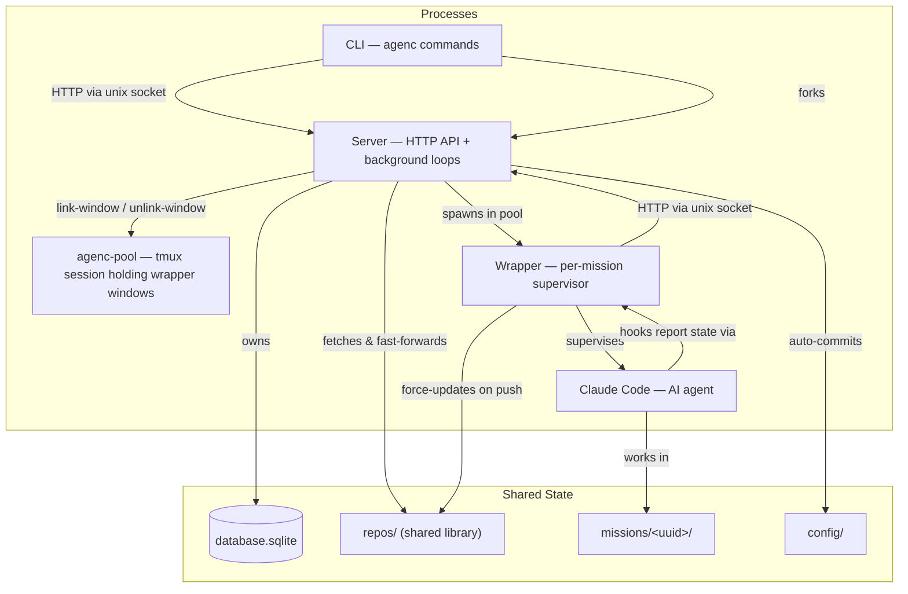

System Architecture
===================

AgenC is a CLI tool that runs AI agents (Claude Code instances) in isolated, per-mission sandboxes. It tracks all missions in a central database, manages a shared repository library, and keeps configuration version-controlled via a background server process.

Read this document before making non-trivial changes to the codebase. It is the canonical map of how the system fits together — runtime processes, directory layout, package responsibilities, and cross-cutting patterns.


Process Overview
----------------

Four cooperating processes form the runtime. They share state through the filesystem, unix sockets, and HTTP over a unix socket. The server is the sole process that reads from and writes to the SQLite database.


```mermaid
graph TB
    subgraph Processes
        CLI["CLI — agenc commands"]
        Server["Server — HTTP API + background loops"]
        Pool["agenc-pool — tmux session holding wrapper windows"]
        Wrapper["Wrapper — per-mission supervisor"]
        Claude["Claude Code — AI agent"]
    end

    subgraph "Shared State"
        DB[("database.sqlite")]
        Repos["repos/ (shared library)"]
        Missions["missions/&lt;uuid&gt;/"]
        Config["config/"]
    end

    CLI -->|HTTP via unix socket| Server
    CLI -->|forks| Server
    Server -->|spawns in pool| Wrapper
    Server -->|link-window / unlink-window| Pool
    Wrapper -->|supervises| Claude
    Wrapper -->|HTTP via unix socket| Server

    Server -->|owns| DB

    Server -->|fetches & fast-forwards| Repos
    Wrapper -->|force-updates on push| Repos

    Claude -->|works in| Missions
    Claude -->|hooks report state via| Wrapper

    Server -->|auto-commits| Config
```

**Inter-process communication** relies on filesystem artifacts, SQLite, and per-mission unix sockets:

| Mechanism | Writer | Reader | Purpose |
|-----------|--------|--------|---------|
| `database.sqlite` | Server | Server | Mission records, heartbeats, pane tracking |
| `server/server.sock` | Server (listener) | CLI, Wrapper (HTTP clients) | REST API for mission CRUD, heartbeats, prompt tracking, pane/title updates |
| `server/server.pid` | Server | CLI (`server stop/status`) | Process coordination |
| `missions/<uuid>/pid` | Wrapper | Server (idle timeout, attach) | Process coordination |
| `missions/<uuid>/wrapper.sock` | Wrapper (listener) | CLI, hooks (`mission send claude-update`) | Restart commands, Claude state updates |
| `agenc-pool` tmux session | Server (creates) | Server (link/unlink), Wrapper (runs in) | Background session holding all wrapper windows |
| `.git/refs/remotes/origin/<branch>` | Git (after push) | Wrapper (via fsnotify) | Trigger repo library update |


Runtime Processes
-----------------

### CLI

The CLI is a thin interface layer that collects user input (arguments, flags, environment variables) and delegates to the server via HTTP over a unix socket. The CLI never accesses the database directly and avoids querying external systems (tmux, git) when the server can do it instead — the server runs outside any sandbox and has full system access. For example, the CLI reads `$TMUX_PANE` (an env var) and sends the pane ID to the server, which queries tmux to resolve the session name.

- Entry point: `main.go`
- Commands: `cmd/` (Cobra-based; one file per command or command group)
- Full command reference: `docs/cli/`

### Server

The server is a long-running HTTP API process that listens on a unix socket. It handles mission lifecycle operations, serves query endpoints, and runs background maintenance loops. The CLI communicates with the server via HTTP requests over the unix socket.

- Entry point: `internal/server/server.go` (`Server.Run`)
- Process management: `internal/server/process.go` (PID file, fork, stop)
- HTTP client: `internal/server/client.go` (CLI-side HTTP client for unix socket communication)
- Error/JSON helpers: `internal/server/errors.go`
- Request logging middleware: `internal/server/middleware.go`
- PID file: `$AGENC_DIRPATH/server/server.pid`
- Log file: `$AGENC_DIRPATH/server/server.log`
- Request log: `$AGENC_DIRPATH/server/requests.log` (structured JSON, one line per HTTP request)
- Socket: `$AGENC_DIRPATH/server/server.sock` (mode 0600)

Current endpoints:
- `GET /health` — returns `{"status": "ok", "version": "<version>"}`
- `GET /server/logs` — returns server log content as plain text (supports `source` and `mode` query params)
- `GET /missions` — lists all missions (supports `include_archived`, `source`, and `source_id` query params)
- `GET /missions/{id}` — get a single mission by ID (supports short ID resolution)
- `POST /missions` — create a new mission (DB record, directory, wrapper spawn in pool)
- `PATCH /missions/{id}` — update mission fields (config_commit, session_name, prompt, tmux_pane)
- `POST /missions/{id}/attach` — ensure wrapper running (lazy start), resolve caller's tmux session from `calling_pane_id`, link pool window into it
- `POST /missions/{id}/detach` — resolve caller's session from `calling_pane_id`, unlink pool window (wrapper keeps running)
- `POST /missions/{id}/stop` — stop a mission's wrapper process and clean up pool window
- `DELETE /missions/{id}` — stop wrapper, clean up pool window and directory, delete from DB
- `POST /missions/{id}/reload` — in-place reload via tmux respawn-pane
- `POST /missions/{id}/archive` — stop and archive a mission
- `POST /missions/{id}/unarchive` — set a mission back to active
- `POST /missions/{id}/heartbeat` — update a mission's `last_heartbeat` timestamp; also updates `last_user_prompt_at` if included in the payload
- `POST /missions/{id}/prompt` — update `last_user_prompt_at` and increment `prompt_count`
- `GET /missions/search?q={query}&limit={n}` — full-text search over mission transcripts; returns BM25-ranked results with snippets and enriched mission metadata
- `GET /sessions?mission_id={id}` — list sessions for a mission (ordered by updated_at descending)
- `PATCH /sessions/{id}` — update session fields (agenc_custom_title); triggers tmux window title reconciliation
- `POST /repos/{name}/push-event` — enqueue a repo library update (returns 202 Accepted)
- `GET /stash` — list saved workspace stash files with metadata
- `POST /stash/push` — snapshot all running missions and their tmux links, then stop them
- `POST /stash/pop` — restore missions from a stash file, re-link into tmux sessions

The server is forked by `agenc server start` (or auto-started by CLI commands via `ensureServerRunning`) and detaches from the parent terminal via `setsid`. It performs graceful shutdown on SIGTERM/SIGINT: stops accepting new connections, drains in-flight requests, stops background loops, cleans up the socket file.
### Background loops

The server runs eleven concurrent background goroutines:

**1. Repo update loop** (`internal/server/template_updater.go`)
- Runs every 60 seconds
- Collects repos to sync: `config.yml` `repoConfig` entries with `alwaysSynced: true` + repos from missions with a recent heartbeat (< 5 minutes)
- Enqueues update requests to the repo update worker channel (does not call git directly)
- Sets `refreshDefaultBranch` flag every 10 cycles (~10 minutes)

**2. Config auto-commit loop** (`internal/server/config_auto_commit.go`)
- Runs every 10 minutes (first cycle delayed by 10 minutes after startup)
- If `$AGENC_DIRPATH/config/` is a Git repo with uncommitted changes: stages all, commits with timestamp message, pushes (if `origin` remote exists)

**3. Config watcher loop** (`internal/server/config_watcher.go`)
- Initializes the shadow repo on first run, then watches both `~/.claude` and `config.yml` for changes via fsnotify
- On `~/.claude` changes (debounced at 500ms), ingests tracked files into the shadow repo (see "Shadow repo" under Key Architectural Patterns)
- On `config.yml` changes (debounced at 500ms), triggers cron sync to launchd plists
- Watches both the `~/.claude` directory and all tracked subdirectories, resolving symlinks to watch actual targets

**4. Keybindings writer loop** (`internal/server/keybindings_writer.go`)
- Writes the tmux keybindings file on startup and every 5 minutes
- Sources the keybindings into any running tmux server after writing
- Ensures keybindings stay current after binary upgrades (server auto-restarts on version bump)

**5. Session summarizer worker** (`internal/server/session_summarizer.go`)
- Consumes summary requests from a buffered channel (fed by the session scanner when a session has no `auto_summary`)
- For each request: calls Claude Haiku via `claude --print --model claude-haiku-4-5-20251001` to generate a 3-8 word description from the user's first message, stores the result in the session's `auto_summary` column
- Uses a `sync.Map` to permanently deduplicate: each session ID triggers at most one Haiku call per process lifetime
- Uses the Claude CLI subprocess rather than a direct API call to avoid requiring users to configure an API key

**6. Idle timeout loop** (`internal/server/idle_timeout.go`)
- Runs every 2 minutes
- Scans all non-archived missions for running wrappers
- Uses the active JSONL conversation log's modification time to determine idle duration, falling back to `created_at`
- Stops wrappers idle longer than 30 minutes and destroys their pool windows
- Wrappers are automatically re-spawned on the next attach (lazy start)

**7. Repo update worker** (`internal/server/repo_update_worker.go`)
- Processes update requests from a buffered channel (fed by the repo update loop and push-event handler)
- For each request: captures HEAD before update, runs `ForceUpdateRepo`, compares HEAD after
- If HEAD changed (or first clone), reads the repo's `postUpdateHook` from config and runs it via `sh -c` in the repo library directory
- Hook timeout: 30-minute hard limit, WARN logs emitted every 5 minutes after the first 5 minutes
- Hook failures are logged but non-fatal — they do not block subsequent updates

**8. File watcher** (`internal/server/session_scanner.go` — `runFileWatcherLoop`)
- Runs every 3 seconds
- Discovers JSONL files and updates `known_file_size` on the sessions table; does NOT read file content
- Two scopes per cycle:
  - Running missions: queries tmux pool for live pane IDs, resolves each to a mission, walks project dirs for JSONL files, stats them
  - NULL file size sessions: queries sessions where `known_file_size IS NULL`, computes JSONL paths, stats files to set initial sizes (backfill trigger for historical sessions)
- Creates session rows for newly discovered JSONL files

**9. Title consumer** (`internal/server/session_scanner.go` — `runTitleConsumerLoop`)
- Runs every 3 seconds
- Queries sessions where `known_file_size > last_title_update_offset`
- For each: opens the JSONL file, seeks to `last_title_update_offset`, reads new content
- Extracts `custom-title` metadata entries using a quick string-match filter before JSON parsing
- When a session has no `auto_summary`, also extracts the first user message and sends a summary request to the session summarizer worker
- Updates the session row with any new `custom_title` and advances `last_title_update_offset`
- When `custom_title` changes, triggers tmux window title reconciliation

**10. Search indexer** (`internal/server/search_indexer.go`)
- Runs every 30 seconds
- Queries sessions where `known_file_size > last_indexed_offset`
- For each: opens the JSONL file, seeks to `last_indexed_offset`, reads to `known_file_size`
- Extracts user messages and assistant text blocks (skipping tool_use, thinking, system messages)
- Inserts extracted text into the FTS5 `mission_search_index` table and advances `last_indexed_offset` atomically in a single transaction
- Powers the `GET /missions/search` endpoint and the `agenc mission search` CLI command

**11. Writeable-copy reconcile worker** (`internal/server/writeable_copies.go`)
- Drains a buffered channel of reconcile requests, one tick per request
- Three trigger sources feed the channel: working-tree fsnotify (debounced 15s) per writeable copy, library worker fan-out after a successful library update, and a server-startup boot sweep
- Per tick: resume probe (if paused), sanity checks, commit-if-dirty, fetch+reconcile (equal/ahead/behind/diverged) — each step backed by a `GitCommander` interface that the production code wires to the `git` CLI and tests mock with a fake
- On rebase conflict, non-FF push reject, auth failure, wrong branch, origin URL drift, missing path, or git corruption: atomically inserts a pause row in `writeable_copy_pauses` and a notification in `notifications`. The pause is checked at the start of every subsequent tick; the loop auto-resumes when `git status` is clean and HEAD has moved past `local_head_at_pause`
- Notifications are append-only (only mutation: mark-as-read). Pauses are deleted on auto-resume; the linked notification stays in history
- Per-writeable-copy fsnotify watchers are managed by `writeableCopyWatchers` (`internal/server/writeable_copies_watcher.go`): one watcher on the working tree (excluding `.git/`) and one on `.git/refs/remotes/origin/<default-branch>`. The latter triggers an existing-machinery library push-event refresh when the writeable copy successfully pushes to origin

The file watcher, title consumer, and search indexer form a three-layer session processing pipeline. The file watcher (layer 1) tracks file sizes. Consumers (layer 2) independently query for sessions where `known_file_size > their_offset` and process new content at their own cadence. The sessions table (layer 3) coordinates via three columns: `known_file_size` (nullable, written by file watcher), `last_title_update_offset` (title consumer), `last_indexed_offset` (search indexer).

The FTS5 virtual table `mission_search_index` stores indexed conversation text with `mission_id` and `session_id` as unindexed columns. It uses the `porter unicode61` tokenizer for stemming and Unicode normalization. Queries use BM25 ranking with results deduplicated by mission.

### Tmux pool

The `agenc-pool` tmux session is a background session that holds all wrapper windows. This enables the attach/detach model — wrappers run in the pool regardless of whether the user is viewing them.

- Pool management: `internal/server/pool.go`
- Created on server startup via `ensurePoolSession()`
- Each mission gets a window named with the short mission ID
- `link-window` / `unlink-window` are used to show/hide missions in the user's tmux session
- Pool windows are auto-cleaned when wrappers exit or are stopped

### Wrapper

The wrapper is a per-mission foreground process that supervises a Claude child process. One wrapper runs per active mission. It communicates with the server via an HTTP client over the unix socket for all database operations (heartbeats, prompt tracking, pane registration, window title updates).

- Entry point: `internal/wrapper/wrapper.go` (`Wrapper.Run` for interactive, `Wrapper.RunHeadless` for headless)
- Tmux integration: `internal/wrapper/tmux.go`

The wrapper:

1. Writes the wrapper PID to `$AGENC_DIRPATH/missions/<uuid>/pid`
2. Records the tmux pane ID via the server (cleared on exit) for pane→mission resolution
3. Reads the OAuth token from the token file and sets `CLAUDE_CODE_OAUTH_TOKEN` in the child environment
4. Resolves the Claude model: checks the repo's `defaultModel` in `config.yml`, falls back to the top-level `defaultModel`, or omits `--model` entirely (letting Claude choose its default)
5. Rebuilds the mission's `claude-config/` from the shadow repo at `$AGENC_DIRPATH/claude-config-shadow/` (see "Shadow repo" under Key Architectural Patterns), then writes the shadow's HEAD commit to the mission's `config_commit` DB column via the server. This runs at the top of every Claude spawn — initial start, in-place tmux respawn-pane reload, and devcontainer rebuild — so each spawn picks up the latest user `~/.claude` config without a manual reconfig step.
6. Spawns Claude as a child process (with 1Password wrapping if `secrets.env` exists), passing `--model <value>` if a model was resolved
7. Sets `CLAUDE_CONFIG_DIR` to the per-mission config directory
8. Sets `AGENC_MISSION_UUID` for the child process
9. Starts background goroutines:
   - **Heartbeat writer** — updates `last_heartbeat` via the server every 10 seconds; also piggybacks `last_user_prompt_at` for crash recovery
   - **Remote refs watcher** (if mission has a git repo) — watches `.git/refs/remotes/origin/<branch>` for pushes; when detected, force-updates the repo library clone so other missions get fresh copies (debounced at 5 seconds)
   - **HTTP server** (interactive mode only) — serves an HTTP API on `wrapper.sock` (unix socket) with endpoints for status queries, restart commands, and claude_update events
   - **`watchCredentialUpwardSync`** — polls per-mission Keychain every 60s; when hash changes, merges to global and broadcasts via `global-credentials-expiry`
   - **`watchCredentialDownwardSync`** — fsnotify on `global-credentials-expiry`; when another mission broadcasts, pulls global credentials into per-mission Keychain
10. Main event loop implements a three-state machine (see below)

**Interactive mode** (`Run`): pipes stdin/stdout/stderr directly to the terminal. On signal, forwards it to Claude and waits for exit. Exposes an HTTP API on a unix socket for restart commands and state queries.

**Headless mode** (`RunHeadless`): runs `claude --print -p <prompt>`, captures output to `claude-output.log` with log rotation (10MB max, 3 backups). Supports timeout and graceful shutdown (SIGTERM then SIGKILL after 30 seconds). No socket listener — headless missions are one-shot and don't need restart support.

**Three-state restart machine** (interactive mode only):

```
  ┌─────────┐  restart cmd   ┌────────────────┐  claude idle   ┌────────────┐
  │ Running │ ─────────────→ │ RestartPending  │ ────────────→ │ Restarting │
  └─────────┘                └────────────────┘               └────────────┘
       ↑                                                            │
       └────────────────────────────────────────────────────────────┘
                              claude respawned

  Hard restart skips RestartPending — goes directly Running → Restarting.
```

- **Running** + Claude exits → natural exit, wrapper exits
- **Restarting** + Claude exits → wrapper-initiated restart, respawn Claude
- **RestartPending** + Claude becomes idle → transition to Restarting, SIGINT Claude
- Restarts are idempotent: duplicate requests return ok. A hard restart overrides a pending graceful.

**Wrapper HTTP API**: standard HTTP-over-unix-socket (using Go's `net/http`). Socket path: `missions/<uuid>/wrapper.sock`. Endpoints:
- `GET /status` — returns JSON with `claude_state` (`"idle"`, `"busy"`, or `"needs_attention"`), `wrapper_state` (`"running"`, `"restart_pending"`, or `"restarting"`), and `has_conversation` (bool). Read directly under `stateMu` — does not go through the command channel.
- `POST /restart` — accepts `{"mode": "graceful"|"hard", "reason": "..."}`. Graceful waits for idle then SIGINTs Claude and resumes with `claude -c`; hard SIGKILLs immediately and starts a fresh session. Processed through the main event loop command channel.
- `POST /claude_update` — accepts `{"event": "...", "notification_type": "..."}`. Sent by Claude hooks to report state changes (event types: `Stop`, `UserPromptSubmit`, `Notification`, `PostToolUse`, `PostToolUseFailure`). The wrapper uses these to track idle state, conversation existence, needs-attention status, trigger deferred restarts, and set tmux pane colors for visual feedback. Processed through the main event loop command channel.

**Token passthrough at spawn time**: the wrapper reads the OAuth token from `$AGENC_DIRPATH/cache/oauth-token` and passes it to Claude via the `CLAUDE_CODE_OAUTH_TOKEN` environment variable. All missions share the same token file. When the user updates the token (`agenc config set claudeCodeOAuthToken <new-token>`), new missions pick it up immediately; running missions get the new token on their next restart.

**Model resolution at spawn time**: the wrapper resolves the Claude model from `config.yml` using a precedence chain: the repo's `repoConfig` `defaultModel` (if set) takes priority over the top-level `defaultModel` (if set). When a model is resolved, the wrapper passes `--model <value>` to the Claude CLI. If neither level specifies a model, `--model` is omitted and Claude uses its own default.


Directory Structure
-------------------

### Source tree

```
.
├── main.go                       # CLI entry point
├── Makefile                      # Build, check, and setup targets with version injection via ldflags
├── .githooks/                    # Git hooks (pre-commit runs make check; others delegate to beads)
├── go.mod / go.sum
├── README.md
├── CLAUDE.md                     # Agent instructions for working on this codebase
├── AGENTS.md                     # Agent definitions
├── cmd/                          # CLI commands (Cobra); see docs/cli/ for full reference
│   ├── session.go                # `session` command group
│   ├── session_print.go          # `session print` — print raw JSONL transcript for a session
│   ├── mission_print.go          # `mission print` — print JSONL for a mission's current session
│   ├── gendocs/                  # Build-time CLI doc generator
│   └── genprime/                 # Build-time CLI quick reference generator (agenc prime)
├── internal/
│   ├── config/                   # Path management, YAML config
│   ├── database/                 # SQLite CRUD
│   ├── mission/                  # Mission lifecycle, Claude spawning
│   ├── claudeconfig/             # Per-mission config merging, shadow repo
│   ├── server/                   # HTTP API server (unix socket)
│   ├── tmux/                     # Tmux keybindings generation
│   ├── wrapper/                  # Claude child process management
│   ├── history/                  # Prompt extraction from history.jsonl
│   ├── session/                  # Session name resolution and transcript access
│   ├── version/                  # Build-time version string
│   └── tableprinter/             # ANSI-aware table formatting
├── docs/                         # Documentation
│   └── cli/                      # Generated CLI reference
├── specs/                        # Design specs (historical reference)
└── scripts/                      # Utility scripts
```

### Runtime tree (`$AGENC_DIRPATH`, defaults to `~/.agenc/`)

```
$AGENC_DIRPATH/
├── database.sqlite                        # SQLite: missions and sessions tables
├── statusline-wrapper.sh                  # Shared statusline wrapper script
├── statusline-original-cmd                # User's original statusLine.command (saved on first build)
│
├── cache/                                 # Cached runtime data (not committed to Git)
│   └── oauth-token                        # Claude Code OAuth token (mode 600)
│
├── config/                                # User configuration (optionally a git repo)
│   ├── config.yml                         # Synced repos, Claude config source, cron jobs
│   └── claude-modifications/              # AgenC-specific Claude config overrides
│       ├── CLAUDE.md                      # Appended to user's CLAUDE.md during merge
│       └── settings.json                  # Deep-merged with user's settings.json
│
├── claude-config-shadow/                  # Shadow repo tracking ~/.claude config
│   ├── .git/                              # Local-only Git repo (auto-committed)
│   ├── CLAUDE.md                          # Normalized copy of ~/.claude/CLAUDE.md
│   ├── settings.json                      # Normalized copy of ~/.claude/settings.json
│   ├── skills/                            # Normalized copy of ~/.claude/skills/
│   ├── hooks/                             # Normalized copy of ~/.claude/hooks/
│   ├── commands/                          # Normalized copy of ~/.claude/commands/
│   └── agents/                            # Normalized copy of ~/.claude/agents/
│
├── repos/                                 # Shared repo library (server syncs these)
│   └── github.com/owner/repo/            # One clone per repo
│
├── missions/                              # Per-mission sandboxes
│   └── <uuid>/
│       ├── .adjutant                      # Marker file (empty); present only for adjutant missions
│       ├── agent/                         # Git repo working directory
│       ├── claude-config/                 # Per-mission CLAUDE_CONFIG_DIR
│       │   ├── CLAUDE.md                  # Merged: shadow repo + claude-modifications (+ adjutant instructions for adjutant missions)
│       │   ├── settings.json              # Merged + hooks + deny entries (+ adjutant permissions for adjutant missions)
│       │   ├── .claude.json               # Copy of user's account identity + trust entry
│       │   ├── skills/                    # From shadow repo (path-rewritten)
│       │   ├── hooks/                     # From shadow repo (path-rewritten)
│       │   ├── commands/                  # From shadow repo (path-rewritten)
│       │   ├── agents/                    # From shadow repo (path-rewritten)
│       │   ├── plugins/                   # Symlink to ~/.claude/plugins/
│       │   └── projects/                  # Symlink to ~/.claude/projects/ (persistent sessions)
│       ├── pid                            # Wrapper process ID
│       ├── wrapper.sock                   # Unix socket for wrapper commands (restart, claude_update)
│       ├── wrapper.log                    # Wrapper lifecycle log
│       ├── statusline-message             # Per-mission statusline message (e.g. token expiry warning)
│       └── claude-output.log              # Headless mode output (with rotation)
│
├── server/
│   ├── server.pid                         # Server process ID
│   ├── server.log                         # Server log
│   ├── requests.log                       # Structured HTTP request log (JSON lines)
│   └── server.sock                        # Unix socket for HTTP API (mode 0600)
│
├── stash/                                     # Workspace snapshots (agenc stash push/pop)
│   └── <timestamp>.json                       # Each file captures running missions and their tmux links
```


Configuration Reference
-----------------------

For the full `config.yml` reference (keys, defaults, annotated examples) and environment variables, see the [Configuration section of the README](../README.md#configuration). The config file is parsed by `internal/config/agenc_config.go`.


Core Packages
-------------

### `internal/config/`

Path management and YAML configuration. All path construction flows from `GetAgencDirpath()`, which reads `$AGENC_DIRPATH` and falls back to `~/.agenc`.

- `config.go` — path helper functions (`GetMissionDirpath`, `GetRepoDirpath`, `GetDatabaseFilepath`, `GetCacheDirpath`, `GetOAuthTokenFilepath`, etc.), directory structure initialization (`EnsureDirStructure`), constant definitions for filenames and directory names, adjutant mission detection (`IsMissionAdjutant` checks for `.adjutant` marker file), OAuth token file read/write (`ReadOAuthToken`, `WriteOAuthToken`)
- `agenc_config.go` — `AgencConfig` struct (YAML round-trip with comment preservation, `defaultModel` for specifying the default Claude model), `RepoConfig` struct (per-repo settings: `alwaysSynced`, `emoji`, `trustedMcpServers`, `defaultModel`), `TrustedMcpServers` struct (custom YAML marshal/unmarshal supporting `all` string or a list of named servers), `CronConfig` struct, `PaletteCommandConfig` struct (user-defined and builtin palette entries with optional tmux keybindings), `PaletteTmuxKeybinding` (configurable key for the command palette, defaults to `k`), `BuiltinPaletteCommands` defaults map, `GetResolvedPaletteCommands` merge logic, validation functions for repo format, cron names, palette command names, schedules, timeouts, and overlap policies. Cron schedule validation via `launchd.ParseCronExpression` (rejects expressions launchd cannot represent).
- `first_run.go` — `IsFirstRun()` detection

### `internal/repo/`

Repo library operations and resolution logic. Used by the server for repo API endpoints and by CLI commands that resolve repo input (e.g., `mission new`, `cron new`).

- `repo.go` — `FindReposOnDisk` (filesystem walk of `repos/<host>/<owner>/<repo>/`), `listSubdirs` helper
- `resolution.go` — `ResolveAsRepoReference` (resolves URLs, shorthand, and local paths to canonical repo names with cloning), `LooksLikeRepoReference` (input classification), `GetProtocolPreference` (non-interactive SSH/HTTPS detection via gh config and existing repos), `GetOriginRemoteURL`
- `gh_config.go` — GitHub CLI config reading (`~/.config/gh/hosts.yml`): `GetGhConfig`, `GetGhConfigProtocol`, `GetGhLoggedInUser`, `GetDefaultGitHubUser`

### `internal/mission/`

Mission lifecycle: directory creation, repo copying, and Claude process spawning.

- `mission.go` — `CreateMissionDir` (sets up mission directory, copies git repo, builds per-mission config), `SpawnClaude`/`SpawnClaudeWithPrompt`/`SpawnClaudeResume` (construct and start Claude `exec.Cmd` with 1Password integration, environment variables, and `--model` flag when a `defaultModel` is configured)
- `repo.go` — git repository operations: `CopyRepo`/`CopyAgentDir` (rsync-based), `ForceUpdateRepo` (fetch + reset to remote default branch), `ParseRepoReference`/`ParseGitHubRemoteURL` (handle shorthand, canonical, SSH, and HTTPS URL formats), `EnsureRepoClone`, `DetectPreferredProtocol` (infers SSH vs HTTPS from existing repos)

### `internal/claudeconfig/`

Per-mission Claude configuration building, merging, and shadow repo management.

- `build.go` — `BuildMissionConfigDir` (copies trackable items from shadow repo with path rewriting, merges CLAUDE.md and settings.json, copies and patches .claude.json with trust entry, symlinks plugins and projects), `GetMissionClaudeConfigDirpath` (falls back to global config if per-mission doesn't exist), `GetLastSessionID` (reads the mission's per-project `.claude.json` to resolve the current session UUID), `ResolveConfigCommitHash`, `EnsureShadowRepo`. Keychain credential functions (`CloneKeychainCredentials`, `WriteBackKeychainCredentials`, `DeleteKeychainCredentials`) handle MCP OAuth token propagation: `CloneKeychainCredentials` is called at mission spawn to seed the per-mission entry from global; `WriteBackKeychainCredentials` is called at mission exit to merge tokens back to global; `DeleteKeychainCredentials` is called by `agenc mission rm` to clean up the per-mission Keychain entry. Claude's own authentication uses the token file approach (see `internal/config/`).
- `merge.go` — `DeepMergeJSON` (objects merge recursively, arrays concatenate, scalars overlay), `MergeClaudeMd` (concatenation), `MergeSettings` (deep-merge user + modifications, then apply operational overrides), `RewriteSettingsPaths` (selective path rewriting preserving permissions block)
- `agent_instructions.go` — embeds `agent_instructions.md` and substitutes dynamic placeholders (CLI name, repo library path, env var names) at runtime. Prepended to every mission's CLAUDE.md to give agents foundational context about AgenC, missions, workspace structure, and how to spawn other agents.
- `agent_instructions.md` — hardcoded agent operating instructions covering AgenC overview, mission lifecycle, git workflow, repo library access, cross-repo work, and security boundaries.
- `overrides.go` — `AgencHookEntries` (Stop, UserPromptSubmit, and Notification hooks for idle detection and state tracking via socket), `AgencRepoLibraryWriteTools` (deny Write/Edit/NotebookEdit on repo library; read tools allowed for code exploration), `BuildRepoLibraryDenyEntries`
- `prime_content.go` — embeds the CLI quick reference generated at build time by `cmd/genprime/` from the Cobra command tree. Content is printed by `agenc prime` and injected into adjutant missions via a `SessionStart` hook.
- `adjutant.go` — adjutant mission config builders: `buildAdjutantClaudeMd` (appends adjutant instructions), `buildAdjutantSettings` (injects adjutant permissions), `BuildAdjutantAllowEntries`/`BuildAdjutantDenyEntries` (permission entry generators)
- `adjutant_claude.md` — embedded CLAUDE.md instructions for adjutant missions (tells the agent it is the Adjutant, directs CLI usage, establishes filesystem access boundaries)
- `shadow.go` — shadow repo for tracking the user's `~/.claude` config (see "Shadow repo" under Key Architectural Patterns)

### `internal/server/`

HTTP API server that listens on a unix socket. Serves mission lifecycle endpoints and runs background maintenance loops.

- `server.go` — `Server` struct, `NewServer`, `Run` (starts HTTP listener, background loops, graceful shutdown on context cancellation), `registerRoutes`, `handleHealth`
- `process.go` — server lifecycle: `ForkServer` (re-executes binary as detached process via setsid), `ReadPID`, `IsRunning`, `IsProcessRunning`, `StopServer` (SIGTERM then SIGKILL), `IsServerProcess` (env var check)
- `client.go` — `Client` struct with `Get`, `Post`, `Delete`, `Patch` methods for CLI-to-server and wrapper-to-server communication over the unix socket. High-level API: `ListMissions`, `GetMission`, `CreateMission`, `UpdateMission`, `StopMission`, `DeleteMission`, `ArchiveMission`, `UnarchiveMission`, `Heartbeat`, `RecordPrompt`, `ReloadMission`, `ListRepos`, `AddRepo`, `RemoveRepo`, `ListCrons`, `CreateCron`, `UpdateCron`, `DeleteCron`
- `missions.go` — mission CRUD endpoints, wrapper process management (stop/reload/delete), tmux in-place reload, transient field enrichment (queries each running wrapper's `GET /status` endpoint for `ClaudeState`, checks `.adjutant` marker for `IsAdjutant`)
- `repos.go` — repo management endpoints (`GET /repos` list with synced status, `POST /repos` clone and configure, `DELETE /repos/` remove from disk and config) and push-event endpoint (enqueues repo update, returns 202 Accepted)
- `repo_update_worker.go` — centralized repo update worker goroutine: processes update requests, runs `ForceUpdateRepo`, executes `postUpdateHook` when HEAD changes
- `errors.go` — `writeError`, `writeJSON` helper functions for consistent JSON responses
- `template_updater.go` — repo update loop (60-second interval, collects synced + active-mission repos, enqueues update requests)
- `config_auto_commit.go` — config auto-commit loop (10-minute interval, git add/commit/push)
- `handle_crons.go` — cron CRUD endpoints (`GET /crons` list, `POST /crons` create with sleepGuard, `PATCH /crons/{name}` update, `DELETE /crons/{name}` remove). All mutations acquire the config lock, read-modify-write config.yml, update cachedConfig, and trigger cron sync to launchd
- `handle_cron_logs.go` — cron log endpoint (`GET /crons/{id}/logs`)
- `cron_syncer.go` — cron syncer: synchronizes `config.yml` cron jobs to macOS launchd plists in `~/Library/LaunchAgents/`, reconciles orphaned plists on startup, skips writes and reloads when plist content is unchanged
- `config_watcher.go` — config watcher loop (fsnotify on `~/.claude` and `config.yml`, 500ms debounce, ingests into shadow repo, updates cached `AgencConfig` via `atomic.Pointer`, and triggers cron sync)
- `keybindings_writer.go` — keybindings writer loop (writes and sources tmux keybindings file every 5 minutes)
- `session_scanner.go` — session scanner loop (3-second interval, queries tmux pool for running missions then incrementally scans their JSONL files, updates sessions table, triggers tmux title reconciliation on changes)
- `session_summarizer.go` — session summarizer worker (channel-driven, generates auto_summary from first user prompt via Claude Haiku CLI subprocess, with sync.Map deduplication)
- `tmux.go` — tmux window title reconciliation: idempotent convergence of tmux window names using the priority chain (custom_title > agenc_custom_title > auto_summary > repo name > short ID), with sole-pane guard. Prepends per-mission emoji (from config, or hardcoded 🤖 for adjutant / 🦀 for blank missions) with fixed-column-4 padding via `go-runewidth`
- `sessions.go` — session HTTP handlers: list sessions by mission, update session fields (agenc_custom_title) with automatic title reconciliation

### `internal/devcontainer/`

Devcontainer detection, configuration overlay, and project path encoding for containerized missions.

- `detection.go` — `DetectDevcontainer` checks repo for devcontainer.json in two spec-defined locations (`.devcontainer/devcontainer.json` preferred, `.devcontainer.json` fallback)
- `project_path_encoding.go` — `EncodeProjectPath` replicates Claude Code's path encoding (replace `/` and `.` with `-`), `ComputeSessionBindMount` computes host↔container project directory name mapping for session bind mounts
- `overlay.go` — `GenerateOverlay` reads repo's devcontainer.json, merges AgenC operational plumbing (mounts, env vars), absolutizes relative paths, writes merged config

### `internal/database/`

SQLite mission tracking with auto-migration.

- `database.go` — `DB` struct (wraps `sql.DB` with max connections = 1 for SQLite), `Mission` struct, CRUD operations (`CreateMission`, `ListMissions`, `GetMission`, `ResolveMissionID`, `ArchiveMission`, `DeleteMission`), heartbeat updates, session name caching, generic source tracking (`source`, `source_id`, `source_metadata` columns). Idempotent migrations handle schema evolution.
- `sessions.go` — `Session` struct, CRUD operations (`CreateSession`, `GetSession`, `UpdateSessionScanResults`, `GetActiveSession`). The `GetActiveSession` query returns the most recently updated session for a mission, used by tmux title reconciliation to determine the current display title.

### `internal/launchd/`

macOS launchd integration for cron scheduling.

- `plist.go` — `Plist` struct and XML generation, `ParseCronExpression` (converts cron expressions to `StartCalendarInterval`), `CronToPlistFilename` (sanitizes cron names), `PlistDirpath` helper
- `manager.go` — `Manager` wraps launchctl operations: `LoadPlist`, `UnloadPlist`, `IsLoaded`, `RemovePlist` (two-step: unload then delete), `ListAgencCronJobs`, `VerifyLaunchctlAvailable`

### `internal/tmux/`

Tmux keybindings generation and version detection, shared by the CLI (`tmux inject`) and server.

- `keybindings.go` — `GenerateKeybindingsContent`, `WriteKeybindingsFile`, `SourceKeybindings`, `BuildKeybindingsFromCommands`, `RefreshKeybindings`. Commands are self-contained strings that include their own tmux primitives (e.g. `tmux display-popup ...`, `tmux split-window ...`) when needed. Both keybinding generation and the palette dispatch commands via `tmux run-shell`. Mission-scoped commands (those containing `$AGENC_CALLING_MISSION_UUID`) get a UUID-resolution preamble in keybindings; the palette instead prepends `export` statements. Commands containing `display-popup` are skipped on tmux < 3.2. The hardcoded key table entry (`prefix + a`) and palette popup remain fixed; all other keybindings are driven by the resolved palette commands.
- `version.go` — `ParseVersion` (parses `tmux -V` output), `DetectVersion` (runs `tmux -V` and parses the result). Used by keybindings generation, the server, and the CLI to detect the installed tmux version.

### `internal/wrapper/`

Per-mission Claude child process management.

- `wrapper.go` — `Wrapper` struct (uses `server.Client` for all database operations, `stateMu` protects state for concurrent HTTP reads), `Run` (interactive mode with three-state restart machine), `RunHeadless` (headless mode with timeout and log rotation), background goroutines (heartbeat, remote refs watcher, HTTP server), `handleClaudeUpdate` (processes hook events for idle tracking, needs-attention tracking, and pane coloring), signal handling, OAuth token passthrough via `CLAUDE_CODE_OAUTH_TOKEN` environment variable, model resolution from `defaultModel` config (repo-level then top-level) passed as `--model` to the Claude CLI
- `credential_sync.go` — MCP OAuth credential sync goroutines: `initCredentialHash` (baseline hash at spawn), `watchCredentialUpwardSync` (polls per-mission Keychain every 60s; when hash changes, merges to global and writes broadcast timestamp to `global-credentials-expiry`), `watchCredentialDownwardSync` (fsnotify on `global-credentials-expiry`; when another mission broadcasts, pulls global into per-mission Keychain)
- `socket.go` — HTTP server on unix socket (`startHTTPServer`), request/response types (`StatusResponse`, `RestartRequest`, `ClaudeUpdateRequest`, `CommandResponse`), internal `Command`/`commandWithResponse` types for the event loop channel, HTTP handlers for each endpoint
- `client.go` — `WrapperClient` HTTP client using unix socket transport, typed methods (`GetStatus`, `Restart`, `SendClaudeUpdate`), `ErrWrapperNotRunning` sentinel error
- `tmux.go` — pane color management (`setWindowBusy`, `setWindowNeedsAttention`, `resetWindowTabStyle`) for visual mission status feedback, pane registration/clearing via server client (triggers initial tmux window title reconciliation on the server side)

### Utility packages

- `internal/version/` — single `Version` string set via ldflags at build time (`version.go`)
- `internal/history/` — `FindFirstPrompt` extracts the first user prompt from Claude's `history.jsonl` for a given mission UUID (`history.go`)
- `internal/session/` — `FindSessionName` resolves a mission's session name from Claude metadata (priority: custom-title > sessions-index.json summary > JSONL summary) (`session.go`), `FindCustomTitle` returns only the /rename custom title (`session.go`), `FindSessionJSONLPath` locates the JSONL transcript file for a session UUID by searching all project directories under `~/.claude/projects/` (`session.go`), `ListSessionIDs` returns all session UUIDs for a mission sorted by modification time (most recent first) by scanning the mission's project directory for `.jsonl` files (`session.go`), `TailJSONLFile` reads the last N lines from a JSONL file and writes them to a given writer, or writes the entire file when N is zero (`session.go`), `ExtractRecentUserMessages` extracts user message contents from session JSONL for AI summarization (`conversation.go`)
- `internal/sleep/` — sleep mode types and validation (`sleep.go`). Defines `WindowDef` (days + start/end times) and validation functions (`ValidateDays`, `ValidateTime`, `ValidateWindow`). Used by `internal/config/` for config validation and `internal/server/` for the sleep guard middleware.
- `internal/tableprinter/` — ANSI-aware table formatting using `rodaine/table` with `runewidth` for wide character support (`tableprinter.go`)


Key Architectural Patterns
--------------------------

### Per-mission config merging

Each mission gets its own `claude-config/` directory, rebuilt by the wrapper (`internal/wrapper/wrapper.go`) on every Claude spawn — initial start, in-place tmux respawn-pane reload, and devcontainer rebuild — from five sources. There is no separate manual reconfig step; the previous `agenc mission reconfig` command has been removed. After each rebuild the wrapper writes the shadow repo's HEAD commit to the mission's `config_commit` DB column and logs the short hash. The five sources are:

1. **Agent instructions** — hardcoded operating instructions embedded in the binary (`internal/claudeconfig/agent_instructions.md`). Prepended to every mission's CLAUDE.md. Contains AgenC overview, mission lifecycle, git workflow, repo library access, cross-repo work, and security boundaries. Dynamic values (CLI name, repo library path, env var names) are substituted at runtime.
2. **Shadow repo** — a verbatim copy of the user's `~/.claude` config (CLAUDE.md, settings.json, skills, hooks, commands, agents), with `~/.claude` paths rewritten at build time to point to the mission's concrete config path. See "Shadow repo" below.
3. **`agenc prime` hook** — for adjutant missions only, a `SessionStart` hook in the project-level settings runs `agenc prime`, which prints the CLI quick reference into the agent's context. Content is generated at build time from the Cobra command tree (`cmd/genprime/`).
4. **AgenC modifications** — files in `$AGENC_DIRPATH/config/claude-modifications/` that overlay the user's config
5. **AgenC operational overrides** — programmatically injected hooks and deny permissions

**Adjutant missions** (`agenc mission new --adjutant`) receive additional configuration beyond the standard merge. The presence of the `.adjutant` marker file in the mission directory triggers conditional logic in `BuildMissionConfigDir`:

- **CLAUDE.md** — the adjutant-specific instructions (`internal/claudeconfig/adjutant_claude.md`) are appended after the standard agent instructions + user + modifications merge
- **settings.json** — adjutant permissions are injected: allow entries for Read/Write/Edit/Glob/Grep on `$AGENC_DIRPATH/**` and `Bash(agenc:*)`, plus deny entries for Write/Edit on other missions' agent directories
- **`agenc prime` SessionStart hook** — project-level hook in adjutant missions only (regular missions do not get it)

Two directories are symlinked rather than copied: `plugins/` → `~/.claude/plugins/` (so plugin installations are shared), and `projects/` → `~/.claude/projects/` (so conversation transcripts and auto-memory persist beyond the mission lifecycle).

Merging logic (`internal/claudeconfig/merge.go`):
- CLAUDE.md: three-layer concatenation (agent instructions + user content + modifications content)
- settings.json: recursive deep merge (user as base, modifications as overlay), then append operational overrides (hooks and deny entries)
- Deep merge rules: objects merge recursively, arrays concatenate, scalars from the overlay win

Credentials are handled in two layers. Claude's own authentication uses a token file at `$AGENC_DIRPATH/cache/oauth-token` — the wrapper reads this at spawn time and passes it as `CLAUDE_CODE_OAUTH_TOKEN` in the child environment. MCP server OAuth tokens (`mcpOAuth`) use the macOS Keychain: at spawn time the wrapper clones the global `"Claude Code-credentials"` entry into a per-mission entry (`"Claude Code-credentials-<8hexchars>"`). Two goroutines keep these in sync: upward sync detects hash changes in the per-mission entry and merges them to global; downward sync watches a broadcast file (`global-credentials-expiry`) for changes made by other missions and pulls the updated global entry into the per-mission entry.

### Shadow repo

`~/.claude/` is the canonical home of global Claude config. The shadow repo (`internal/claudeconfig/shadow.go`) is a server-owned snapshot of that config at `$AGENC_DIRPATH/claude-config-shadow/`, kept in lockstep with `~/.claude/` by the server's config watcher. It provides version history for Claude config changes without modifying the user's `~/.claude` directory, and serves as the stable source that the wrapper builds each mission's per-mission config from on every Claude spawn.

**Tracked items:**
- Files: `CLAUDE.md`, `settings.json`
- Directories: `skills/`, `hooks/`, `commands/`, `agents/`

**Storage:** Files are stored verbatim — no path transformation on ingest. The shadow repo is a faithful copy of `~/.claude` tracked items.

**Path rewriting:** Path rewriting is a one-way operation at build time only (`RewriteClaudePaths`). When `BuildMissionConfigDir` creates the per-mission config, `~/.claude` paths (absolute, `${HOME}/.claude`, and `~/.claude` forms) are rewritten to point to the mission's `claude-config/` directory. For `settings.json`, rewriting is selective: the `permissions` block is preserved unchanged while all other fields (hooks, etc.) are rewritten (`RewriteSettingsPaths`).

**Workflow:** The server's config watcher loop (`internal/server/config_watcher.go`) owns shadow-repo ingestion. It initializes the shadow repo on server startup and runs an fsnotify watcher on `~/.claude/`; on every change (debounced) it ingests tracked items into the shadow repo as-is and auto-commits if anything changed. Commits are authored as `AgenC <agenc@local>`. The wrapper consumes the shadow repo on every Claude spawn (see "Per-mission config merging") — there is no manual ingestion or reconfig step.

### Idle detection via socket

The wrapper needs to know whether Claude is idle and whether a resumable conversation exists. This is accomplished via Claude Code hooks that send state updates to the wrapper's HTTP API (unix socket).

The config merge injects five hooks into each mission's `settings.json` (`internal/claudeconfig/overrides.go`):

- **Stop hook** — calls `agenc mission send claude-update $AGENC_MISSION_UUID Stop` when Claude finishes responding
- **UserPromptSubmit hook** — calls `agenc mission send claude-update $AGENC_MISSION_UUID UserPromptSubmit` when the user submits a prompt
- **Notification hook** — calls `agenc mission send claude-update $AGENC_MISSION_UUID Notification` when Claude needs user attention (permission prompts, idle prompts, elicitation dialogs)
- **PostToolUse hook** — calls `agenc mission send claude-update $AGENC_MISSION_UUID PostToolUse` after a tool call succeeds
- **PostToolUseFailure hook** — calls `agenc mission send claude-update $AGENC_MISSION_UUID PostToolUseFailure` after a tool call fails

The `agenc mission send claude-update` command only reads stdin for Notification events (to extract `notification_type` from the hook JSON payload, with a 500ms timeout). All other events skip stdin entirely in the Go handler — Claude Code may not close stdin for some event types (notably UserPromptSubmit), which would cause `io.ReadAll` to block indefinitely. Shell-level redirects (`< /dev/null`) cannot be used in hook commands because Claude Code may tokenize the command string rather than passing it through `sh -c`, causing redirect tokens to be interpreted as extra positional arguments. The command sends an HTTP POST to the wrapper's `/claude-update` endpoint (unix socket) with a 1-second timeout. It always exits 0 to avoid blocking Claude.

The wrapper processes these updates in its main event loop (`handleClaudeUpdate`):
- **Stop** → marks Claude idle, records that a conversation exists, sets tmux pane to attention color, triggers deferred restart if pending
- **UserPromptSubmit** → marks Claude busy, records that a conversation exists, resets tmux pane to default color, calls the server's `/prompt` endpoint to increment `prompt_count`
- **Notification** → sets tmux pane to attention color for `permission_prompt`, `idle_prompt`, and `elicitation_dialog` notification types
- **PostToolUse / PostToolUseFailure** → sets tmux pane to busy color; corrects the window color after a permission prompt (which turns the pane orange) when Claude resumes work after the user responds

### Tmux pane coloring

The wrapper provides visual feedback by setting the tmux pane background color when Claude needs user attention (`internal/wrapper/tmux.go`). When Claude stops responding, encounters a permission prompt, or shows an elicitation dialog, the pane background turns dark teal (`colour022`). When the user submits a new prompt, the pane resets to the default background. The pane style is also reset on wrapper exit. All pane color operations are no-ops outside tmux (`TMUX_PANE` empty).

### Mission pane tracking

Each wrapper records its tmux pane ID (`TMUX_PANE`) via the server's `PATCH /missions/{id}` endpoint on startup and clears it on exit (`internal/wrapper/tmux.go`). This enables tmux keybindings and the command palette to resolve which mission is focused in the current pane.

The resolution flow:

1. A tmux keybinding calls `agenc tmux resolve-mission "$(tmux display-message -p "#{pane_id}")"` to look up the focused pane's mission UUID
2. The UUID is exported as `AGENC_CALLING_MISSION_UUID`
3. For direct keybindings: mission-scoped keybindings include a preamble that resolves the UUID and a guard that skips execution when empty
4. For the palette: the env var is passed into the popup so `buildPaletteEntries` can filter out mission-scoped commands when no mission is focused. On selection, the palette prepends `export AGENC_CALLING_MISSION_UUID=<uuid>; export AGENC_DIRPATH=<path>;` to the command before handing off via `tmux run-shell -b`, since the tmux server's shell environment does not inherit the palette process's env vars. Output is redirected to `$AGENC_DIRPATH/logs/palette.log` to prevent `run-shell` from echoing into the active pane

Commands reference `$AGENC_CALLING_MISSION_UUID` as a plain shell variable — no special placeholder syntax. The palette detects mission-scoped commands by checking whether the command string contains the env var name (`ResolvedPaletteCommand.IsMissionScoped()`).

### Calling pane resolution

CLI commands that create, attach, or detach missions need to tell the server which tmux session to link windows into. The server resolves this from the calling pane ID via `getSessionForPane()` (`internal/server/pool.go`). The CLI sends the pane ID as `CallingPaneID` in the request body — it never queries the tmux server directly (which may be blocked by a sandbox).

There are three execution contexts that reach these server endpoints, each with a different mechanism for obtaining the pane ID:

| Context | How it runs | `$TMUX_PANE` | `$AGENC_CALLING_PANE_ID` | Resolution |
|---------|------------|--------------|--------------------------|------------|
| **Direct CLI** | User types `agenc mission new` in a tmux pane | Set by tmux (correct pane) | Not set | CLI reads `$TMUX_PANE` |
| **Keybinding → run-shell** | Palette "Quick Claude", "Detach", or palette-dispatched non-popup commands | Not set (run-shell has no pane) | Set by keybinding via `#{pane_id}` expansion | CLI reads `$AGENC_CALLING_PANE_ID` |
| **Keybinding → display-popup** | "Attach Mission", "New Mission" picker, or any palette command that opens a popup | Set by tmux (temporary popup pane — **not resolvable** to a session) | Set via `display-popup -e` flag, injected by keybinding generation (`internal/tmux/keybindings.go`) and palette dispatch (`cmd/tmux_palette.go`) | CLI reads `$AGENC_CALLING_PANE_ID`, ignoring the popup's `$TMUX_PANE` |

`getCallingPaneID()` (`cmd/mission_helpers.go`) implements the priority: `$AGENC_CALLING_PANE_ID` first, then `$TMUX_PANE`. This ensures the correct underlying pane is used regardless of execution context.

**Key constraint:** tmux popup panes (created by `display-popup`) do not appear in `tmux list-panes -a`. Any code that resolves pane IDs to sessions will fail on popup pane IDs. This is why `$AGENC_CALLING_PANE_ID` (the underlying pane, captured at keybinding time before any popup is created) must be preferred over `$TMUX_PANE` in popup contexts.

When adding new palette commands or keybindings that invoke CLI commands needing session context, ensure `AGENC_CALLING_PANE_ID` is available in the execution environment. For display-popup commands, this means injecting `-e AGENC_CALLING_PANE_ID=#{pane_id}` (or `$AGENC_CALLING_PANE_ID` in palette dispatch). The keybinding generator (`internal/tmux/keybindings.go`) handles this automatically for all generated keybindings.

### Tmux title reconciliation

The server provides an idempotent function (`internal/server/tmux.go`) that examines all available data for a mission and converges the tmux window to the correct title. It can be called from any context — the session scanner, the session summarizer, or a mission switch — and always produces the same result for the same input state.

**Title priority chain** (highest to lowest):

1. Active session's `custom_title` (from Claude's `/rename`, stored in the `sessions` table)
2. Active session's `agenc_custom_title` (user-set via `agenc mission rename` CLI, stored in the `sessions` table)
3. Active session's `auto_summary` (generated by the session summarizer from the first user prompt via Haiku)
4. Repo short name (extracted from the mission's `git_repo` field)
5. Mission short ID (fallback)

The "active session" is the most recently updated session for the mission, determined by `GetActiveSession` which queries by `mission_id` ordered by `updated_at DESC`.

**Guards:**

- **Sole-pane check** — only renames the window if the mission's tmux pane is the sole pane in its window. Avoids renaming shared windows (e.g., when the user has split panes).

Titles are truncated to 30 characters (with ellipsis) before applying.

### Heartbeat system

Each wrapper sends a heartbeat to the server every 10 seconds via the `/heartbeat` endpoint (`internal/wrapper/wrapper.go:writeHeartbeat`). The heartbeat payload includes `pane_id` and, if the user has submitted any prompts this session, `last_user_prompt_at`. The server uses heartbeat staleness (> 5 minutes) to determine which missions are actively running and should have their repos included in the sync cycle (`internal/server/template_updater.go`).

The `last_user_prompt_at` column tracks when the user last submitted a prompt to the mission's Claude session. It is updated immediately by the `/prompt` endpoint on each `UserPromptSubmit` event, and also included in heartbeat payloads as a consistency backstop after server restarts. Unlike `last_heartbeat`, which stops updating when the wrapper exits, `last_user_prompt_at` persists indefinitely and reflects true user engagement.

The mission attach picker sorts using a three-tier scheme (`cmd/mission_sort.go`): missions with `claude_state == "needs_attention"` float to the top, then by `last_user_prompt_at` descending (nil sorts last), then by `COALESCE(last_heartbeat, created_at)` descending. The `claude_state` is queried from running wrappers at picker time, not persisted to the database.

### Repo library

All repos are cloned into a shared library at `$AGENC_DIRPATH/repos/github.com/owner/repo/`. Missions copy from this library at creation time rather than cloning directly from GitHub.

The server keeps the library fresh by fetching and fast-forwarding every 60 seconds. The wrapper contributes by watching `.git/refs/remotes/origin/<branch>` for push events — when a mission pushes to its repo, the wrapper immediately force-updates the corresponding library clone so other missions get the changes without waiting for the next server cycle (debounced at 5 seconds).

Missions are denied Read/Glob/Grep/Write/Edit access to the repo library directory via injected deny permissions in settings.json (`internal/claudeconfig/overrides.go`).

### 1Password secret injection

When a mission's `agent/.claude/secrets.env` file exists, Claude is launched via `op run --env-file secrets.env --no-masking -- claude [args]`. The 1Password CLI resolves vault references (e.g., `op://vault/item/field`) into actual secret values and injects them as environment variables. If `secrets.env` is absent, Claude launches directly without `op`.

Implemented in `internal/mission/mission.go:buildClaudeCmd` and `internal/wrapper/wrapper.go:buildHeadlessClaudeCmd`.

### Config auto-sync

The `$AGENC_DIRPATH/config/` directory can optionally be a Git repo. The server's config auto-commit loop (`internal/server/config_auto_commit.go`) checks every 10 minutes: if there are uncommitted changes, it stages all, commits with a timestamped message, and pushes (skipping push if no `origin` remote exists). This keeps agent configuration version-controlled without manual effort.

### Cron scheduling

Cron jobs are defined in `config.yml` under the `crons` key. Each cron has a UUID (`id` field) for stable identity. The server syncs cron configuration to macOS launchd plists in `~/Library/LaunchAgents/`.

**Architecture:**
```
config.yml → fsnotify → server → cron syncer → launchd plists → launchd → agenc mission new --headless
```

The server's cron syncer (`internal/server/cron_syncer.go`, `internal/launchd/`) handles synchronization:

**Plist management:**
- Each cron job generates a plist file: `agenc-cron.{cronUUID}.plist` (UUID-based naming prevents collision and enables reliable reverse lookup)
- Plists contain `StartCalendarInterval` scheduling directives parsed from cron expressions
- Enabled crons: plist is written and loaded into launchd
- Disabled crons: plist is unloaded from launchd (but file remains)
- Deleted crons: plist is unloaded and file is deleted
- Crons without a UUID are skipped with a warning
- **Content-comparison optimization:** the syncer generates plist XML in memory and compares it byte-for-byte against the existing file on disk (`bytes.Equal`). Writes and launchd reloads are skipped when content is unchanged. When content differs, the syncer writes the new file, unloads the old job, and reloads. This avoids unnecessary macOS notification popups from launchctl load/unload on every sync.

**Sync triggers:**
- On server startup: full sync of all crons
- On `config.yml` change: incremental sync (debounced at 500ms)
- Orphan cleanup: on each sync, scans `~/Library/LaunchAgents/` for `agenc-cron.*` plist files whose UUID is not in config and removes them (unload + delete). Also removes legacy `agenc-cron-*` plists from the pre-UUID naming scheme.

**Execution flow:**
1. launchd triggers at scheduled time
2. Invokes `agenc mission new --headless --source cron --source-id <cronUUID> --source-metadata '{"cron_name":"<name>"}' --prompt <prompt> [repo]`
3. Server creates a normal mission with generic source tracking columns
4. Mission runs in a tmux pool window like any other headless mission
5. Standard 30-minute idle timeout applies (JSONL ModTime-based)

**Key behaviors:**
- **Cron missions are normal missions** — no special lifecycle, timeout, or cleanup. Users can attach/detach them like any other mission.
- **Generic source tracking** — missions have `source`, `source_id`, and `source_metadata` columns instead of cron-specific columns. `source=cron`, `source_id=<UUID>`, `source_metadata={"cron_name":"<name>"}`.
- **Scheduling reliability** — launchd handles scheduling, survives server restarts
- **Cron expression support** — basic expressions only (`minute hour day month weekday`), no `*/N` syntax
- **Plist logs** — single appending log file per cron at `$AGENC_DIRPATH/logs/crons/<cronID>.log` (captures `agenc mission new` stdout/stderr for diagnosing launch failures)


Data Flow: Mission Lifecycle
-----------------------------

### Creation (`agenc mission new`)

1. CLI ensures the server is running and a config source repo is registered
2. Resolves the git repo reference (URL, shorthand, or fzf picker) and ensures it is cloned into the repo library
3. Creates a database record — generates UUID + 8-char short ID, records the git repo name, config source commit hash, and optional cron association
4. Creates the mission directory structure: copies the repo from the library via rsync, then builds the per-mission Claude config directory (see "Per-mission config merging")
5. Creates a `Wrapper` and calls `Run` or `RunHeadless` depending on flags

### Running

1. Wrapper writes PID file, starts socket listener
2. Wrapper reads OAuth token from token file, spawns Claude (with 1Password wrapping if `secrets.env` exists), setting `CLAUDE_CONFIG_DIR`, `AGENC_MISSION_UUID`, `CLAUDE_CODE_OAUTH_TOKEN`, and `--model` if a `defaultModel` is configured (repo-level overrides top-level)
3. Background goroutines start: heartbeat writer (sends heartbeats to server), remote refs watcher, credential upward sync, credential downward sync
4. Claude hooks send state updates to the wrapper socket (`claude_update` commands); the wrapper uses these for idle detection, conversation tracking, deferred restarts, tmux pane coloring, and recording prompts via the server
5. Main event loop blocks until Claude exits or a signal arrives
6. Server concurrently syncs the mission's repo while the heartbeat is fresh

### Stopping

- **User-initiated** (`agenc mission stop`): reads PID file, sends SIGINT to wrapper, wrapper forwards to Claude, waits for exit, cleans up PID file
- **Natural exit**: Claude exits on its own (e.g., user types `/exit`), wrapper detects via `cmd.Wait()`, cleans up
- **Headless timeout**: context cancellation triggers SIGTERM to Claude, then SIGKILL after 30 seconds

### Resuming (`agenc mission resume`)

1. Creates a new `Wrapper` and calls `Run(isResume=true)`
2. If the previous wrapper recorded a conversation (via the `hasConversation` flag from idle detection), spawns `claude -c` to resume the last conversation; otherwise spawns a fresh Claude session
3. The wrapper re-enters the same running lifecycle: PID file, background goroutines, event loop


Failure Modes
-------------

**Server dies while missions are running.** Missions are unaffected — each wrapper is an independent process. The repo library stops syncing and cron jobs stop scheduling. Restarting the server (`agenc server start`) restores both. The cron scheduler adopts orphaned headless missions on startup.

**Wrapper crashes or is killed.** Claude continues running as an orphaned process (it is a child process, but not monitored). The PID file becomes stale. The heartbeat stops updating, so the server drops the mission from its repo sync set after 5 minutes. A subsequent `agenc mission stop` will detect the stale PID.

**Repo fetch fails.** The server logs the error and moves on to the next repo. The failed repo retries on the next 60-second cycle. Missions already running are unaffected since they have their own copy.

**Database is locked.** SQLite is configured with max connections = 1. Only the server process accesses the database, so contention is limited to concurrent HTTP request handlers. If a long-running transaction blocks others, they wait (SQLite's default busy timeout applies).

**Claude crashes mid-mission.** The wrapper detects the exit via `cmd.Wait()`, cleans up the PID file, and exits. The mission can be resumed with `agenc mission resume` if a conversation was recorded.


Database Schema
---------------

### `missions` table

| Column | Type | Description |
|--------|------|-------------|
| `id` | TEXT (PK) | Full UUID |
| `short_id` | TEXT (UNIQUE) | First 8 characters of UUID, for user-friendly display |
| `git_repo` | TEXT | Canonical repo name (`github.com/owner/repo`), empty for blank missions |
| `config_commit` | TEXT | Shadow repo HEAD hash at the most recent claude-config rebuild — written by the wrapper on every Claude spawn (nullable) |
| `status` | TEXT | `active` or `archived` |
| `prompt` | TEXT | First user prompt, cached for listing display |
| `last_heartbeat` | TEXT | Last wrapper heartbeat timestamp (RFC3339, nullable) |
| `last_user_prompt_at` | TEXT | Last user prompt submission timestamp (RFC3339, nullable). Updated immediately by `/prompt` endpoint and also included in heartbeat payloads for crash recovery. Persists after wrapper stops. Used for three-tier picker sorting. |
| `session_name` | TEXT | User-assigned or auto-generated session name |
| `session_name_updated_at` | TEXT | When `session_name` was last updated (nullable) |
| `cron_id` | TEXT | UUID of the cron that spawned this mission (nullable) |
| `cron_name` | TEXT | Name of the cron job (nullable, used for orphan tracking) |
| `tmux_pane` | TEXT | Tmux pane ID where the mission wrapper is running (nullable, cleared on exit) |
| `prompt_count` | INTEGER | Total number of user prompt submissions, incremented by `UserPromptSubmit` hook |
| `last_summary_prompt_count` | INTEGER | Value of `prompt_count` when the AI summary was last generated. The server re-summarizes when `prompt_count - last_summary_prompt_count >= 10` |
| `ai_summary` | TEXT | (Legacy, unused) Previously held AI-generated mission descriptions |
| `created_at` | TEXT | Mission creation timestamp (RFC3339) |
| `updated_at` | TEXT | Last update timestamp (RFC3339) |

**Indices:**

| Index | Columns | Description |
|-------|---------|-------------|
| `idx_missions_short_id` | `short_id` | Enables O(1) mission resolution by short ID |
| `idx_missions_activity` | `last_heartbeat DESC` | Optimizes heartbeat-based queries (repo sync, idle timeout) |
| `idx_missions_tmux_pane` | `tmux_pane` (partial, WHERE tmux_pane IS NOT NULL) | Speeds up pane-to-mission resolution for tmux keybindings |
| `idx_missions_summary` | `status, prompt_count, last_summary_prompt_count` | Improves performance of server's summary eligibility query |

### `sessions` table

| Column | Type | Description |
|--------|------|-------------|
| `id` | TEXT (PK) | Session UUID (matches the JSONL filename stem) |
| `mission_id` | TEXT (FK) | References `missions(id)` with `ON DELETE CASCADE` |
| `custom_title` | TEXT | User-assigned title from Claude's `/rename`, extracted from JSONL `custom-title` entries |
| `agenc_custom_title` | TEXT | User-assigned title from `agenc mission rename` CLI command |
| `auto_summary` | TEXT | AI-generated session description from the first user prompt, produced by the session summarizer via Claude Haiku |
| `last_scanned_offset` | INTEGER | Byte offset into the JSONL file up to which the scanner has read. Enables incremental scanning — the scanner seeks to this offset and only parses new data. |
| `created_at` | TEXT | Session creation timestamp (RFC3339) |
| `updated_at` | TEXT | Last update timestamp (RFC3339) |

**Indices:**

| Index | Columns | Description |
|-------|---------|-------------|
| `idx_sessions_mission_id` | `mission_id` | Enables efficient lookup of all sessions belonging to a mission |

SQLite is opened with max connections = 1 (`SetMaxOpenConns(1)`) due to its single-writer limitation. Only the server process opens the database; the CLI and wrapper access data exclusively through the server's HTTP API. Migrations are idempotent and run on every database open.
