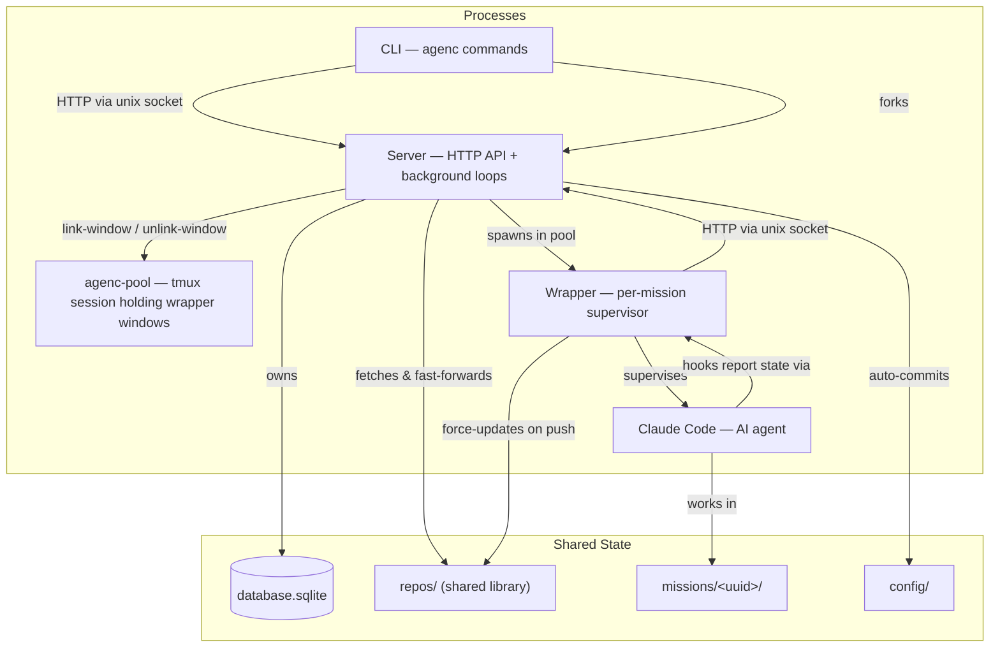

System Architecture
===================

AgenC is a CLI tool that runs AI agents (Claude Code instances) in isolated, per-mission sandboxes. It tracks all missions in a central database, manages a shared repository library, and keeps configuration version-controlled via a background server process.

Read this document before making non-trivial changes to the codebase. It is the canonical map of how the system fits together — runtime processes, directory layout, package responsibilities, and cross-cutting patterns.


Process Overview
----------------

Four cooperating processes form the runtime. They share state through the filesystem, unix sockets, and HTTP over a unix socket. The server is the sole process that reads from and writes to the SQLite database.


```mermaid
graph TB
    subgraph Processes
        CLI["CLI — agenc commands"]
        Server["Server — HTTP API + background loops"]
        Pool["agenc-pool — tmux session holding wrapper windows"]
        Wrapper["Wrapper — per-mission supervisor"]
        Claude["Claude Code — AI agent"]
    end

    subgraph "Shared State"
        DB[("database.sqlite")]
        Repos["repos/ (shared library)"]
        Missions["missions/&lt;uuid&gt;/"]
        Config["config/"]
    end

    CLI -->|HTTP via unix socket| Server
    CLI -->|forks| Server
    Server -->|spawns in pool| Wrapper
    Server -->|link-window / unlink-window| Pool
    Wrapper -->|supervises| Claude
    Wrapper -->|HTTP via unix socket| Server

    Server -->|owns| DB

    Server -->|fetches & fast-forwards| Repos
    Wrapper -->|force-updates on push| Repos

    Claude -->|works in| Missions
    Claude -->|hooks report state via| Wrapper

    Server -->|auto-commits| Config
```

**Inter-process communication** relies on filesystem artifacts, SQLite, and per-mission unix sockets:

| Mechanism | Writer | Reader | Purpose |
|-----------|--------|--------|---------|
| `database.sqlite` | Server | Server | Mission records, heartbeats, pane tracking |
| `server/server.sock` | Server (listener) | CLI, Wrapper (HTTP clients) | REST API for mission CRUD, heartbeats, prompt tracking, pane/title updates |
| `server/server.pid` | Server | CLI (`server stop/status`) | Process coordination |
| `missions/<uuid>/pid` | Wrapper | Server (idle timeout, attach) | Process coordination |
| `missions/<uuid>/wrapper.sock` | Wrapper (listener) | CLI, hooks (`mission send claude-update`) | Restart commands, Claude state updates |
| `agenc-pool` tmux session | Server (creates) | Server (link/unlink), Wrapper (runs in) | Background session holding all wrapper windows |
| `.git/refs/remotes/origin/<branch>` | Git (after push) | Wrapper (via fsnotify) | Trigger repo library update |


Runtime Processes
-----------------

### CLI

The CLI is a thin interface layer that collects user input (arguments, flags, environment variables) and delegates to the server via HTTP over a unix socket. The CLI never accesses the database directly and avoids querying external systems (tmux, git) when the server can do it instead — the server runs outside any sandbox and has full system access. For example, the CLI reads `$TMUX_PANE` (an env var) and sends the pane ID to the server, which queries tmux to resolve the session name.

- Entry point: `main.go`
- Commands: `cmd/` (Cobra-based; one file per command or command group)
- Full command reference: `docs/cli/`

### Server

The server is a long-running HTTP API process that listens on a unix socket. It handles mission lifecycle operations, serves query endpoints, and runs background maintenance loops. The CLI communicates with the server via HTTP requests over the unix socket.

- Entry point: `internal/server/server.go` (`Server.Run`)
- Process management: `internal/server/process.go` (PID file, fork, stop)
- HTTP client: `internal/server/client.go` (CLI-side HTTP client for unix socket communication)
- Error/JSON helpers: `internal/server/errors.go`
- Request logging middleware: `internal/server/middleware.go`
- PID file: `$AGENC_DIRPATH/server/server.pid`
- Log file: `$AGENC_DIRPATH/server/server.log`
- Request log: `$AGENC_DIRPATH/server/requests.log` (structured JSON, one line per HTTP request)
- Socket: `$AGENC_DIRPATH/server/server.sock` (mode 0600)

Current endpoints:
- `GET /health` — returns `{"status": "ok", "version": "<version>"}`
- `GET /server/logs` — returns server log content as plain text (supports `source` and `mode` query params)
- `GET /missions` — lists all missions (supports `include_archived`, `source`, and `source_id` query params)
- `GET /missions/{id}` — get a single mission by ID (supports short ID resolution)
- `POST /missions` — create a new mission (DB record, directory, wrapper spawn in pool)
- `PATCH /missions/{id}` — update mission fields (config_commit, session_name, prompt, tmux_pane)
- `POST /missions/{id}/attach` — ensure wrapper running (lazy start), resolve caller's tmux session from `calling_pane_id`, link pool window into it
- `POST /missions/{id}/detach` — resolve caller's session from `calling_pane_id`, unlink pool window (wrapper keeps running)
- `POST /missions/{id}/stop` — stop a mission's wrapper process and clean up pool window
- `DELETE /missions/{id}` — stop wrapper, clean up pool window and directory, delete from DB
- `POST /missions/{id}/reload` — in-place reload via tmux respawn-pane
- `POST /missions/{id}/archive` — stop and archive a mission
- `POST /missions/{id}/unarchive` — set a mission back to active
- `POST /missions/{id}/heartbeat` — update a mission's `last_heartbeat` timestamp; also updates `last_user_prompt_at` if included in the payload
- `POST /missions/{id}/prompt` — update `last_user_prompt_at` and increment `prompt_count`
- `GET /missions/search?q={query}&limit={n}` — full-text search over mission transcripts; returns BM25-ranked results with snippets and enriched mission metadata
- `GET /sessions?mission_id={id}` — list sessions for a mission (ordered by updated_at descending)
- `PATCH /sessions/{id}` — update session fields (agenc_custom_title); triggers tmux window title reconciliation
- `POST /repos/{name}/push-event` — enqueue a repo library update (returns 202 Accepted)
- `GET /stash` — list saved workspace stash files with metadata
- `POST /stash/push` — snapshot all running missions and their tmux links, then stop them
- `POST /stash/pop` — restore missions from a stash file, re-link into tmux sessions

The server is forked by `agenc server start` (or auto-started by CLI commands via `ensureServerRunning`) and detaches from the parent terminal via `setsid`. It performs graceful shutdown on SIGTERM/SIGINT: stops accepting new connections, drains in-flight requests, stops background loops, cleans up the socket file.
### Background loops

The server runs eleven concurrent background goroutines:

**1. Repo update loop** (`internal/server/template_updater.go`)
- Runs on a fixed interval
- Collects repos to sync: `config.yml` `repoConfig` entries with `alwaysSynced: true` + repos from missions with a recent heartbeat
- Enqueues update requests to the repo update worker channel (does not call git directly)
- Sets `refreshDefaultBranch` flag periodically (every N cycles)

**2. Config auto-commit loop** (`internal/server/config_auto_commit.go`)
- Runs on a fixed interval, with the first cycle delayed after startup
- If `$AGENC_DIRPATH/config/` is a Git repo with uncommitted changes: stages all, commits with timestamp message, pushes (if `origin` remote exists)

**3. Config watcher loop** (`internal/server/config_watcher.go`)
- Watches `config.yml` for changes via fsnotify
- On `config.yml` changes (debounced), re-reads the config, updates the cached `AgencConfig` via `atomic.Pointer`, triggers cron sync to launchd plists, and reconciles writeable-copy watchers

**4. Keybindings writer loop** (`internal/server/keybindings_writer.go`)
- Writes the tmux keybindings file on startup and on a fixed interval
- Sources the keybindings into any running tmux server after writing
- Ensures keybindings stay current after binary upgrades (server auto-restarts on version bump)

**5. Custom-title loop** (`internal/server/custom_title_loop.go`)
- Runs on a fixed 3-second interval
- Queries sessions where `known_file_size > last_custom_title_scan_offset` (new bytes since the last custom-title scan)
- For each: scans new bytes for `custom-title` metadata entries using a quick string-match filter before JSON parsing
- Branches:
  - Title found and different from existing `custom_title` → atomically writes the new title and advances `last_custom_title_scan_offset` to `known_file_size`, then triggers tmux window title reconciliation
  - Title found and equal to existing (or no title found) → advances `last_custom_title_scan_offset` only (no spurious write, no tmux reconcile)
  - Scan I/O error → offset stays put, retry on next cycle

**6. Auto-summary loop** (`internal/server/auto_summary_loop.go`)
- Runs on a fixed 3-second interval
- Queries sessions where `auto_summary = ''` AND `known_file_size > last_auto_summary_scan_offset` (empty summary plus new bytes since the last auto-summary scan)
- For each: scans new bytes for the first user-role line with string content (skipping tool results / multimodal array content), early-returning on the first match
- Branches:
  - First user message found → calls Claude Haiku via `claude --print --model <haiku>` to generate a 3-N word description; on success, atomically writes `auto_summary` and advances `last_auto_summary_scan_offset` to `known_file_size`, then triggers tmux window title reconciliation
  - Haiku failure (CLI killed, OAuth missing, oversized response, etc.) → offset stays put, naturally retried on the next cycle (this is the retry semantics that make the loop self-healing)
  - No user message in the scanned range → advances `last_auto_summary_scan_offset` only; session re-selected when the file grows
- Uses the Claude CLI subprocess rather than a direct API call to avoid requiring users to configure an API key

**7. Idle timeout loop** (`internal/server/idle_timeout.go`)
- Runs on a fixed interval
- Scans all non-archived missions for running wrappers
- Uses the active JSONL conversation log's modification time to determine idle duration, falling back to `created_at`
- Stops wrappers idle past the configured threshold and destroys their pool windows
- Wrappers are automatically re-spawned on the next attach (lazy start)

**8. Repo update worker** (`internal/server/repo_update_worker.go`)
- Processes update requests from a buffered channel (fed by the repo update loop and push-event handler)
- For each request: captures HEAD before update, runs `ForceUpdateRepo`, compares HEAD after
- If HEAD changed (or first clone), reads the repo's `postUpdateHook` from config and runs it via `sh -c` in the repo library directory
- Hook timeout: hard limit; WARN logs emitted at fixed intervals after a grace period
- Hook failures are logged but non-fatal — they do not block subsequent updates

**9. File watcher** (`internal/server/session_scanner.go` — `runFileWatcherLoop`)
- Runs on a fixed interval
- Discovers JSONL files and updates `known_file_size` on the sessions table; does NOT read file content
- Two scopes per cycle:
  - Running missions: queries tmux pool for live pane IDs, resolves each to a mission, walks project dirs for JSONL files, stats them
  - NULL file size sessions: queries sessions where `known_file_size IS NULL`, computes JSONL paths, stats files to set initial sizes (backfill trigger for historical sessions)
- Creates session rows for newly discovered JSONL files

**10. Search indexer** (`internal/server/search_indexer.go`)
- Runs on a fixed interval
- Queries sessions where `known_file_size > last_indexed_offset`
- For each: opens the JSONL file, seeks to `last_indexed_offset`, reads to `known_file_size`
- Extracts user messages and assistant text blocks (skipping tool_use, thinking, system messages)
- Inserts extracted text into the FTS5 `mission_search_index` table and advances `last_indexed_offset` atomically in a single transaction
- Powers the `GET /missions/search` endpoint and the `agenc mission search` CLI command

**11. Writeable-copy reconcile worker** (`internal/server/writeable_copies.go`)
- Drains a buffered channel of reconcile requests, one tick per request
- Three trigger sources feed the channel: working-tree fsnotify (debounced) per writeable copy, library worker fan-out after a successful library update, and a server-startup boot sweep
- Per tick: resume probe (if paused), sanity checks, commit-if-dirty, fetch+reconcile (equal/ahead/behind/diverged) — each step backed by a `GitCommander` interface that the production code wires to the `git` CLI and tests mock with a fake
- On rebase conflict, non-FF push reject, auth failure, wrong branch, origin URL drift, missing path, or git corruption: atomically inserts a pause row in `writeable_copy_pauses` and a notification in `notifications`. The pause is checked at the start of every subsequent tick; the loop auto-resumes when `git status` is clean and HEAD has moved past `local_head_at_pause`
- Notifications are append-only (only mutation: mark-as-read). Pauses are deleted on auto-resume; the linked notification stays in history
- Per-writeable-copy fsnotify watchers are managed by `writeableCopyWatchers` (`internal/server/writeable_copies_watcher.go`): one watcher on the working tree (excluding `.git/`) and one on `.git/refs/remotes/origin/<default-branch>`. The latter triggers an existing-machinery library push-event refresh when the writeable copy successfully pushes to origin

The file watcher, custom-title loop, auto-summary loop, and search indexer form a multi-layer session processing pipeline. The file watcher (layer 1) tracks file sizes. Consumers (layer 2) independently query for sessions where `known_file_size > their_offset` and process new content at their own cadence. The sessions table (layer 3) coordinates via four columns: `known_file_size` (nullable, written by file watcher), `last_custom_title_scan_offset` (custom-title loop), `last_auto_summary_scan_offset` (auto-summary loop), and `last_indexed_offset` (search indexer). Each consumer's output column and its offset are advanced together in a single atomic UPDATE — on failure the offset stays put and the session is naturally re-picked on the next cycle.

The FTS5 virtual table `mission_search_index` stores indexed conversation text with `mission_id` and `session_id` as unindexed columns. It uses the `porter unicode61` tokenizer for stemming and Unicode normalization. Queries use BM25 ranking with results deduplicated by mission.

### Tmux pool

The `agenc-pool` tmux session is a background session that holds all wrapper windows. This enables the attach/detach model — wrappers run in the pool regardless of whether the user is viewing them.

- Pool management: `internal/server/pool.go`
- Created on server startup via `ensurePoolSession()`
- Each mission gets a window named with the short mission ID
- `link-window` / `unlink-window` are used to show/hide missions in the user's tmux session
- Pool windows are auto-cleaned when wrappers exit or are stopped

### Wrapper

The wrapper is a per-mission foreground process that supervises a Claude child process. One wrapper runs per active mission. It communicates with the server via an HTTP client over the unix socket for all database operations (heartbeats, prompt tracking, pane registration, window title updates).

- Entry point: `internal/wrapper/wrapper.go` (`Wrapper.Run` for interactive, `Wrapper.RunHeadless` for headless)
- Tmux integration: `internal/wrapper/tmux.go`

The wrapper:

1. Writes the wrapper PID to `$AGENC_DIRPATH/missions/<uuid>/pid`
2. Records the tmux pane ID via the server (cleared on exit) for pane→mission resolution
3. Resolves the Claude model: checks the repo's `defaultModel` in `config.yml`, falls back to the top-level `defaultModel`, or omits `--model` entirely (letting Claude choose its default)
4. Writes the mission's operational-settings file (`agenc-settings.json`) and its `agenc-hooks/` guard script into the mission dir (via `claudeconfig.WriteMissionOpSettings`). This runs at the top of every Claude spawn — initial start, in-place tmux respawn-pane reload — so each spawn regenerates the operational overlay with the latest config. Under State Y (native passthrough) there is **no** per-mission `claude-config/` snapshot: Claude reads the user's real `~/.claude` directly, and AgenC's operational layer is delivered per-invocation via `claude --settings <op-settings file>` (which unions with `~/.claude/settings.json`).
5. Spawns Claude as a child process (with 1Password wrapping if `secrets.env` exists), passing `--settings <op-settings file>`, `--model <value>` if a model was resolved, and the initial prompt if any
6. Sets `AGENC_MISSION_UUID` for the child process. Does **not** set `CLAUDE_CONFIG_DIR` (State Y — Claude reads the real `~/.claude`). Injects `CLAUDE_CODE_OAUTH_TOKEN` **only** when a token file is present (the machine-token fallback toggle); absent, Claude uses its native `~/.claude` login.
7. Starts background goroutines:
   - **Heartbeat writer** — updates `last_heartbeat` via the server on a fixed interval; also piggybacks `last_user_prompt_at` for crash recovery
   - **Remote refs watcher** (if mission has a git repo) — watches `.git/refs/remotes/origin/<branch>` for pushes; when detected, force-updates the repo library clone so other missions get fresh copies (debounced)
   - **HTTP server** (interactive mode only) — serves an HTTP API on `wrapper.sock` (unix socket) with endpoints for status queries, restart commands, and claude_update events
8. Main event loop implements a three-state machine (see below)

**Interactive mode** (`Run`): pipes stdin/stdout/stderr directly to the terminal. On signal, forwards it to Claude and waits for exit. Exposes an HTTP API on a unix socket for restart commands and state queries.

**Headless mode** (`RunHeadless`): runs `claude --print -p <prompt>`, captures output to `claude-output.log` with log rotation. Supports timeout and graceful shutdown (SIGTERM then SIGKILL after a grace period). No socket listener — headless missions are one-shot and don't need restart support.

**Three-state restart machine** (interactive mode only):

```
  ┌─────────┐  restart cmd   ┌────────────────┐  claude idle   ┌────────────┐
  │ Running │ ─────────────→ │ RestartPending  │ ────────────→ │ Restarting │
  └─────────┘                └────────────────┘               └────────────┘
       ↑                                                            │
       └────────────────────────────────────────────────────────────┘
                              claude respawned

  Hard restart skips RestartPending — goes directly Running → Restarting.
```

- **Running** + Claude exits → natural exit, wrapper exits
- **Restarting** + Claude exits → wrapper-initiated restart, respawn Claude
- **RestartPending** + Claude becomes idle → transition to Restarting, SIGINT Claude
- Restarts are idempotent: duplicate requests return ok. A hard restart overrides a pending graceful.

**Wrapper HTTP API**: standard HTTP-over-unix-socket (using Go's `net/http`). Socket path: `missions/<uuid>/wrapper.sock`. Endpoints:
- `GET /status` — returns JSON with `claude_state` (`"idle"`, `"busy"`, or `"needs_attention"`), `wrapper_state` (`"running"`, `"restart_pending"`, or `"restarting"`), and `has_conversation` (bool). Read directly under `stateMu` — does not go through the command channel.
- `POST /restart` — accepts `{"mode": "graceful"|"hard", "reason": "..."}`. Graceful waits for idle then SIGINTs Claude and resumes with `claude -c`; hard SIGKILLs immediately and starts a fresh session. Processed through the main event loop command channel.
- `POST /claude_update` — accepts `{"event": "...", "notification_type": "..."}`. Sent by Claude hooks to report state changes (event types: `Stop`, `UserPromptSubmit`, `Notification`, `PostToolUse`, `PostToolUseFailure`). The wrapper uses these to track idle state, conversation existence, needs-attention status, trigger deferred restarts, and set tmux pane colors for visual feedback. Processed through the main event loop command channel.

**Conditional auth at spawn time**: missions default to native Claude authentication (set up via `claude auth login`). If an explicit token is stored at `$AGENC_DIRPATH/cache/oauth-token` (written via `agenc token set`), the wrapper reads it and passes it to Claude via `CLAUDE_CODE_OAUTH_TOKEN`. When no token file exists, `CLAUDE_CODE_OAUTH_TOKEN` is omitted and Claude uses its own native credentials. This "conditional passthrough" model avoids forcing token setup while still supporting the State-X fallback for headless/high-concurrency workflows. All missions share the same token file; when the token is updated (`agenc token set <new-token>`), new missions pick it up immediately and running missions pick it up on their next restart.

**Model resolution at spawn time**: the wrapper resolves the Claude model from `config.yml` using a precedence chain: the repo's `repoConfig` `defaultModel` (if set) takes priority over the top-level `defaultModel` (if set). When a model is resolved, the wrapper passes `--model <value>` to the Claude CLI. If neither level specifies a model, `--model` is omitted and Claude uses its own default.


Directory Structure
-------------------

### Source tree

```
.
├── main.go                       # CLI entry point
├── Makefile                      # Build, check, and setup targets with version injection via ldflags
├── .githooks/                    # Git hooks (pre-commit runs make check; others delegate to beads)
├── go.mod / go.sum
├── README.md
├── CLAUDE.md                     # Agent instructions for working on this codebase
├── AGENTS.md                     # Agent definitions
├── cmd/                          # CLI commands (Cobra); see docs/cli/ for full reference
│   ├── session.go                # `session` command group
│   ├── session_print.go          # `session print` — print raw JSONL transcript for a session
│   ├── mission_print.go          # `mission print` — print JSONL for a mission's current session
│   ├── gendocs/                  # Build-time CLI doc generator
│   └── genprime/                 # Build-time CLI quick reference generator (agenc prime)
├── internal/
│   ├── config/                   # Path management, YAML config
│   ├── database/                 # SQLite CRUD
│   ├── mission/                  # Mission lifecycle, Claude spawning
│   ├── claudeconfig/             # Claude configuration building
│   ├── server/                   # HTTP API server (unix socket)
│   ├── tmux/                     # Tmux keybindings generation
│   ├── wrapper/                  # Claude child process management
│   ├── history/                  # Prompt extraction from history.jsonl
│   ├── session/                  # Session name resolution and transcript access
│   ├── version/                  # Build-time version string
│   └── tableprinter/             # ANSI-aware table formatting
├── docs/                         # Documentation
│   └── cli/                      # Generated CLI reference
├── specs/                        # Design specs (historical reference)
└── scripts/                      # Utility scripts
```

### Runtime tree (`$AGENC_DIRPATH`, defaults to `~/.agenc/`)

```
$AGENC_DIRPATH/
├── database.sqlite                        # SQLite: missions and sessions tables
├── statusline-wrapper.sh                  # Shared statusline wrapper script
├── statusline-original-cmd                # User's original statusLine.command (saved on first build)
│
├── cache/                                 # Cached runtime data (not committed to Git)
│   └── oauth-token                        # Claude Code OAuth token (mode 600)
│
├── config/                                # User configuration (optionally a git repo)
│   └── config.yml                         # Synced repos, Claude config source, cron jobs
│
├── repos/                                 # Shared repo library (server syncs these)
│   └── github.com/owner/repo/            # One clone per repo
│
├── missions/                              # Per-mission sandboxes
│   └── <uuid>/
│       ├── .adjutant                      # Marker file (empty); present only for adjutant missions
│       ├── agent/                         # Git repo working directory
│       ├── agenc-hooks/                   # AgenC-managed hook scripts (e.g. PreToolUse repo-library guard)
│       ├── op-settings.json               # Operational settings file (passed via --settings to Claude)
│       ├── pid                            # Wrapper process ID
│       ├── wrapper.sock                   # Unix socket for wrapper commands (restart, claude_update)
│       ├── wrapper.log                    # Wrapper lifecycle log
│       ├── statusline-message             # Per-mission statusline message (e.g. token expiry warning)
│       └── claude-output.log              # Headless mode output (with rotation)
│
├── server/
│   ├── server.pid                         # Server process ID
│   ├── server.log                         # Server log
│   ├── requests.log                       # Structured HTTP request log (JSON lines)
│   └── server.sock                        # Unix socket for HTTP API (mode 0600)
│
├── stash/                                     # Workspace snapshots (agenc stash push/pop)
│   └── <timestamp>.json                       # Each file captures running missions and their tmux links
```


Configuration Reference
-----------------------

For the full `config.yml` reference (keys, defaults, annotated examples) and environment variables, see the [Configuration section of the README](../README.md#configuration). The config file is parsed by `internal/config/agenc_config.go`.


Core Packages
-------------

### `internal/config/`

Path management and YAML configuration. All path construction flows from `GetAgencDirpath()`, which reads `$AGENC_DIRPATH` and falls back to `~/.agenc`.

- `config.go` — path helper functions (`GetMissionDirpath`, `GetRepoDirpath`, `GetDatabaseFilepath`, `GetCacheDirpath`, `GetOAuthTokenFilepath`, etc.), directory structure initialization (`EnsureDirStructure`), constant definitions for filenames and directory names, adjutant mission detection (`IsMissionAdjutant` checks for `.adjutant` marker file), OAuth token file read/write (`ReadOAuthToken`, `WriteOAuthToken`)
- `agenc_config.go` — `AgencConfig` struct (YAML round-trip with comment preservation, `defaultModel` for specifying the default Claude model), `RepoConfig` struct (per-repo settings: `alwaysSynced`, `emoji`, `trustedMcpServers`, `defaultModel`), `TrustedMcpServers` struct (custom YAML marshal/unmarshal supporting `all` string or a list of named servers), `CronConfig` struct (with per-cron `notificationsEnabled` opt-out for the cron.triggered notification, default-on), `PaletteCommandConfig` struct (user-defined and builtin palette entries with optional tmux keybindings), `PaletteTmuxKeybinding` (configurable key for the command palette, defaults to `k`), `BuiltinPaletteCommands` defaults map, `GetResolvedPaletteCommands` merge logic, validation functions for repo format, cron names, palette command names, and schedules. Cron schedule validation via `launchd.ParseCronExpression` (rejects expressions launchd cannot represent).
- `first_run.go` — `IsFirstRun()` detection

### `internal/repo/`

Repo library operations and resolution logic. Used by the server for repo API endpoints and by CLI commands that resolve repo input (e.g., `mission new`, `cron new`).

- `repo.go` — `FindReposOnDisk` (filesystem walk of `repos/<host>/<owner>/<repo>/`), `listSubdirs` helper
- `resolution.go` — `ResolveAsRepoReference` (resolves URLs, shorthand, and local paths to canonical repo names with cloning), `LooksLikeRepoReference` (input classification), `GetProtocolPreference` (non-interactive SSH/HTTPS detection via gh config and existing repos), `GetOriginRemoteURL`
- `gh_config.go` — GitHub CLI config reading (`~/.config/gh/hosts.yml`): `GetGhConfig`, `GetGhConfigProtocol`, `GetGhLoggedInUser`, `GetDefaultGitHubUser`

### `internal/mission/`

Mission lifecycle: directory creation, repo copying, and Claude process spawning.

- `mission.go` — `CreateMissionDir` (sets up mission directory, copies git repo, builds per-mission config), `SpawnClaude`/`SpawnClaudeWithPrompt`/`SpawnClaudeResume` (construct and start Claude `exec.Cmd` with 1Password integration, environment variables, and `--model` flag when a `defaultModel` is configured)
- `repo.go` — git repository operations: `CopyRepo`/`CopyAgentDir` (rsync-based), `ForceUpdateRepo` (fetch + reset to remote default branch), `ParseRepoReference`/`ParseGitHubRemoteURL` (handle shorthand, canonical, SSH, and HTTPS URL formats), `EnsureRepoClone`, `DetectPreferredProtocol` (infers SSH vs HTTPS from existing repos)

### `internal/claudeconfig/`

Claude configuration building.

- `build.go` — `WriteAgencHookScripts` (writes the embedded repo-library guard hook script to disk), `GetMissionClaudeConfigDirpath` (backward-compatibility: falls back to global config when no per-mission snapshot exists), `GetLastSessionID` (scans the mission's project directory for the most-recently-modified JSONL session file), `GetMissionProjectDirpath`, `ComputeProjectDirpath`, `ProjectDirectoryExists`.
- `merge.go` — `mergeAgencSandbox` (adds the AgenC server socket to `allowUnixSockets` in the settings sandbox block; used by `BuildOperationalSettings`).
- `overrides.go` — `BuildAgencHookEntries` builds the hook entry map: state-tracking hooks (Stop, UserPromptSubmit, Notification, PostToolUse, PostToolUseFailure for idle detection and tmux pane color updates via socket), a SessionStart hook that injects the `agenc prime` routing index on every fresh spawn via the `agenc` CLI, and a PreToolUse repo-library guard. Also `BuildAgentDirAllowEntries`, `AgencRepoLibraryWriteTools`, `BuildRepoLibraryDenyEntries`, and `buildRepoLibraryGuardHookEntry`.
- `operational_settings.go` — `BuildOperationalSettings` assembles a standalone `settings.json` carrying only AgenC operational plumbing (hooks, allow/deny permissions, sandbox socket allowlist) for delivery to Claude via `--settings`. Does not merge user settings and does not rewrite paths — `--settings` unions with the user's `~/.claude/settings.json`.
- `repo_library_guard.sh` — embedded bash script run as a PreToolUse hook. When an agent attempts Write/Edit/NotebookEdit on a path under `<agencDirpath>/repos`, replaces Claude Code's bare permission denial with explicit guidance directing the agent to spawn a new mission scoped to the target repo. Fails open if `jq` is missing — the permission-deny layer in settings.json still blocks the write.
- `prime_content.go` — embeds the routing-index content generated at build time by `cmd/genprime/` from `prime_preamble.md` + the Cobra command tree + `prime_postamble.md`. Printed by `agenc prime`; injected into every mission via the SessionStart hook wired in `overrides.go`. Replaces the old `agent_instructions.md` CLAUDE.md-prepend layer.
- `prime_preamble.md` — hand-written operating context that opens `agenc prime`: AgenC concept, mission filesystem semantics, configuration source-of-truth, the self-reload `--async` constraint, the cross-repo-write constraint, and the briefing-a-spawned-mission principle. Path-scoped `.claude/rules/prompt-files-discipline.md` directs editors to invoke `/prompt-writing` before modifying.
- `prime_postamble.md` — hand-written Repo Formats reference appended after the Cobra-generated middle. Same prompt-discipline rule applies.
- `adjutant.go` — adjutant mission config builders: `buildAdjutantClaudeMd` (appends adjutant instructions), `buildAdjutantSettings` (injects adjutant permissions), `BuildAdjutantAllowEntries`/`BuildAdjutantDenyEntries` (permission entry generators)
- `adjutant_claude.md` — embedded CLAUDE.md instructions for adjutant missions (tells the agent it is the Adjutant, directs CLI usage, establishes filesystem access boundaries)
### `internal/server/`

HTTP API server that listens on a unix socket. Serves mission lifecycle endpoints and runs background maintenance loops.

- `server.go` — `Server` struct, `NewServer`, `Run` (starts HTTP listener, background loops, graceful shutdown on context cancellation), `registerRoutes`, `handleHealth`
- `process.go` — server lifecycle: `ForkServer` (re-executes binary as detached process via setsid), `ReadPID`, `IsRunning`, `IsProcessRunning`, `StopServer` (SIGTERM then SIGKILL), `IsServerProcess` (env var check)
- `client.go` — `Client` struct with `Get`, `Post`, `Delete`, `Patch` methods for CLI-to-server and wrapper-to-server communication over the unix socket. High-level API: `ListMissions`, `GetMission`, `CreateMission`, `UpdateMission`, `StopMission`, `DeleteMission`, `ArchiveMission`, `UnarchiveMission`, `Heartbeat`, `RecordPrompt`, `ReloadMission`, `ListRepos`, `AddRepo`, `RemoveRepo`, `ListCrons`, `CreateCron`, `UpdateCron`, `DeleteCron`
- `missions.go` — mission CRUD endpoints, wrapper process management (stop/reload/delete), tmux in-place reload, transient field enrichment (queries each running wrapper's `GET /status` endpoint for `ClaudeState`, checks `.adjutant` marker for `IsAdjutant`)
- `repos.go` — repo management endpoints (`GET /repos` list with synced status, `POST /repos` clone and configure, `DELETE /repos/` remove from disk and config) and push-event endpoint (enqueues repo update, returns 202 Accepted)
- `repo_update_worker.go` — centralized repo update worker goroutine: processes update requests, runs `ForceUpdateRepo`, executes `postUpdateHook` when HEAD changes
- `errors.go` — `writeError`, `writeJSON` helper functions for consistent JSON responses
- `template_updater.go` — repo update loop (60-second interval, collects synced + active-mission repos, enqueues update requests)
- `config_auto_commit.go` — config auto-commit loop (10-minute interval, git add/commit/push)
- `handle_crons.go` — cron CRUD endpoints (`GET /crons` list, `POST /crons` create with sleepGuard, `PATCH /crons/{name}` update, `DELETE /crons/{name}` remove). All mutations acquire the config lock, read-modify-write config.yml, update cachedConfig, and trigger cron sync to launchd
- `handle_cron_logs.go` — cron log endpoint (`GET /crons/{id}/logs`)
- `cron_syncer.go` — cron syncer: synchronizes `config.yml` cron jobs to macOS launchd plists in `~/Library/LaunchAgents/`, reconciles orphaned plists on startup, skips writes and reloads when plist content is unchanged
- `config_watcher.go` — config watcher loop (fsnotify on `config.yml`, debounced, updates cached `AgencConfig` via `atomic.Pointer`, triggers cron sync to launchd plists, and reconciles writeable-copy watchers)
- `keybindings_writer.go` — keybindings writer loop (writes and sources tmux keybindings file on a fixed interval)
- `session_scanner.go` — file watcher loop (3-second interval, discovers JSONL files via tmux pool + backfills NULL file sizes, updates `known_file_size`) plus shared scan helpers used by the custom-title and auto-summary loops: `scanJSONLForCustomTitle` (reads new bytes for `custom-title` metadata) and `scanJSONLForFirstUserMessage` (early-returns on the first user-role string-content line, skipping array-content tool-result / multimodal lines)
- `custom_title_loop.go` — custom-title loop (3-second interval; atomically writes `custom_title` and advances `last_custom_title_scan_offset` together; triggers tmux title reconciliation when the title changes)
- `auto_summary_loop.go` — auto-summary loop (3-second interval; on first-user-message hit, invokes the Haiku helper and atomically writes `auto_summary` + advances `last_auto_summary_scan_offset` on success; Haiku failures leave the offset untouched so the session is retried on the next cycle)
- `session_summarizer.go` — Haiku helper used by the auto-summary loop: `generateSessionSummary` calls Claude Haiku via the `claude --print --model <haiku>` CLI subprocess to produce a short description from the first user prompt, and `buildSummarizerSystemPrompt` constructs the system prompt. Uses the Claude CLI rather than a direct API call to avoid requiring users to configure an API key
- `tmux.go` — tmux window title reconciliation: idempotent convergence of tmux window names using the priority chain (custom_title > agenc_custom_title > auto_summary > repo name > short ID), with sole-pane guard. Prepends per-mission emoji (from config, or hardcoded 🤖 for adjutant / 🦀 for blank missions) with fixed-column-4 padding via `go-runewidth`
- `sessions.go` — session HTTP handlers: list sessions by mission, update session fields (agenc_custom_title) with automatic title reconciliation
- `notifications_handlers.go` — notifications CRUD endpoints (`POST /notifications`, `GET /notifications`, `GET /notifications/{id}`, `POST /notifications/{id}/read`, `GET /notifications/unread-count`); body-size cap. Cron-source missions auto-create a `cron.triggered` notification linked to the new mission via `MissionID`; failure to insert is logged and never fails the mission request
- `notifications_helpers.go` — `sanitizeNotificationTitle` strips ANSI sequences and control characters from titles before persistence (defense-in-depth for cron names sourced from user-edited config)

### `internal/database/`

SQLite mission tracking with auto-migration.

- `database.go` — `DB` struct (wraps `sql.DB` with max connections = 1 for SQLite), `Mission` struct, CRUD operations (`CreateMission`, `ListMissions`, `GetMission`, `ResolveMissionID`, `ArchiveMission`, `DeleteMission`), heartbeat updates, session name caching, generic source tracking (`source`, `source_id`, `source_metadata` columns). Idempotent migrations handle schema evolution.
- `sessions.go` — `Session` struct and CRUD operations: `CreateSession`, `GetSession`, `ListSessions`, `ListSessionsByMission`, `GetActiveSession`, `UpdateSessionAgencCustomTitle`, `UpdateKnownFileSize`, `SessionsWithNullFileSize`, plus the split-loop query and atomic-update helpers — `SessionsNeedingCustomTitleUpdate` / `UpdateCustomTitleAndOffset` / `UpdateCustomTitleScanOffset` for the custom-title loop, and `SessionsNeedingAutoSummary` / `UpdateAutoSummaryAndOffset` / `UpdateAutoSummaryScanOffset` for the auto-summary loop. Each `*AndOffset` helper writes the output column and advances its scan offset in a single UPDATE so failure rolls back both. `GetActiveSession` returns the most recently updated session for a mission, used by tmux title reconciliation to determine the current display title.
- `notifications.go` — `Notification` struct (with optional `MissionID` attach target) and CRUD operations (`CreateNotification`, `GetNotification`, `ListNotifications`, `MarkNotificationRead`, `CountUnreadNotifications`). Notifications are append-only — `read_at` is the only mutation. The `mission_id` column links a notification to a mission so the Notification Center picker can attach on `ENTER`.

### `internal/launchd/`

macOS launchd integration for cron scheduling.

- `plist.go` — `Plist` struct and XML generation, `ParseCronExpression` (converts cron expressions to `StartCalendarInterval`), `CronToPlistFilename` (sanitizes cron names), `PlistDirpath` helper
- `manager.go` — `Manager` wraps launchctl operations: `LoadPlist`, `UnloadPlist`, `IsLoaded`, `RemovePlist` (two-step: unload then delete), `ListAgencCronJobs`, `VerifyLaunchctlAvailable`

### `internal/tmux/`

Tmux keybindings generation and version detection, shared by the CLI (`tmux inject`) and server.

- `keybindings.go` — `GenerateKeybindingsContent`, `WriteKeybindingsFile`, `SourceKeybindings`, `BuildKeybindingsFromCommands`, `RefreshKeybindings`. Commands are self-contained strings that include their own tmux primitives (e.g. `tmux display-popup ...`, `tmux split-window ...`) when needed. Both keybinding generation and the palette dispatch commands via `tmux run-shell`. Mission-scoped commands (those containing `$AGENC_CALLING_MISSION_UUID`) get a UUID-resolution preamble in keybindings; the palette instead prepends `export` statements. Commands containing `display-popup` are skipped on tmux < 3.2. The hardcoded key table entry (`prefix + a`) and palette popup remain fixed; all other keybindings are driven by the resolved palette commands.
- `version.go` — `ParseVersion` (parses `tmux -V` output), `DetectVersion` (runs `tmux -V` and parses the result). Used by keybindings generation, the server, and the CLI to detect the installed tmux version.

### `internal/wrapper/`

Per-mission Claude child process management.

- `wrapper.go` — `Wrapper` struct (uses `server.Client` for all database operations, `stateMu` protects state for concurrent HTTP reads), `Run` (interactive mode with three-state restart machine), `RunHeadless` (headless mode with timeout and log rotation), background goroutines (heartbeat, remote refs watcher, HTTP server), `handleClaudeUpdate` (processes hook events for idle tracking, needs-attention tracking, and pane coloring), signal handling, OAuth token passthrough via `CLAUDE_CODE_OAUTH_TOKEN` environment variable, model resolution from `defaultModel` config (repo-level then top-level) passed as `--model` to the Claude CLI
- `socket.go` — HTTP server on unix socket (`startHTTPServer`), request/response types (`StatusResponse`, `RestartRequest`, `ClaudeUpdateRequest`, `CommandResponse`), internal `Command`/`commandWithResponse` types for the event loop channel, HTTP handlers for each endpoint
- `client.go` — `WrapperClient` HTTP client using unix socket transport, typed methods (`GetStatus`, `Restart`, `SendClaudeUpdate`), `ErrWrapperNotRunning` sentinel error
- `tmux.go` — pane color management (`setWindowBusy`, `setWindowNeedsAttention`, `resetWindowTabStyle`) for visual mission status feedback, pane registration/clearing via server client (triggers initial tmux window title reconciliation on the server side)

### Utility packages

- `internal/version/` — single `Version` string set via ldflags at build time (`version.go`)
- `internal/history/` — `FindFirstPrompt` extracts the first user prompt from Claude's `history.jsonl` for a given mission UUID (`history.go`)
- `internal/session/` — `FindSessionName` resolves a mission's session name from Claude metadata (priority: custom-title > sessions-index.json summary > JSONL summary) (`session.go`), `FindCustomTitle` returns only the /rename custom title (`session.go`), `FindSessionJSONLPath` locates the JSONL transcript file for a session UUID by searching all project directories under `~/.claude/projects/` (`session.go`), `ListSessionIDs` returns all session UUIDs for a mission sorted by modification time (most recent first) by scanning the mission's project directory for `.jsonl` files (`session.go`), `TailJSONLFile` reads the last N lines from a JSONL file and writes them to a given writer, or writes the entire file when N is zero (`session.go`), `ExtractRecentUserMessages` extracts user message contents from session JSONL for AI summarization (`conversation.go`)
- `internal/sleep/` — sleep mode types and validation (`sleep.go`). Defines `WindowDef` (days + start/end times) and validation functions (`ValidateDays`, `ValidateTime`, `ValidateWindow`). Used by `internal/config/` for config validation and `internal/server/` for the sleep guard middleware.
- `internal/tableprinter/` — ANSI-aware table formatting using `rodaine/table` with `runewidth` for wide character support (`tableprinter.go`)


Key Architectural Patterns
--------------------------

### Operational settings (State Y)

Under State Y, `CLAUDE_CONFIG_DIR` is unset. Claude reads the user's own `~/.claude/` config directly — no per-mission snapshot is built. AgenC's operational plumbing (hooks, allow/deny permissions, sandbox socket allowlist) is delivered to Claude via a standalone `op-settings.json` file written to the mission directory and passed as `--settings op-settings.json` on every Claude spawn. The `--settings` flag causes Claude to union the file with the user's `~/.claude/settings.json` rather than replace it.

`BuildOperationalSettings` (`internal/claudeconfig/operational_settings.go`) assembles this file. It does not merge user settings and does not rewrite paths. The hook script (the PreToolUse repo-library guard) is written by `WriteAgencHookScripts` to `<missionDir>/agenc-hooks/repo-library-guard.sh`.

AgenC operating context is delivered to every mission via the SessionStart hook, not by prepending to CLAUDE.md. The `agenc prime` content (`internal/claudeconfig/prime_content.md`, generated by `cmd/genprime/` from `prime_preamble.md` + Cobra tree + `prime_postamble.md`) is injected as a system-reminder on every fresh Claude spawn, including post-compaction resume.

**Authentication**: Claude's own authentication uses a token file at `$AGENC_DIRPATH/cache/oauth-token` — the wrapper injects `CLAUDE_CODE_OAUTH_TOKEN` only when this file is present (a machine-token fallback toggle); absent, Claude uses its native `~/.claude` login. MCP server OAuth tokens are managed entirely by Claude Code natively; no per-mission Keychain cloning or sync goroutines are involved.

### Trust seeding

Under State Y, `CLAUDE_CONFIG_DIR` is unset, so Claude reads and writes the real `~/.claude.json` (or `$CLAUDE_CONFIG_DIR/.claude.json` when the surrounding environment sets it, e.g. the e2e harness). Claude Code gates each git-repo root behind a one-time trust dialog keyed to `projects["<repoRoot>"].hasTrustDialogAccepted`. Since there is no global trust bypass, AgenC seeds this entry itself so a mission spawns without a blocking dialog.

The trust write is server-side (`internal/server/trust.go`), keyed on the mission's agent directory:

- **Seed at create** — both create handlers (`handleCreateMission`, `handleCreateClonedMission`) call `seedMissionTrust(agentDir, trustedMcpServers)` after the mission dir is built and before the wrapper spawns. It writes `hasTrustDialogAccepted=true` plus the repo's `enabledMcpjsonServers`/`disabledMcpjsonServers`.
- **Prune at delete** — `handleDeleteMission` calls `pruneMissionTrust(agentDir)` to remove the entry.
- **Boot-time reconcile** — on server startup, `reconcileMissionTrust` seeds an entry for every existing mission's agent dir (migrating in-flight missions created before the flip) and prunes stale entries under the missions directory whose mission no longer exists. This is both the migration pass and the trust-drift check-loop.

All three paths serialize on a single `Server.claudeJSONMu` mutex and write atomically (temp file + rename in the same directory), with a bounded verify-retry loop to survive Claude's own lock-free writes to the same file. AgenC only ever touches the specific `projects[...]` keys for its missions; all other content is preserved byte-for-byte.

### Idle detection via socket

The wrapper needs to know whether Claude is idle and whether a resumable conversation exists. This is accomplished via Claude Code hooks that send state updates to the wrapper's HTTP API (unix socket).

`BuildOperationalSettings` injects seven hooks into each mission's `op-settings.json` (`internal/claudeconfig/operational_settings.go`, using entries from `overrides.go`). Five are fire-and-forget state-tracking hooks that report Claude's lifecycle to the wrapper; the sixth is a PreToolUse repo-library guard; the seventh is a SessionStart hook that injects the `agenc prime` routing index via the `agenc` CLI.

State-tracking hooks (sent to the wrapper socket):

- **Stop hook** — calls `agenc mission send claude-update $AGENC_MISSION_UUID Stop` when Claude finishes responding
- **UserPromptSubmit hook** — calls `agenc mission send claude-update $AGENC_MISSION_UUID UserPromptSubmit` when the user submits a prompt
- **Notification hook** — calls `agenc mission send claude-update $AGENC_MISSION_UUID Notification` when Claude needs user attention (permission prompts, idle prompts, elicitation dialogs)
- **PostToolUse hook** — calls `agenc mission send claude-update $AGENC_MISSION_UUID PostToolUse` after a tool call succeeds
- **PostToolUseFailure hook** — calls `agenc mission send claude-update $AGENC_MISSION_UUID PostToolUseFailure` after a tool call fails

Guidance hook:

- **PreToolUse repo-library guard** — runs `bash <claudeConfigDirpath>/agenc-hooks/repo-library-guard.sh` against Write, Edit, and NotebookEdit calls (matched via the hook entry's `matcher` field). When the target path lies under `<agencDirpath>/repos/`, the script emits a `permissionDecision: deny` JSON response whose reason directs the agent to spawn a new mission scoped to the target repo (`agenc mission new <repo>`). Without the guard, the bare permission-deny message that Claude sees ("denied by your permission settings") gives the agent no actionable next step and it tends to fall back to Bash + an interpreter (e.g. python writing files) as a workaround.

The `agenc mission send claude-update` command only reads stdin for Notification events (to extract `notification_type` from the hook JSON payload, with a short timeout). All other events skip stdin entirely in the Go handler — Claude Code may not close stdin for some event types (notably UserPromptSubmit), which would cause `io.ReadAll` to block indefinitely. Shell-level redirects (`< /dev/null`) cannot be used in hook commands because Claude Code may tokenize the command string rather than passing it through `sh -c`, causing redirect tokens to be interpreted as extra positional arguments. The command sends an HTTP POST to the wrapper's `/claude-update` endpoint (unix socket) with a short timeout. It always exits 0 to avoid blocking Claude.

The wrapper processes these updates in its main event loop (`handleClaudeUpdate`):
- **Stop** → marks Claude idle, records that a conversation exists, sets tmux pane to attention color, triggers deferred restart if pending
- **UserPromptSubmit** → marks Claude busy, records that a conversation exists, resets tmux pane to default color, calls the server's `/prompt` endpoint to increment `prompt_count`
- **Notification** → sets tmux pane to attention color for `permission_prompt`, `idle_prompt`, and `elicitation_dialog` notification types
- **PostToolUse / PostToolUseFailure** → sets tmux pane to busy color; corrects the window color after a permission prompt (which turns the pane orange) when Claude resumes work after the user responds

### Tmux pane coloring

The wrapper provides visual feedback by setting the tmux pane background color when Claude needs user attention (`internal/wrapper/tmux.go`). When Claude stops responding, encounters a permission prompt, or shows an elicitation dialog, the pane background turns dark teal (`colour022`). When the user submits a new prompt, the pane resets to the default background. The pane style is also reset on wrapper exit. All pane color operations are no-ops outside tmux (`TMUX_PANE` empty).

### Mission pane tracking

Each wrapper records its tmux pane ID (`TMUX_PANE`) via the server's `PATCH /missions/{id}` endpoint on startup and clears it on exit (`internal/wrapper/tmux.go`). This enables tmux keybindings and the command palette to resolve which mission is focused in the current pane.

The resolution flow:

1. A tmux keybinding calls `agenc tmux resolve-mission "$(tmux display-message -p "#{pane_id}")"` to look up the focused pane's mission UUID
2. The UUID is exported as `AGENC_CALLING_MISSION_UUID`
3. For direct keybindings: mission-scoped keybindings include a preamble that resolves the UUID, then an `if`/`else` — running the command when a mission resolves, otherwise showing a `tmux display-message` status-line notice. (The empty case must not fall through as a bare `&& cmd`: that leaves the compound statement's exit code non-zero, which `run-shell` surfaces as a spurious error overlay — the failure mode a tmux-resurrect-restored pane hits, since its wrapper is gone and reconciliation left its `tmux_pane` NULL.)
4. For the palette: the env var is passed into the popup so `buildPaletteEntries` can filter out mission-scoped commands when no mission is focused. On selection, the palette prepends `export AGENC_CALLING_MISSION_UUID=<uuid>; export AGENC_DIRPATH=<path>;` to the command before handing off via `tmux run-shell -b`, since the tmux server's shell environment does not inherit the palette process's env vars. Output is redirected to `$AGENC_DIRPATH/logs/palette.log` to prevent `run-shell` from echoing into the active pane

Commands reference `$AGENC_CALLING_MISSION_UUID` as a plain shell variable — no special placeholder syntax. The palette detects mission-scoped commands by checking whether the command string contains the env var name (`ResolvedPaletteCommand.IsMissionScoped()`).

### Calling pane and session resolution

CLI commands that create, attach, or detach missions need to tell the server two things about the invocation: which tmux pane the user invoked from (the "calling pane") and which tmux session the user is currently attached to (the "calling session"). These are two distinct concepts and serve different purposes:

- **Calling pane ID** identifies the underlying pane the user pressed a key in. It is used by `agenc tmux resolve-mission` to look up which mission owns the focused pane (so `AGENC_CALLING_MISSION_UUID` can be exported into mission-scoped commands).
- **Calling session name** identifies the session the user is *attached to* via their tmux client. This is the authoritative answer for "where should I link/unlink the mission window?" — pane IDs are not authoritative here, because a mission's window can be linked into multiple sessions simultaneously, making pane-ID-based session resolution ambiguous.

All three endpoints (create, attach, detach) send `tmux_session` in the request body and the server uses it directly — pane-ID-based session inference is no longer used for any session-linking decision. The CLI never queries the tmux server in sandboxed contexts; it forwards env-var values that tmux populates at key-press time.

There are three execution contexts that reach these server endpoints. Each must supply both env vars:

| Context | How it runs | `$AGENC_CALLING_PANE_ID` | `$AGENC_CALLING_SESSION_NAME` |
|---------|------------|--------------------------|--------------------------------|
| **Direct CLI** | User types `agenc mission ...` in a tmux pane | Falls back to `$TMUX_PANE` | Falls back to `tmux display-message -p '#{session_name}'` |
| **Keybinding → run-shell** | Palette "Quick Claude", "Detach Mission" (Ctrl-i), or palette-dispatched non-popup commands | Set by keybinding via `#{pane_id}` expansion | Set by keybinding via `#{session_name}` expansion |
| **Keybinding → display-popup** | "Attach Mission", "New Mission" picker, or any palette command that opens a popup | Set via `display-popup -e` flag | Set via `display-popup -e` flag |

`getCallingPaneID()` and `getCallingSessionName()` (`cmd/mission_helpers.go`) implement the priority: env var first, then a tmux query fallback. Both `#{pane_id}` and `#{session_name}` are expanded by tmux at key-press time, so they reflect the user's actual client context — independent of any popup or run-shell wrapper.

**Key constraints:**

- tmux popup panes (created by `display-popup`) do not appear in `tmux list-panes -a`. Any code that resolves pane IDs to sessions will fail on popup pane IDs. This is why `$AGENC_CALLING_PANE_ID` (the underlying pane, captured at keybinding time before any popup is created) must be preferred over `$TMUX_PANE` in popup contexts.
- A mission's pane can be linked into multiple sessions simultaneously (e.g., when "migrating" a mission between sessions). Resolving a session by listing panes (`tmux list-panes -a` and picking the first non-pool match) returns an arbitrary linked session, not necessarily the user's current one. The session must come from `#{session_name}` in the calling client's context — never from pane-listing on a multi-linked pane.

When adding new palette commands or keybindings that invoke CLI commands needing pane or session context, ensure both `AGENC_CALLING_PANE_ID` and `AGENC_CALLING_SESSION_NAME` are available in the execution environment. For display-popup commands, this means injecting both via `-e` flags. The keybinding generator (`internal/tmux/keybindings.go`) and palette dispatch (`cmd/tmux_palette.go`) handle this automatically.

**Source-driven UI dispatch for mission creation.** When a CLI command creates a new mission, the `source` field on `CreateMissionRequest` doubles as the dispatch key for the new mission's UI affordance at spawn time:

| `source` | UI affordance | Driver |
|----------|---------------|--------|
| `"mission"` | Mirror parent's tmux link-set: server looks up the parent mission's pane via `source_id`, calls `getLinkedPaneSessions(poolName)`, and links the child's pool window into every session the parent currently appears in. | A Claude agent running inside another mission |
| `"cron"` | Pool-only | launchd-fired cron job |
| `""` (empty) | Single session from `tmux_session` field (the legacy user-terminal path) | User typing `agenc mission new` in their own tmux shell |

The CLI auto-populates `source="mission"` and `source_id=$AGENC_MISSION_UUID` whenever it detects it is running from inside a mission (`cmd/mission_new.go:runMissionNew`). The calling agent does not need to opt in — the CLI cannot forget. Explicit `--source=X` overrides the auto-detection (e.g., a cron firing from a mission context).

`source`/`source_id` are persisted to the `missions` table as durable provenance: every mission-spawned child carries a permanent pointer back to its parent. UI affordance and provenance ride the same field by design.

The "calling session" concept does not apply to mission-originated CLI calls: a mission has no single "calling session" because its pane can be linked into multiple sessions simultaneously. The parent's link-set is the replacement.

### Tmux title reconciliation

The server provides an idempotent function (`internal/server/tmux.go`) that examines all available data for a mission and converges the tmux window to the correct title. It can be called from any context — the custom-title loop, the auto-summary loop, or a mission switch — and always produces the same result for the same input state.

**Title priority chain** (highest to lowest):

1. Active session's `custom_title` (from Claude's `/rename`, stored in the `sessions` table)
2. Active session's `agenc_custom_title` (user-set via `agenc mission rename` CLI, stored in the `sessions` table)
3. Active session's `auto_summary` (generated by the auto-summary loop from the first user prompt via Haiku)
4. Repo short name (extracted from the mission's `git_repo` field)
5. Mission short ID (fallback)

The "active session" is the most recently updated session for the mission, determined by `GetActiveSession` which queries by `mission_id` ordered by `updated_at DESC`.

**Guards:**

- **Sole-pane check** — only renames the window if the mission's tmux pane is the sole pane in its window. Avoids renaming shared windows (e.g., when the user has split panes).

Titles are truncated to 30 characters (with ellipsis) before applying.

### Heartbeat system

Each wrapper sends a heartbeat to the server on a fixed interval via the `/heartbeat` endpoint (`internal/wrapper/wrapper.go:writeHeartbeat`). The heartbeat payload includes `pane_id` and, if the user has submitted any prompts this session, `last_user_prompt_at`. The server uses heartbeat staleness to determine which missions are actively running and should have their repos included in the sync cycle (`internal/server/template_updater.go`).

The `last_user_prompt_at` column tracks when the user last submitted a prompt to the mission's Claude session. It is updated immediately by the `/prompt` endpoint on each `UserPromptSubmit` event, and also included in heartbeat payloads as a consistency backstop after server restarts. Unlike `last_heartbeat`, which stops updating when the wrapper exits, `last_user_prompt_at` persists indefinitely and reflects true user engagement.

The mission attach picker sorts using a three-tier scheme (`cmd/mission_sort.go`): missions with `claude_state == "needs_attention"` float to the top, then by `last_user_prompt_at` descending (nil sorts last), then by `COALESCE(last_heartbeat, created_at)` descending. The `claude_state` is queried from running wrappers at picker time, not persisted to the database.

### Repo library

All repos are cloned into a shared library at `$AGENC_DIRPATH/repos/github.com/owner/repo/`. Missions copy from this library at creation time rather than cloning directly from GitHub.

The server keeps the library fresh by fetching and fast-forwarding on a fixed interval. The wrapper contributes by watching `.git/refs/remotes/origin/<branch>` for push events — when a mission pushes to its repo, the wrapper immediately force-updates the corresponding library clone so other missions get the changes without waiting for the next server cycle (debounced).

Missions are denied Read/Glob/Grep/Write/Edit access to the repo library directory via injected deny permissions in settings.json (`internal/claudeconfig/overrides.go`).

### 1Password secret injection

When a mission's `agent/.claude/secrets.env` file exists, Claude is launched via `op run --env-file secrets.env --no-masking -- claude [args]`. The 1Password CLI resolves vault references (e.g., `op://vault/item/field`) into actual secret values and injects them as environment variables. If `secrets.env` is absent, Claude launches directly without `op`.

Implemented in `internal/mission/mission.go:buildClaudeCmd` and `internal/wrapper/wrapper.go:buildHeadlessClaudeCmd`.

### Config auto-sync

The `$AGENC_DIRPATH/config/` directory can optionally be a Git repo. The server's config auto-commit loop (`internal/server/config_auto_commit.go`) checks on a fixed interval: if there are uncommitted changes, it stages all, commits with a timestamped message, and pushes (skipping push if no `origin` remote exists). This keeps agent configuration version-controlled without manual effort.

### Cron scheduling

Cron jobs are defined in `config.yml` under the `crons` key. Each cron has a UUID (`id` field) for stable identity. The server syncs cron configuration to macOS launchd plists in `~/Library/LaunchAgents/`.

**Architecture:**
```
config.yml → fsnotify → server → cron syncer → launchd plists → launchd → agenc mission new --headless
```

The server's cron syncer (`internal/server/cron_syncer.go`, `internal/launchd/`) handles synchronization:

**Plist management:**
- Each cron job generates a plist file: `agenc-cron.{cronUUID}.plist` (UUID-based naming prevents collision and enables reliable reverse lookup)
- Plists contain `StartCalendarInterval` scheduling directives parsed from cron expressions
- Enabled crons: plist is written and loaded into launchd
- Disabled crons: plist is unloaded from launchd (but file remains)
- Deleted crons: plist is unloaded and file is deleted
- Crons without a UUID are skipped with a warning
- **Content-comparison optimization:** the syncer generates plist XML in memory and compares it byte-for-byte against the existing file on disk (`bytes.Equal`). Writes and launchd reloads are skipped when content is unchanged. When content differs, the syncer writes the new file, unloads the old job, and reloads. This avoids unnecessary macOS notification popups from launchctl load/unload on every sync.

**Sync triggers:**
- On server startup: full sync of all crons
- On `config.yml` change: incremental sync (debounced)
- Orphan cleanup: on each sync, scans `~/Library/LaunchAgents/` for `agenc-cron.*` plist files whose UUID is not in config and removes them (unload + delete). Also removes legacy `agenc-cron-*` plists from the pre-UUID naming scheme.

**Execution flow:**
1. launchd triggers at scheduled time
2. Invokes `agenc mission new --headless --source cron --source-id <cronUUID> --source-metadata '{"cron_name":"<name>"}' --prompt <prompt> [repo]`
3. Server creates a normal mission with generic source tracking columns
4. After spawn, the server inserts a `cron.triggered` notification with `mission_id` pointing at the new mission so the Notification Center picker can find and attach to it. Skipped when the cron's `notificationsEnabled` is false (default true). Applies to both scheduled and manual `agenc cron run` triggers — the per-cron opt-out is universal across trigger modes.
5. Mission runs in a tmux pool window like any other headless mission
6. Standard 30-minute idle timeout applies (JSONL ModTime-based)

**Key behaviors:**
- **Cron missions are normal missions** — no special lifecycle, timeout, or cleanup. Users can attach/detach them like any other mission.
- **Generic source tracking** — missions have `source`, `source_id`, and `source_metadata` columns instead of cron-specific columns. `source=cron`, `source_id=<UUID>`, `source_metadata={"cron_name":"<name>"}`.
- **Scheduling reliability** — launchd handles scheduling, survives server restarts
- **Cron expression support** — basic expressions only (`minute hour day month weekday`), no `*/N` syntax
- **Plist logs** — single appending log file per cron at `$AGENC_DIRPATH/logs/crons/<cronID>.log` (captures `agenc mission new` stdout/stderr for diagnosing launch failures)


Data Flow: Mission Lifecycle
-----------------------------

### Creation (`agenc mission new`)

1. CLI ensures the server is running and a config source repo is registered
2. Resolves the git repo reference (URL, shorthand, or fzf picker) and ensures it is cloned into the repo library
3. Creates a database record — generates UUID + 8-char short ID, records the git repo name, config source commit hash, and optional cron association
4. Creates the mission directory structure: copies the repo from the library via rsync
5. Server-side, seeds the mission's agent-dir trust entry (`projects["<agentDir>"].hasTrustDialogAccepted=true`, plus the repo's `trustedMcpServers`) into the real `~/.claude.json` (or `$CLAUDE_CONFIG_DIR/.claude.json` when set) under a mutex, via atomic temp-file+rename with verify-retry — so the first Claude in the mission does not hit a blocking trust dialog (State Y; see "Trust seeding" under Key Architectural Patterns)
6. Creates a `Wrapper` and calls `Run` or `RunHeadless` depending on flags

### Running

1. Wrapper writes PID file, starts socket listener
2. Wrapper writes the operational-settings file, then spawns Claude (with 1Password wrapping if `secrets.env` exists), passing `--settings <op-settings file>` and `--model` if a `defaultModel` is configured (repo-level overrides top-level). Sets `AGENC_MISSION_UUID`; does **not** set `CLAUDE_CONFIG_DIR` (State Y); injects `CLAUDE_CODE_OAUTH_TOKEN` only when a token file is present
3. Background goroutines start: heartbeat writer (sends heartbeats to server), remote refs watcher
4. Claude hooks send state updates to the wrapper socket (`claude_update` commands); the wrapper uses these for idle detection, conversation tracking, deferred restarts, tmux pane coloring, and recording prompts via the server
5. Main event loop blocks until Claude exits or a signal arrives
6. Server concurrently syncs the mission's repo while the heartbeat is fresh

### Stopping

- **User-initiated** (`agenc mission stop`): reads PID file, sends SIGINT to wrapper, wrapper forwards to Claude, waits for exit, cleans up PID file
- **Natural exit**: Claude exits on its own (e.g., user types `/exit`), wrapper detects via `cmd.Wait()`, cleans up
- **Headless timeout**: context cancellation triggers SIGTERM to Claude, then SIGKILL after a grace period

### Resuming (`agenc mission resume`)

1. Creates a new `Wrapper` and calls `Run(isResume=true)`
2. If the previous wrapper recorded a conversation (via the `hasConversation` flag from idle detection), spawns `claude -c` to resume the last conversation; otherwise spawns a fresh Claude session
3. The wrapper re-enters the same running lifecycle: PID file, background goroutines, event loop


Failure Modes
-------------

**Server dies while missions are running.** Missions are unaffected — each wrapper is an independent process. The repo library stops syncing and cron jobs stop scheduling. Restarting the server (`agenc server start`) restores both. The cron scheduler adopts orphaned headless missions on startup.

**Wrapper crashes or is killed.** Claude continues running as an orphaned process (it is a child process, but not monitored). The PID file becomes stale. The heartbeat stops updating, so the server drops the mission from its repo sync set once the heartbeat goes stale. A subsequent `agenc mission stop` will detect the stale PID.

**Repo fetch fails.** The server logs the error and moves on to the next repo. The failed repo retries on the next 60-second cycle. Missions already running are unaffected since they have their own copy.

**Database is locked.** SQLite is configured with max connections = 1. Only the server process accesses the database, so contention is limited to concurrent HTTP request handlers. If a long-running transaction blocks others, they wait (SQLite's default busy timeout applies).

**Claude crashes mid-mission.** The wrapper detects the exit via `cmd.Wait()`, cleans up the PID file, and exits. The mission can be resumed with `agenc mission resume` if a conversation was recorded.


Database Schema
---------------

### `missions` table

| Column | Type | Description |
|--------|------|-------------|
| `id` | TEXT (PK) | Full UUID |
| `short_id` | TEXT (UNIQUE) | First 8 characters of UUID, for user-friendly display |
| `git_repo` | TEXT | Canonical repo name (`github.com/owner/repo`), empty for blank missions |
| `config_commit` | TEXT | Legacy: shadow-repo HEAD hash from the old snapshot-rebuild path (State X). Vestigial under State Y — pending removal in a later cleanup (nullable) |
| `status` | TEXT | `active` or `archived` |
| `prompt` | TEXT | First user prompt, cached for listing display |
| `last_heartbeat` | TEXT | Last wrapper heartbeat timestamp (RFC3339, nullable) |
| `last_user_prompt_at` | TEXT | Last user prompt submission timestamp (RFC3339, nullable). Updated immediately by `/prompt` endpoint and also included in heartbeat payloads for crash recovery. Persists after wrapper stops. Used for three-tier picker sorting. |
| `session_name` | TEXT | User-assigned or auto-generated session name |
| `session_name_updated_at` | TEXT | When `session_name` was last updated (nullable) |
| `cron_id` | TEXT | UUID of the cron that spawned this mission (nullable) |
| `cron_name` | TEXT | Name of the cron job (nullable, used for orphan tracking) |
| `tmux_pane` | TEXT | Tmux pane ID where the mission wrapper is running (nullable, cleared on exit) |
| `prompt_count` | INTEGER | Total number of user prompt submissions, incremented by `UserPromptSubmit` hook |
| `last_summary_prompt_count` | INTEGER | Value of `prompt_count` when the AI summary was last generated. The server re-summarizes when `prompt_count - last_summary_prompt_count >= 10` |
| `ai_summary` | TEXT | (Legacy, unused) Previously held AI-generated mission descriptions |
| `created_at` | TEXT | Mission creation timestamp (RFC3339) |
| `updated_at` | TEXT | Last update timestamp (RFC3339) |

**Indices:**

| Index | Columns | Description |
|-------|---------|-------------|
| `idx_missions_short_id` | `short_id` | Enables O(1) mission resolution by short ID |
| `idx_missions_activity` | `last_heartbeat DESC` | Optimizes heartbeat-based queries (repo sync, idle timeout) |
| `idx_missions_tmux_pane` | `tmux_pane` (partial, WHERE tmux_pane IS NOT NULL) | Speeds up pane-to-mission resolution for tmux keybindings |
| `idx_missions_summary` | `status, prompt_count, last_summary_prompt_count` | Improves performance of server's summary eligibility query |

### `sessions` table

| Column | Type | Description |
|--------|------|-------------|
| `id` | TEXT (PK) | Session UUID (matches the JSONL filename stem) |
| `mission_id` | TEXT (FK) | References `missions(id)` with `ON DELETE CASCADE` |
| `custom_title` | TEXT | User-assigned title from Claude's `/rename`, extracted from JSONL `custom-title` entries |
| `agenc_custom_title` | TEXT | User-assigned title from `agenc mission rename` CLI command |
| `auto_summary` | TEXT | AI-generated session description from the first user prompt, produced by the auto-summary loop via Claude Haiku |
| `known_file_size` | INTEGER | File size of the session's JSONL file (nullable). Written by the file watcher; consumed by the custom-title, auto-summary, and search-indexer loops to detect new bytes. |
| `last_custom_title_scan_offset` | INTEGER | Byte offset up to which the custom-title loop has scanned for `custom-title` metadata. Advanced atomically with any `custom_title` write — on failure the offset stays put so the session is retried on the next cycle. |
| `last_auto_summary_scan_offset` | INTEGER | Byte offset up to which the auto-summary loop has scanned for the first user message. Advanced atomically with `auto_summary` only when Haiku succeeds — Haiku failures leave the offset untouched so the session is retried on the next cycle. |
| `last_indexed_offset` | INTEGER | Byte offset up to which the search indexer has read. Advanced atomically with FTS5 inserts in a single transaction. |
| `created_at` | TEXT | Session creation timestamp (RFC3339) |
| `updated_at` | TEXT | Last update timestamp (RFC3339) |

**Indices:**

| Index | Columns | Description |
|-------|---------|-------------|
| `idx_sessions_mission_id` | `mission_id` | Enables efficient lookup of all sessions belonging to a mission |

SQLite is opened with max connections = 1 (`SetMaxOpenConns(1)`) due to its single-writer limitation. Only the server process opens the database; the CLI and wrapper access data exclusively through the server's HTTP API. Migrations are idempotent and run on every database open.
