System Architecture
===================

AgenC is a CLI tool that runs AI agents (Claude Code instances) in isolated, per-mission sandboxes. It tracks all missions in a central database, manages a shared repository library, and keeps configuration version-controlled via a background daemon.

Read this document before making non-trivial changes to the codebase. It is the canonical map of how the system fits together — runtime processes, directory layout, package responsibilities, and cross-cutting patterns.


Process Overview
----------------

Three cooperating processes form the runtime. They share state through the filesystem, a SQLite database, and per-mission unix sockets (for wrapper commands).

```mermaid
graph TB
    subgraph Processes
        CLI["CLI — agenc commands"]
        Daemon["Daemon — background loops"]
        Wrapper["Wrapper — per-mission supervisor"]
        Claude["Claude Code — AI agent"]
    end

    subgraph "Shared State"
        DB[("database.sqlite")]
        Repos["repos/ (shared library)"]
        Missions["missions/&lt;uuid&gt;/"]
        Config["config/"]
    end

    CLI -->|forks| Daemon
    CLI -->|spawns| Wrapper
    Daemon -->|spawns headless| Wrapper
    Wrapper -->|supervises| Claude

    CLI -->|creates records| DB
    Wrapper -->|writes heartbeats| DB
    Daemon -->|reads heartbeats| DB

    Daemon -->|fetches & fast-forwards| Repos
    Wrapper -->|force-updates on push| Repos
    CLI -->|copies repo into mission| Repos

    Claude -->|works in| Missions
    Claude -->|hooks report state via| Wrapper

    Daemon -->|auto-commits| Config
```



**Inter-process communication** relies on filesystem artifacts, SQLite, and per-mission unix sockets:

| Mechanism | Writer | Reader | Purpose |
|-----------|--------|--------|---------|
| `database.sqlite` | CLI, Wrapper | Daemon, CLI | Mission records, heartbeats, pane tracking |
| `missions/<uuid>/pid` | Wrapper | CLI (`mission stop`) | Process coordination |
| `missions/<uuid>/wrapper.sock` | Wrapper (listener) | CLI (`login`), hooks (`mission send claude-update`) | Restart commands, Claude state updates |
| `daemon/daemon.pid` | Daemon | CLI (`daemon stop/status`) | Process coordination |
| `.git/refs/remotes/origin/<branch>` | Git (after push) | Wrapper (via fsnotify) | Trigger repo library update |


Runtime Processes
-----------------

### CLI

The CLI is the user-facing entry point. It parses commands, manages the database, creates mission directories, and spawns wrapper processes.

- Entry point: `main.go`
- Commands: `cmd/` (Cobra-based; one file per command or command group)
- Full command reference: `docs/cli/`

### Daemon

The daemon is a long-running background process that performs periodic maintenance. It is forked by `agenc daemon start` and detaches from the parent terminal via `setsid`.

- Entry point: `internal/daemon/daemon.go` (`Daemon.Run`)
- Process management: `internal/daemon/process.go` (PID file, fork, stop)
- PID file: `$AGENC_DIRPATH/daemon/daemon.pid`
- Log file: `$AGENC_DIRPATH/daemon/daemon.log`

The daemon runs five concurrent goroutines:

**1. Repo update loop** (`internal/daemon/template_updater.go`)
- Runs every 60 seconds
- Fetches and fast-forwards all repos in the synced set: `config.yml` `repoConfig` entries with `alwaysSynced: true` + repos from missions with a recent heartbeat (< 5 minutes)
- Refreshes `origin/HEAD` every 10 cycles (~10 minutes) via `git remote set-head origin --auto`

**2. Config auto-commit loop** (`internal/daemon/config_auto_commit.go`)
- Runs every 10 minutes (first cycle delayed by 10 minutes after startup)
- If `$AGENC_DIRPATH/config/` is a Git repo with uncommitted changes: stages all, commits with timestamp message, pushes (if `origin` remote exists)

**3. Cron scheduler loop** (`internal/daemon/cron_scheduler.go`)
- Runs every 60 seconds (immediate first cycle)
- Reads enabled cron jobs from `config.yml`, checks which are due
- Spawns headless missions for due crons, respecting max concurrent limit and overlap policies
- On startup, adopts orphaned headless missions from a previous daemon instance
- On shutdown, gracefully terminates all running cron missions

**4. Config watcher loop** (`internal/daemon/config_watcher.go`)
- Initializes the shadow repo on first run, then watches `~/.claude` for changes via fsnotify
- On change (debounced at 500ms), ingests tracked files into the shadow repo (see "Shadow repo" under Key Architectural Patterns)
- Watches both the `~/.claude` directory and all tracked subdirectories, resolving symlinks to watch actual targets

**5. Keybindings writer loop** (`internal/daemon/keybindings_writer.go`)
- Writes the tmux keybindings file on startup and every 5 minutes
- Sources the keybindings into any running tmux server after writing
- Ensures keybindings stay current after binary upgrades (daemon auto-restarts on version bump)

### Wrapper

The wrapper is a per-mission foreground process that supervises a Claude child process. One wrapper runs per active mission.

- Entry point: `internal/wrapper/wrapper.go` (`Wrapper.Run` for interactive, `Wrapper.RunHeadless` for headless)
- Tmux integration: `internal/wrapper/tmux.go`

The wrapper:

1. Writes the wrapper PID to `$AGENC_DIRPATH/missions/<uuid>/pid`
2. Records the tmux pane ID in the database (cleared on exit) for pane→mission resolution
3. Clones fresh credentials from the global Keychain into the per-mission entry
4. Spawns Claude as a child process (with 1Password wrapping if `secrets.env` exists)
5. Sets `CLAUDE_CONFIG_DIR` to the per-mission config directory
6. Sets `AGENC_MISSION_UUID` for the child process
7. Starts six background goroutines:
   - **Heartbeat writer** — updates `last_heartbeat` in the database every 30 seconds
   - **Remote refs watcher** (if mission has a git repo) — watches `.git/refs/remotes/origin/<branch>` for pushes; when detected, force-updates the repo library clone so other missions get fresh copies (debounced at 5 seconds)
   - **Socket listener** (interactive mode only) — listens on `wrapper.sock` for JSON commands (restart, claude_update)
   - **Token expiry watcher** (interactive mode only) — checks the stored OAuth token expiry timestamp every 60 seconds; when within 1 hour of expiry, writes a warning to the per-mission `statusline-message` file; when fresh credentials are cloned (after restart), clears the warning. Suppresses warnings when a credential-triggered restart is pending.
   - **Credential upward sync** (interactive mode only) — polls the per-mission Keychain entry every 60 seconds. When the credential hash changes (e.g. after `/login`), merges per-mission credentials into the global Keychain and writes the new expiry to `$AGENC_DIRPATH/global-credentials-expiry` to notify other wrappers.
   - **Credential downward sync** (interactive mode only) — watches `$AGENC_DIRPATH/global-credentials-expiry` via fsnotify. When the file's expiry is newer than the wrapper's cached `tokenExpiresAt`, pulls fresh credentials from the global Keychain, merges into per-mission, and schedules a graceful restart. The originating wrapper short-circuits naturally (its cached expiry already matches the file).
8. Main event loop implements a three-state machine (see below)

**Interactive mode** (`Run`): pipes stdin/stdout/stderr directly to the terminal. On signal, forwards it to Claude and waits for exit. Supports restart commands via unix socket.

**Headless mode** (`RunHeadless`): runs `claude --print -p <prompt>`, captures output to `claude-output.log` with log rotation (10MB max, 3 backups). Supports timeout and graceful shutdown (SIGTERM then SIGKILL after 30 seconds). No socket listener — headless missions are one-shot and don't need restart support.

**Three-state restart machine** (interactive mode only):

```
  ┌─────────┐  restart cmd   ┌────────────────┐  claude idle   ┌────────────┐
  │ Running │ ─────────────→ │ RestartPending  │ ────────────→ │ Restarting │
  └─────────┘                └────────────────┘               └────────────┘
       ↑                                                            │
       └────────────────────────────────────────────────────────────┘
                              claude respawned

  Hard restart skips RestartPending — goes directly Running → Restarting.
```

- **Running** + Claude exits → natural exit, wrapper exits
- **Restarting** + Claude exits → wrapper-initiated restart, write back creds, clone fresh creds, respawn Claude
- **RestartPending** + Claude becomes idle → transition to Restarting, SIGINT Claude
- Restarts are idempotent: duplicate requests return ok. A hard restart overrides a pending graceful.

**Socket protocol**: one JSON request per connection (connect → send → receive → close). Socket path: `missions/<uuid>/wrapper.sock`. Commands:
- `restart` — mode `graceful` (wait for idle, SIGINT, resume with `claude -c`) or `hard` (SIGKILL immediately, fresh session)
- `claude_update` — sent by Claude hooks to report state changes (event types: `Stop`, `UserPromptSubmit`, `Notification`). The wrapper uses these to track idle state, conversation existence, trigger deferred restarts, and set tmux pane colors for visual feedback.

**Credential cloning at spawn time**: credentials are cloned from the global Keychain into the per-mission entry immediately before each Claude spawn (both initial and restart). This ensures credentials are always fresh and stopped missions don't accumulate stale Keychain entries.

**Credential propagation across sessions**: when a user runs `/login` in one session, the upward sync goroutine detects the per-mission Keychain change within 60 seconds, merges to global, and writes the new expiry to `$AGENC_DIRPATH/global-credentials-expiry`. Other wrappers' downward sync goroutines detect the file change via fsnotify, compare the expiry to their cached value, and schedule a graceful restart if the file's expiry is newer. After restart, fresh credentials are cloned from the updated global Keychain. Statusline shows "🔄 New authentication token detected; restarting upon next idle" while waiting for idle.


Directory Structure
-------------------

### Source tree

```
.
├── main.go                       # CLI entry point
├── Makefile                      # Build with version injection via ldflags
├── go.mod / go.sum
├── README.md
├── CLAUDE.md                     # Agent instructions for working on this codebase
├── AGENTS.md                     # Agent definitions
├── cmd/                          # CLI commands (Cobra); see docs/cli/ for full reference
│   ├── gendocs/                  # Build-time CLI doc generator
│   └── genskill/                 # Build-time CLI quick reference generator (agenc prime)
├── internal/
│   ├── config/                   # Path management, YAML config
│   ├── database/                 # SQLite CRUD
│   ├── mission/                  # Mission lifecycle, Claude spawning
│   ├── claudeconfig/             # Per-mission config merging, shadow repo
│   ├── daemon/                   # Background loops
│   ├── tmux/                     # Tmux keybindings generation
│   ├── wrapper/                  # Claude child process management
│   ├── history/                  # Prompt extraction from history.jsonl
│   ├── session/                  # Session name resolution
│   ├── version/                  # Build-time version string
│   └── tableprinter/             # ANSI-aware table formatting
├── docs/                         # Documentation
│   └── cli/                      # Generated CLI reference
├── specs/                        # Design specs (historical reference)
└── scripts/                      # Utility scripts
```

### Runtime tree (`$AGENC_DIRPATH`, defaults to `~/.agenc/`)

```
$AGENC_DIRPATH/
├── database.sqlite                        # SQLite: missions table
├── statusline-wrapper.sh                  # Shared statusline wrapper script
├── statusline-original-cmd                # User's original statusLine.command (saved on first build)
├── global-credentials-expiry              # Broadcast file: global Keychain credential expiry (Unix timestamp)
│
├── config/                                # User configuration (optionally a git repo)
│   ├── config.yml                         # Synced repos, Claude config source, cron jobs
│   └── claude-modifications/              # AgenC-specific Claude config overrides
│       ├── CLAUDE.md                      # Appended to user's CLAUDE.md during merge
│       └── settings.json                  # Deep-merged with user's settings.json
│
├── claude-config-shadow/                  # Shadow repo tracking ~/.claude config
│   ├── .git/                              # Local-only Git repo (auto-committed)
│   ├── CLAUDE.md                          # Normalized copy of ~/.claude/CLAUDE.md
│   ├── settings.json                      # Normalized copy of ~/.claude/settings.json
│   ├── skills/                            # Normalized copy of ~/.claude/skills/
│   ├── hooks/                             # Normalized copy of ~/.claude/hooks/
│   ├── commands/                          # Normalized copy of ~/.claude/commands/
│   └── agents/                            # Normalized copy of ~/.claude/agents/
│
├── repos/                                 # Shared repo library (daemon syncs these)
│   └── github.com/owner/repo/            # One clone per repo
│
├── missions/                              # Per-mission sandboxes
│   └── <uuid>/
│       ├── .assistant                     # Marker file (empty); present only for assistant missions
│       ├── agent/                         # Git repo working directory
│       ├── claude-config/                 # Per-mission CLAUDE_CONFIG_DIR
│       │   ├── CLAUDE.md                  # Merged: shadow repo + claude-modifications (+ assistant instructions for assistant missions)
│       │   ├── settings.json              # Merged + hooks + deny entries (+ assistant permissions for assistant missions)
│       │   ├── .claude.json               # Copy of user's account identity + trust entry
│       │   ├── skills/                    # From shadow repo (path-rewritten)
│       │   ├── hooks/                     # From shadow repo (path-rewritten)
│       │   ├── commands/                  # From shadow repo (path-rewritten)
│       │   ├── agents/                    # From shadow repo (path-rewritten)
│       │   ├── plugins/                   # Symlink to ~/.claude/plugins/
│       │   └── projects/                  # Symlink to ~/.claude/projects/ (persistent sessions)
│       ├── pid                            # Wrapper process ID
│       ├── wrapper.sock                   # Unix socket for wrapper commands (restart, claude_update)
│       ├── wrapper.log                    # Wrapper lifecycle log
│       ├── statusline-message             # Per-mission statusline message (e.g. token expiry warning)
│       └── claude-output.log              # Headless mode output (with rotation)
│
└── daemon/
    ├── daemon.pid                         # Daemon process ID
    ├── daemon.log                         # Daemon log
    └── daemon.version                     # Last recorded daemon version
```


Configuration Reference
-----------------------

For the full `config.yml` reference (keys, defaults, annotated examples) and environment variables, see the [Configuration section of the README](../README.md#configuration). The config file is parsed by `internal/config/agenc_config.go`.


Core Packages
-------------

### `internal/config/`

Path management and YAML configuration. All path construction flows from `GetAgencDirpath()`, which reads `$AGENC_DIRPATH` and falls back to `~/.agenc`.

- `config.go` — path helper functions (`GetMissionDirpath`, `GetRepoDirpath`, `GetDatabaseFilepath`, etc.), directory structure initialization (`EnsureDirStructure`), constant definitions for filenames and directory names, assistant mission detection (`IsMissionAssistant` checks for `.assistant` marker file)
- `agenc_config.go` — `AgencConfig` struct (YAML round-trip with comment preservation), `RepoConfig` struct (per-repo settings: `alwaysSynced`, `windowTitle`), `CronConfig` struct, `PaletteCommandConfig` struct (user-defined and builtin palette entries with optional tmux keybindings), `PaletteTmuxKeybinding` (configurable key for the command palette, defaults to `k`), `BuiltinPaletteCommands` defaults map, `GetResolvedPaletteCommands` merge logic, validation functions for repo format, cron names, palette command names, schedules, timeouts, and overlap policies. Cron expression evaluation via the `gronx` library.
- `first_run.go` — `IsFirstRun()` detection

### `internal/mission/`

Mission lifecycle: directory creation, repo copying, and Claude process spawning.

- `mission.go` — `CreateMissionDir` (sets up mission directory, copies git repo, builds per-mission config), `SpawnClaude`/`SpawnClaudeWithPrompt`/`SpawnClaudeResume` (construct and start Claude `exec.Cmd` with 1Password integration and environment variables)
- `repo.go` — git repository operations: `CopyRepo`/`CopyAgentDir` (rsync-based), `ForceUpdateRepo` (fetch + reset to remote default branch), `ParseRepoReference`/`ParseGitHubRemoteURL` (handle shorthand, canonical, SSH, and HTTPS URL formats), `EnsureRepoClone`, `DetectPreferredProtocol` (infers SSH vs HTTPS from existing repos)

### `internal/claudeconfig/`

Per-mission Claude configuration building, merging, and shadow repo management.

- `build.go` — `BuildMissionConfigDir` (copies trackable items from shadow repo with path rewriting, merges CLAUDE.md and settings.json, copies and patches .claude.json with trust entry, symlinks plugins and projects), `CloneKeychainCredentials`/`DeleteKeychainCredentials` (per-mission Keychain entry management, called by wrapper at spawn time), `ComputeCredentialServiceName`, `GetMissionClaudeConfigDirpath` (falls back to global config if per-mission doesn't exist), `ResolveConfigCommitHash`, `EnsureShadowRepo`
- `merge.go` — `DeepMergeJSON` (objects merge recursively, arrays concatenate, scalars overlay), `MergeClaudeMd` (concatenation), `MergeSettings` (deep-merge user + modifications, then apply operational overrides), `RewriteSettingsPaths` (selective path rewriting preserving permissions block)
- `overrides.go` — `AgencHookEntries` (Stop, UserPromptSubmit, and Notification hooks for idle detection and state tracking via socket), `AgencDenyPermissionTools` (deny Read/Glob/Grep/Write/Edit on repo library), `BuildRepoLibraryDenyEntries`
- `prime_content.go` — embeds the CLI quick reference generated at build time by `cmd/genskill/` from the Cobra command tree. Content is printed by `agenc prime` and injected into assistant missions via a `SessionStart` hook.
- `assistant.go` — assistant mission config builders: `buildAssistantClaudeMd` (appends assistant instructions), `buildAssistantSettings` (injects assistant permissions), `BuildAssistantAllowEntries`/`BuildAssistantDenyEntries` (permission entry generators)
- `assistant_claude.md` — embedded CLAUDE.md instructions for assistant missions (tells the agent it is the AgenC assistant, directs CLI usage, establishes filesystem access boundaries)
- `shadow.go` — shadow repo for tracking the user's `~/.claude` config (see "Shadow repo" under Key Architectural Patterns)

### `internal/database/`

SQLite mission tracking with auto-migration.

- `database.go` — `DB` struct (wraps `sql.DB` with max connections = 1 for SQLite), `Mission` struct, CRUD operations (`CreateMission`, `ListMissions`, `GetMission`, `ResolveMissionID`, `ArchiveMission`, `DeleteMission`), heartbeat updates, session name caching, cron association tracking. Idempotent migrations handle schema evolution.

### `internal/daemon/`

Background daemon with five concurrent loops.

- `daemon.go` — `Daemon` struct, `Run` method that starts and coordinates all goroutines
- `process.go` — daemon lifecycle: `ForkDaemon` (re-executes binary as detached process via setsid), `ReadPID`, `IsProcessRunning`, `StopDaemon` (SIGTERM then SIGKILL)
- `template_updater.go` — repo update loop (60-second interval, fetches synced + active-mission repos)
- `config_auto_commit.go` — config auto-commit loop (10-minute interval, git add/commit/push)
- `cron_scheduler.go` — cron scheduler loop (60-second interval, spawns headless missions, overlap policies, orphan adoption)
- `config_watcher.go` — config watcher loop (fsnotify on `~/.claude`, 500ms debounce, ingests into shadow repo)
- `keybindings_writer.go` — keybindings writer loop (writes and sources tmux keybindings file every 5 minutes)

### `internal/tmux/`

Tmux keybindings generation and version detection, shared by the CLI (`tmux inject`) and daemon.

- `keybindings.go` — `GenerateKeybindingsContent`, `WriteKeybindingsFile`, `SourceKeybindings`. Keybinding generation accepts the detected tmux version and a slice of `CustomKeybinding` entries (built from resolved palette commands). Version-gates features: the command palette keybinding (`display-popup`) is only emitted on tmux >= 3.2. The hardcoded key table entry (`prefix + a`) and palette popup (`k`) remain fixed; all other keybindings (including built-in defaults like `n`, `p`, `d`) are driven by the resolved palette commands.
- `version.go` — `ParseVersion` (parses `tmux -V` output), `DetectVersion` (runs `tmux -V` and parses the result). Used by keybindings generation, the daemon, and the CLI to detect the installed tmux version.

### `internal/wrapper/`

Per-mission Claude child process management.

- `wrapper.go` — `Wrapper` struct, `Run` (interactive mode with three-state restart machine), `RunHeadless` (headless mode with timeout and log rotation), background goroutines (heartbeat, remote refs watcher, socket listener, token expiry watcher), `handleClaudeUpdate` (processes hook events for idle tracking and pane coloring), signal handling, credential cloning at spawn time
- `token_expiry.go` — `watchTokenExpiry` goroutine that checks stored OAuth token expiry against the clock every 60 seconds, writes/removes the per-mission statusline message file
- `socket.go` — unix socket listener, `Command`/`Response` protocol types (including `Event` and `NotificationType` fields for `claude_update` commands), `commandWithResponse` internal type for synchronous request/response
- `client.go` — `SendCommand` and `SendCommandWithTimeout` helpers for CLI/daemon/hook use, `ErrWrapperNotRunning` sentinel error
- `tmux.go` — tmux window renaming when `AGENC_TMUX=1` (uses custom `windowTitle` from config.yml if set, otherwise falls back to repo short name; dynamically updates to the session name on each Claude Stop event), pane color management (`setPaneNeedsAttention`, `resetPaneStyle`) for visual mission status feedback, pane registration/clearing for mission resolution

### Utility packages

- `internal/version/` — single `Version` string set via ldflags at build time (`version.go`)
- `internal/history/` — `FindFirstPrompt` extracts the first user prompt from Claude's `history.jsonl` for a given mission UUID (`history.go`)
- `internal/session/` — `FindSessionName` resolves a mission's session name from Claude metadata (priority: custom-title > sessions-index.json summary > JSONL summary) (`session.go`)
- `internal/tableprinter/` — ANSI-aware table formatting using `rodaine/table` with `runewidth` for wide character support (`tableprinter.go`)


Key Architectural Patterns
--------------------------

### Per-mission config merging

Each mission gets its own `claude-config/` directory, built at creation time from four sources:

1. **Shadow repo** — a verbatim copy of the user's `~/.claude` config (CLAUDE.md, settings.json, skills, hooks, commands, agents), with `~/.claude` paths rewritten at build time to point to the mission's concrete config path. See "Shadow repo" below.
2. **`agenc prime` hook** — for assistant missions only, a `SessionStart` hook in the project-level settings runs `agenc prime`, which prints the CLI quick reference into the agent's context. Content is generated at build time from the Cobra command tree (`cmd/genskill/`).
3. **AgenC modifications** — files in `$AGENC_DIRPATH/config/claude-modifications/` that overlay the user's config
4. **AgenC operational overrides** — programmatically injected hooks and deny permissions

**Assistant missions** (`agenc mission new --assistant`) receive additional configuration beyond the standard merge. The presence of the `.assistant` marker file in the mission directory triggers conditional logic in `BuildMissionConfigDir`:

- **CLAUDE.md** — the assistant-specific instructions (`internal/claudeconfig/assistant_claude.md`) are appended after the standard user + modifications merge
- **settings.json** — assistant permissions are injected: allow entries for Read/Write/Edit/Glob/Grep on `$AGENC_DIRPATH/**` and `Bash(agenc:*)`, plus deny entries for Write/Edit on other missions' agent directories
- **`agenc prime` SessionStart hook** — project-level hook in assistant missions only (regular missions do not get it)

Two directories are symlinked rather than copied: `plugins/` → `~/.claude/plugins/` (so plugin installations are shared), and `projects/` → `~/.claude/projects/` (so conversation transcripts and auto-memory persist beyond the mission lifecycle).

Merging logic (`internal/claudeconfig/merge.go`):
- CLAUDE.md: simple concatenation (user content + modifications content)
- settings.json: recursive deep merge (user as base, modifications as overlay), then append operational overrides (hooks and deny entries)
- Deep merge rules: objects merge recursively, arrays concatenate, scalars from the overlay win

Credentials are handled separately: `.claude.json` is copied from the user's account identity file and patched with a trust entry for the mission's agent directory. Auth credentials are cloned as a per-mission macOS Keychain entry named `Claude Code-credentials-<hash>` (where `<hash>` is the first 8 hex chars of the SHA-256 of the mission's CLAUDE_CONFIG_DIR path). Claude Code looks up credentials by this naming convention when CLAUDE_CONFIG_DIR is set to a non-default path. Credential cloning happens at Claude spawn time (in the wrapper, not during config building), ensuring credentials are always fresh. On mission deletion, the cloned Keychain entry is cleaned up.

### Shadow repo

The shadow repo (`internal/claudeconfig/shadow.go`) tracks the user's `~/.claude` configuration in a local Git repository at `$AGENC_DIRPATH/claude-config-shadow/`. This provides version history for Claude config changes without modifying the user's `~/.claude` directory.

**Tracked items:**
- Files: `CLAUDE.md`, `settings.json`
- Directories: `skills/`, `hooks/`, `commands/`, `agents/`

**Storage:** Files are stored verbatim — no path transformation on ingest. The shadow repo is a faithful copy of `~/.claude` tracked items.

**Path rewriting:** Path rewriting is a one-way operation at build time only (`RewriteClaudePaths`). When `BuildMissionConfigDir` creates the per-mission config, `~/.claude` paths (absolute, `${HOME}/.claude`, and `~/.claude` forms) are rewritten to point to the mission's `claude-config/` directory. For `settings.json`, rewriting is selective: the `permissions` block is preserved unchanged while all other fields (hooks, etc.) are rewritten (`RewriteSettingsPaths`).

**Workflow:** `IngestFromClaudeDir` copies tracked items from `~/.claude` into the shadow repo as-is and auto-commits if anything changed. Commits are authored as `AgenC <agenc@local>`. The daemon's config watcher loop (`internal/daemon/config_watcher.go`) triggers ingestion automatically whenever `~/.claude` changes are detected via fsnotify.

### Idle detection via socket

The wrapper needs to know whether Claude is idle and whether a resumable conversation exists. This is accomplished via Claude Code hooks that send state updates directly to the wrapper's unix socket.

The config merge injects three hooks into each mission's `settings.json` (`internal/claudeconfig/overrides.go`):

- **Stop hook** — calls `agenc mission send claude-update $AGENC_MISSION_UUID Stop` when Claude finishes responding
- **UserPromptSubmit hook** — calls `agenc mission send claude-update $AGENC_MISSION_UUID UserPromptSubmit` when the user submits a prompt
- **Notification hook** — calls `agenc mission send claude-update $AGENC_MISSION_UUID Notification` when Claude needs user attention (permission prompts, idle prompts, elicitation dialogs)

The `agenc mission send claude-update` command reads hook JSON from stdin (to extract `notification_type` for Notification events), then sends a `claude_update` command to the wrapper's unix socket with a 1-second timeout. It always exits 0 to avoid blocking Claude.

The wrapper processes these updates in its main event loop (`handleClaudeUpdate`):
- **Stop** → marks Claude idle, records that a conversation exists, sets tmux pane to attention color, triggers deferred restart if pending, updates tmux window title to the session name (if available and no custom windowTitle is configured)
- **UserPromptSubmit** → marks Claude busy, records that a conversation exists, resets tmux pane to default color, updates `last_active` in the database
- **Notification** → sets tmux pane to attention color for `permission_prompt`, `idle_prompt`, and `elicitation_dialog` notification types

### Statusline wrapper and token expiry warning

The statusline wrapper (`$AGENC_DIRPATH/statusline-wrapper.sh`) intercepts Claude Code's `statusLine` feature to display per-mission messages. During config building, the user's original `statusLine.command` is saved to `$AGENC_DIRPATH/statusline-original-cmd`, and the merged `settings.json` is patched to invoke the wrapper script with the mission's message file path as an argument.

The wrapper script reads stdin (the JSON payload from Claude Code), checks whether the per-mission `statusline-message` file exists and is non-empty, and either displays its contents or delegates to the user's original command.

The token expiry watcher (`internal/wrapper/token_expiry.go`) is a background goroutine started by the wrapper in interactive mode. At credential clone time, the wrapper reads `claudeAiOauth.expiresAt` from the global Keychain and stores it in memory. The goroutine ticks every 60 seconds, comparing `time.Now()` against the stored timestamp. When the token is within 1 hour of expiry, it writes a warning message to the per-mission `statusline-message` file. When the wrapper restarts and clones fresh credentials, the stored timestamp is updated and the goroutine clears the file on its next tick. No repeated Keychain reads are needed — the goroutine only performs a time comparison. The watcher suppresses its warnings when a credential-triggered restart is pending (`stateRestartPending` or `stateRestarting`), since the restart will deliver fresh credentials.

Two systems write to the per-mission `statusline-message` file: the token expiry watcher (expiry warnings) and the credential downward sync (restart notification). The credential sync message takes priority — when it writes a restart message, it overwrites any expiry warning. On restart, the file is cleared; the token expiry watcher re-evaluates on its next tick.

### Tmux pane coloring

The wrapper provides visual feedback by setting the tmux pane background color when Claude needs user attention (`internal/wrapper/tmux.go`). When Claude stops responding, encounters a permission prompt, or shows an elicitation dialog, the pane background turns dark teal (`colour022`). When the user submits a new prompt, the pane resets to the default background. The pane style is also reset on wrapper exit. All pane color operations are no-ops outside tmux (`TMUX_PANE` empty).

### Mission pane tracking

Each wrapper records its tmux pane ID (`TMUX_PANE`) in the database's `tmux_pane` column on startup and clears it on exit (`internal/wrapper/tmux.go`). This enables tmux keybindings and the command palette to resolve which mission is focused in the current pane.

The resolution flow:

1. A tmux keybinding calls `agenc tmux resolve-mission "$(tmux display-message -p "#{pane_id}")"` to look up the focused pane's mission UUID
2. The UUID is exported as `AGENC_CALLING_MISSION_UUID`
3. For the palette: the env var is passed into the popup so `buildPaletteEntries` can filter out mission-scoped commands when no mission is focused, and the var is available to executed commands via `sh -c`
4. For direct keybindings: mission-scoped keybindings (those whose command contains `AGENC_CALLING_MISSION_UUID`) include a guard that skips execution when the UUID is empty

Commands reference `$AGENC_CALLING_MISSION_UUID` as a plain shell variable — no special placeholder syntax. The palette detects mission-scoped commands by checking whether the command string contains the env var name (`ResolvedPaletteCommand.IsMissionScoped()`).

### Heartbeat system

Each wrapper writes a heartbeat to the database every 30 seconds (`internal/wrapper/wrapper.go:writeHeartbeat`). The daemon uses heartbeat staleness (> 5 minutes) to determine which missions are actively running and should have their repos included in the sync cycle (`internal/daemon/template_updater.go`).

The `last_active` column tracks a different signal: when the user last submitted a prompt to the mission's Claude session (`internal/wrapper/wrapper.go:handleClaudeUpdate`). Unlike `last_heartbeat`, which stops updating when the wrapper exits, `last_active` persists indefinitely and reflects true user engagement. Mission listing and the switcher sort by `last_active` first, falling back to `last_heartbeat` then `created_at`.

### Repo library

All repos are cloned into a shared library at `$AGENC_DIRPATH/repos/github.com/owner/repo/`. Missions copy from this library at creation time rather than cloning directly from GitHub.

The daemon keeps the library fresh by fetching and fast-forwarding every 60 seconds. The wrapper contributes by watching `.git/refs/remotes/origin/<branch>` for push events — when a mission pushes to its repo, the wrapper immediately force-updates the corresponding library clone so other missions get the changes without waiting for the next daemon cycle (debounced at 5 seconds).

Missions are denied Read/Glob/Grep/Write/Edit access to the repo library directory via injected deny permissions in settings.json (`internal/claudeconfig/overrides.go`).

### 1Password secret injection

When a mission's `agent/.claude/secrets.env` file exists, Claude is launched via `op run --env-file secrets.env --no-masking -- claude [args]`. The 1Password CLI resolves vault references (e.g., `op://vault/item/field`) into actual secret values and injects them as environment variables. If `secrets.env` is absent, Claude launches directly without `op`.

Implemented in `internal/mission/mission.go:buildClaudeCmd` and `internal/wrapper/wrapper.go:buildHeadlessClaudeCmd`.

### Config auto-sync

The `$AGENC_DIRPATH/config/` directory can optionally be a Git repo. The daemon's config auto-commit loop (`internal/daemon/config_auto_commit.go`) checks every 10 minutes: if there are uncommitted changes, it stages all, commits with a timestamped message, and pushes (skipping push if no `origin` remote exists). This keeps agent configuration version-controlled without manual effort.

### Cron scheduling

Cron jobs are defined in `config.yml` under the `crons` key. The daemon's cron scheduler (`internal/daemon/cron_scheduler.go`) evaluates cron expressions every 60 seconds using the `gronx` library.

Key behaviors:
- **Max concurrent limit** — configurable via `cronsMaxConcurrent` (default: 10). Crons are skipped when the limit is reached.
- **Overlap policies** — `skip` (default): skips if the previous run is still active. `allow`: permits concurrent runs of the same cron.
- **Double-fire guard** — checks the database for a mission created by this cron in the current minute, preventing duplicate spawns.
- **Orphan adoption** — on daemon startup, queries the database for cron-spawned missions, checks their wrapper PIDs, and adopts any that are still running into the scheduler's tracking map.
- **Graceful shutdown** — on daemon stop, sends SIGINT to all running cron missions and waits up to 60 seconds before force-killing.

Cron missions run in headless mode (`wrapper.RunHeadless`) with configurable timeout (default: 1 hour), capturing output to `claude-output.log` with log rotation.


Data Flow: Mission Lifecycle
-----------------------------

### Creation (`agenc mission new`)

1. CLI ensures the daemon is running and a config source repo is registered
2. Resolves the git repo reference (URL, shorthand, or fzf picker) and ensures it is cloned into the repo library
3. Creates a database record — generates UUID + 8-char short ID, records the git repo name, config source commit hash, and optional cron association
4. Creates the mission directory structure: copies the repo from the library via rsync, then builds the per-mission Claude config directory (see "Per-mission config merging")
5. Creates a `Wrapper` and calls `Run` or `RunHeadless` depending on flags

### Running

1. Wrapper writes PID file, starts socket listener
2. Wrapper spawns Claude (with 1Password wrapping if `secrets.env` exists), setting `CLAUDE_CONFIG_DIR` and `AGENC_MISSION_UUID`
3. Background goroutines start: heartbeat writer, remote refs watcher
4. Claude hooks send state updates to the wrapper socket (`claude_update` commands); the wrapper uses these for idle detection, conversation tracking, deferred restarts, and tmux pane coloring
5. Main event loop blocks until Claude exits or a signal arrives
6. Daemon concurrently syncs the mission's repo while the heartbeat is fresh

### Stopping

- **User-initiated** (`agenc mission stop`): reads PID file, sends SIGINT to wrapper, wrapper forwards to Claude, waits for exit, cleans up PID file
- **Natural exit**: Claude exits on its own (e.g., user types `/exit`), wrapper detects via `cmd.Wait()`, cleans up
- **Headless timeout**: context cancellation triggers SIGTERM to Claude, then SIGKILL after 30 seconds

### Resuming (`agenc mission resume`)

1. Creates a new `Wrapper` and calls `Run(isResume=true)`
2. If the previous wrapper recorded a conversation (via the `hasConversation` flag from idle detection), spawns `claude -c` to resume the last conversation; otherwise spawns a fresh Claude session
3. The wrapper re-enters the same running lifecycle: PID file, background goroutines, event loop


Failure Modes
-------------

**Daemon dies while missions are running.** Missions are unaffected — each wrapper is an independent process. The repo library stops syncing and cron jobs stop scheduling. Restarting the daemon (`agenc daemon restart`) restores both. The cron scheduler adopts orphaned headless missions on startup.

**Wrapper crashes or is killed.** Claude continues running as an orphaned process (it is a child process, but not monitored). The PID file becomes stale. The heartbeat stops updating, so the daemon drops the mission from its repo sync set after 5 minutes. A subsequent `agenc mission stop` will detect the stale PID.

**Repo fetch fails.** The daemon logs the error and moves on to the next repo. The failed repo retries on the next 60-second cycle. Missions already running are unaffected since they have their own copy.

**Database is locked.** SQLite is configured with max connections = 1. Concurrent access from the CLI, daemon, and wrapper is serialized. If a long-running transaction blocks others, they wait (SQLite's default busy timeout applies).

**Claude crashes mid-mission.** The wrapper detects the exit via `cmd.Wait()`, cleans up the PID file, and exits. The mission can be resumed with `agenc mission resume` if a conversation was recorded.


Database Schema
---------------

### `missions` table

| Column | Type | Description |
|--------|------|-------------|
| `id` | TEXT (PK) | Full UUID |
| `short_id` | TEXT (UNIQUE) | First 8 characters of UUID, for user-friendly display |
| `description` | TEXT | User-editable human-readable label for the mission |
| `git_repo` | TEXT | Canonical repo name (`github.com/owner/repo`), empty for blank missions |
| `config_commit` | TEXT | Config source repo HEAD hash at mission creation (nullable) |
| `status` | TEXT | `active` or `archived` |
| `prompt` | TEXT | First user prompt, cached for listing display |
| `last_heartbeat` | TEXT | Last wrapper heartbeat timestamp (RFC3339, nullable) |
| `last_active` | TEXT | Last user prompt submission timestamp (RFC3339, nullable). Updated by `UserPromptSubmit` hook; persists after wrapper stops. Used for sorting by recency of use. |
| `session_name` | TEXT | User-assigned or auto-generated session name |
| `session_name_updated_at` | TEXT | When `session_name` was last updated (nullable) |
| `cron_id` | TEXT | UUID of the cron that spawned this mission (nullable) |
| `cron_name` | TEXT | Name of the cron job (nullable, used for orphan tracking) |
| `tmux_pane` | TEXT | Tmux pane ID where the mission wrapper is running (nullable, cleared on exit) |
| `created_at` | TEXT | Mission creation timestamp (RFC3339) |
| `updated_at` | TEXT | Last update timestamp (RFC3339) |

SQLite is opened with max connections = 1 (`SetMaxOpenConns(1)`) due to its single-writer limitation. Migrations are idempotent and run on every database open.
